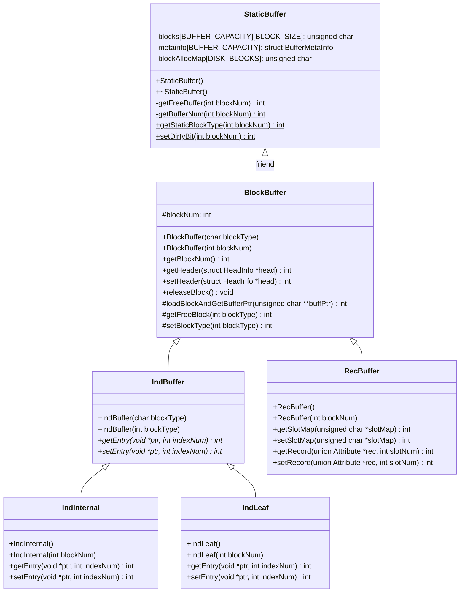
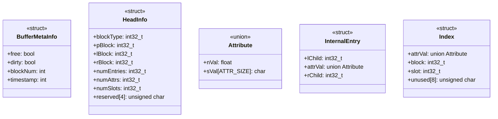

# Buffer Layer

:::info note
The files corresponding to this layer can be found in the `Buffer` directory. The code is to be written in the files `StaticBuffer.cpp` and `BlockBuffer.cpp`. The declaration for the functions can be found in the respective header files `StaticBuffer.h` and `BlockBuffer.h`.

**[The stub code for these files can be found here.](../../Misc/stub/buffer.md)**
:::

## Layout

Whenever NITCbase needs to work on a disk block, the block has to be first fetched from the _secondary memory storage_ (`disk`) to the **primary memory**. _A large pool of memory_ (called _buffer_ in the documentation) is pre-allocated and managed to _hold copies of disk blocks in the primary memory_. When a request involving _access/update_ of a disk block comes from any of the higher layers, the corresponding disk block is loaded into the buffer. After performing updates, the block is committed back to the disk from the buffer.

NITCbase uses a dedicated **Buffer Layer** for the above functionality.
_All the requests involving disk blocks go through the Buffer Layer._ The interface provided by the **_Buffer Layer_** gives a memory address space abstraction to the higher layers, hiding the complexities involved in the reads and writes to the actual physical disk blocks.

NITCbase has pre-allocated memory for holding **32 disk blocks** in its **_buffer memory_** at a given time. Buffer Layer is responsible for maintaining the buffer memory and making _replacements_ and _writebacks_ as required. The disk class functions are used by the Buffer Layer to load blocks from the disk to the buffer and also to write back blocks as and when necessary. A single object of the disk class needs to be declared at the start of the session. Its purpose is to run the constructor and the destructor of the class.

:::tip Note
The `Disk` class _constructor_ will create a new **_Run Copy_** of the actual disk and all disk accesses during runtime of NITCbase is done via this _Run Copy_. At the close of the system, the `Disk` class _destructor_ will write back the _Run Copy_ of disk to the actual disk.
:::

NITCbase follows an Object-Oriented design for Buffer Layer. The class diagram is as shown below.

---



---

Various structures used in the buffer layer are outlined in the below diagrams.



---

Certain other structure definitions and functions that help access record data and metadata from the disk block are also included in the Buffer Layer. These are discussed at the end of this page (see [miscellaneous section](#miscellaneous)).

## Block Structures

The Buffer Layer defines the following block data structures.

- [HeadInfo](#headinfo)
- [Attribute](#attribute)
- [InternalEntry](#internalentry)
- [Index](#index)

Each structure is designed to store **a subset of the data stored in a disk block**. A disk block contains **_2048 bytes_** of data. Higher layer functions, however, instead of processing the whole block data together, typically request access to a particular set of related data in a disk block at a time. Whenever such a selective access request is made, the method in the Buffer Layer implementing the access functionality will pack the requested data into the corresponding block structure designed to store that particular type of data. Variables of these structures will be declared and used in the [Cache Layer](../Cache%20Layer/intro.md), the [Block Access Layer](../Block%20Access%20Layer.md), and the [B+ Tree Layer](../B+%20Tree%20Layer.md).

### HeadInfo

**NITCbase maintains a _32 byte_ _fixed-size_ header for every disk block.** This header stores _meta-information_, like the type of the block, and a few block specific information, like `#Attrs` and `#Slots`. Though the header has many fields, usage of the fields depends on the type of the block. The structure `HeadInfo` is used to collect all the entries of the header, as shown below. The `setHeader()` and the `getHeader()` methods take a pointer to `struct HeadInfo` as argument.

:::caution Implementation Note
`getHeader()` and `setHeader()` methods expect the higher layers to allocate memory for the `struct HeadInfo` before calling them.
:::

```cpp
struct HeadInfo {
    int32_t blockType;
    int32_t pblock;
    int32_t lblock;
    int32_t rblock;
    int32_t numEntries;
    int32_t numAttrs;
    int32_t numSlots;
    unsigned char reserved[4];
};
```

### Attribute

According to the [Disk Model](../../Design/Physical%20Layer#disk-model), a record block has slots for storing records, and each record contains a set of attributes. The `Attribute` block data structure is used to hold an attribute in memory. Since an attribute can have either `NUMBER` or `STRING` type, **`Attribute`** is a _union_ containing the two types. The size of an Attribute variable is fixed at **16 bytes**. A `**record**` will be an array of Attribute whose size is equal to the number of attributes in the relation.

:::tip
Attribute is the fundamental unit of data in a record. Hence, the `Attribute` data structure is used in several functions of NITCbase.
:::

The definition for `union Attribute` is given below:

```cpp
union Attribute {
    double nVal;
    char sVal[ATTR_SIZE];
};
```

### InternalEntry

Each **Internal Index** block of a _B+ Tree_ consists of many _attribute values_ and the _child pointers_. This data is arranged in the block in such a way that an attribute value is stored **between** its left child and right child pointers.

:::info Note
The `right child pointer` of one attribute value will be the **same** as the `left child pointer` of the next attribute value. Hence to avoid redundancy, only one copy is stored, _making the data overlapped._
:::

The combination of `left child`, `attribute value`, and `right child` makes up the `InternalEntry` structure, as shown below. An Internal Index block is a combination of `100 such overlapped entries`. The `getEntry()` and `setEntry()` methods of the class `IndInternal` take a pointer to struct `InternalEntry` as an argument.

:::caution Implementation Note
The `getEntry()` and `setEntry()` methods are declared in the `class IndBuffer` but are overridden in the `class IndInternal`. `getEntry()` and `setEntry()` methods expect the higher layers to allocate memory for struct InternalEntry before calling them.
:::

```cpp
struct InternalEntry {
    int32_t lChild;
    union Attribute attrVal;
    int32_t rChild;
};
/* #include <cstdint> must be done */
```

### Index

An _index_ of a relation should store a reference to its record along with the corresponding attribute value. NITCbase uses `**RecId**`, which is a `(block#, slot#)` pair, for referencing any record. In NITCbase, an `Index` structure is a combination of `attribute value`, `block#`, and `slot#`, followed by some unused space left for future use, as shown below.

Each `Leaf Index block` is a combination of **63 such Index entries**. The `getEntry()` and the `setEntry()` methods of the `class IndLeaf` take a pointer to `struct Index` as an argument.

:::caution Implementation Note
The `getEntry()` and `setEntry()` methods are declared in the `class IndBuffer` but are overridden in the `class LeafBuffer`. `getEntry()` and `setEntry()` methods expect the higher layers to allocate memory for `struct Index` before calling them.
:::

```cpp
struct Index {
    union Attribute attrVal;
    int32_t block;
    int32_t slot;
    unsigned char unused[8];
};
/* #include <cstdint> must be done */
```

---

## Buffer Structure

The Buffer Layer also defines a _buffer_ structure. `StaticBuffer class` maintains meta-information for each block loaded to a buffer.

The `BufferMetaInfo` structure is used for storing this meta-information. This structure contains **four fields**: a `free flag` which indicates whether the buffer is occupied, a `dirty flag` which indicates whether the block has been modified, a `blockNum` field which is the block number of the block that is stored in the given buffer and a `timeStamp` field which indicates the last time the buffer had been accessed.

_Block Replacement_ is done using a simple **Least Recently Used (LRU)** algorithm, which has been implemented in the `getFreeBuffer()` method. The `timeStamp` field has to be updated each time the buffer is accessed, as is done in the `getBufferPtr()` method.

```cpp
struct BufferMetaInfo {
    bool free;
    bool dirty;
    int blockNum;
    int timeStamp;
};
```

---

## Miscellaneous

Given below are the definitions of RecId and IndexId structures. Variables of these structures will be of use in several layers of NITCbase, such as [Cache layer](../Cache%20Layer/intro.md), [Block access layer](../Block%20Access%20Layer.md) and [B+ tree](../B+%20Tree%20Layer.md) layer, to name a few.

:::note
The code for RecId struct and IndexId struct can be found in the `id.h` file defined inside `define/` directory.

:::

### RecId

Relations in NITCbase are made up of records. Every record of any relation can be referenced using an id called `RecId`. `RecId` is a combination of the block number of the corresponding record block and the slot number of the slot occupied by the record in the block. It is used to locate where the record is stored in the disk.

```cpp
struct RecId {
    int block;
    int slot;
};
```

### IndexId

The Leaf Index blocks of a B+ Tree are made of [Index](#index) entries. Every _Index_ entry of any _Leaf Index_ block can be referenced using an id called `IndexId`. It is a combination of block number of the corresponding leaf index block and index number, which is the offset of the index in that block. It is used to locate where the index is stored in the disk.

```cpp
struct IndexId {
    int block;
    int index;
};
```

### compareAttrs()

#### Description

This function compares two [`union Attribute`](#attribute) values on the basis of the input attribute type.

#### Arguments

| **Name** | **Type**                        | **Description**                                             |
| -------- | ------------------------------- | ----------------------------------------------------------- |
| attr1    | [`union Attribute`](#attribute) | First attribute value to be compared.                       |
| attr2    | [`union Attribute`](#attribute) | Second attribute value to be compared.                      |
| attrType | `int`                           | Type of the attribute [`NUMBER`/`STRING`](/docs/constants). |

#### Return Values

| **Value**        | **Description**                                            |
| ---------------- | ---------------------------------------------------------- |
| Negative integer | Value in `attr1` is **less** than the value in `attr2`.    |
| Zero             | Value in `attr1` is **equal** to the value in `attr2`.     |
| Positive integer | Value in `attr1` is **greater** than the value in `attr2`. |

```cpp
int compareAttrs(union Attribute attr1, union Attribute attr2, int attrType) {

    double diff;
    // if attrType == STRING
    //     diff = strcmp(attr1.sval, attr2.sval)

    // else
    //     diff = attr1.nval - attr2.nval

    /*
    if diff > 0 then return 1
    if diff < 0 then return -1
    if diff = 0 then return 0
    */
}
```

:::note

- Both the attributes given as input must be of the same type as the input type.
- For string type, the comparision is performed with respect to _lexicographic order_.

:::
