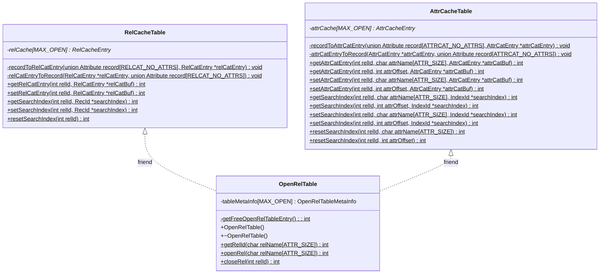
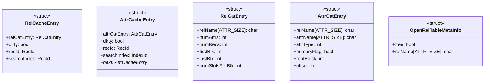

# Cache Layer

:::info note
The files corresponding to this layer can be found in the `Cache` directory. The code is to be written in the files `RelCacheTable.cpp`, `AttrCacheTable.cpp` and `OpenRelTable.cpp`. The declaration for the functions can be found in the respective header files `RelCacheTable.h`, `AttrCacheTable.h` and `OpenRelTable.h`.

**[The stub code for these files can be found here](../../Misc/stub/cache.md)**
:::

## Layout

Almost all operations on a relation require access to its corresponding **Relation Catalog** and **Attribute Catalog** entries. NITCbase stores these catalogs as relations in the disk. To prevent multiple reads and write backs of the catalog blocks, the _Cache Layer_ **caches** the catalog blocks along with some extra metadata associated with the relation that allows faster and easier processing of operations such as search. The Cache Layer, thus, provides an interface for catalog access to the higher layers by hiding the storage and maintenance details of the catalogs. Cache Layer can cache a maximum of [MAX_OPEN](/docs/constants) number of relations at any given time.

**NITCbase requires that the relation be first loaded to cache memory before any operation is performed on it.**

Three tables are used by NITCbase for caching Catalogs - the **Relation Cache Table** for _Relation Catalog_ entries, the **Attribute Cache Table** for _Attribute Catalog_ entries and the **Open Relation Table** to keep track of the entries stored in the other two catalogs.

NITCbase follows an Object-Oriented design for Cache Layer. The class diagram is as shown below.



---

Various structures used in the cache layer are outlined in the below diagrams.



## relId

Any relation that is stored in the cache memory will have an entry in each of the three tables- **Relation Cache Table**, **Attribute Cache Table**, and **Open Relation Table**. An _open relation_ is a relation that has been loaded to the cache memory while a _closed relation_ is one that is not loaded to the cache memory (hence it is only present in the disk). NITCbase is designed in such a way that the entries in all the three tables will be stored at the **same index**.

_This common index is called the **`relId`** of the relation and all further operations on the relation require this `relId`._

---

## Relation Cache Table Structures

The Relation Catalog block in the disk **stores metadata corresponding to all the relations in the database**. In addition to this, the _Relation Catalog_ entry of every open relation is loaded to the Relation Cache for easy access and for better performance. The Relation Cache is implemented in [class RelCacheTable](#class-relcachetable). _Each entry in the Relation Cache stores all the attribute values of the relation's entry from the Relation Catalog along with some additional meta-data._

NITCbase caches _Relation Catalog_ using two structures: `RelCatEntry` and `RelCacheEntry`.

### RelCatEntry

The structure `RelCatEntry` stores all the attribute values in the relation's record entry from the _Relation Catalog_ block in its data fields.

```cpp
typedef struct RelCatEntry {

    unsigned char relName[ATTR_SIZE];
    int numAttrs;
    int numRecs;
    int firstBlk;
    int lastBlk;
    int numSlotsPerBlk;

} RelCatEntry;
```

### RelCacheEntry

The structure `RelCacheEntry` stores the _Relation Catalog_ entry of the relation along with some additonal information needed during runtime.

The `RelCacheEntry` data field details are as follows:

- `relCatEntry`: Stores the relation's cached _Relation Catalog_ entry.
- `dirty`: Indicates whether the _Relation Catalog_ entry has been modified. The _Relation Catalog_ entries with the dirty bit set are written back to disk when an open relation is closed.
- `recId`: Stores the _record id_ `{blockNum, slotNum}` of the relation's entry in the _Relation Catalog_ block on the disk. This is useful during the write back of the catalog entry to disk if it had been modified.
- `searchIndex`: Stores the _record id_ `{blockNum, slotNum}` of the record block corresponding to the last (previous) search hit in the relation. Linear search algorithm of the Block Access Layer starts searching for the next hit from the previous hit location. The entries are initialized to `{-1, -1}` each time the relation is loaded to the cache memory. When every record of the relation has been searched, the linear search algorithm resets the `searchIndex` value to `{-1, -1}`.

```cpp
typedef struct RelCacheEntry {
    RelCatEntry relCatEntry;
    bool dirty;
    RecId recId;
    RecId searchIndex;

} RelCacheEntry;
```

---

## Attribute Cache Table Structures

The _Attribute Catalog_ blocks, analogous to the _Relation Catalog_ block, stores the **meta information of the attributes of all the relations in the database**. In addition to this, the _Attribute Catalog_ entries of every open relation is also loaded to the cache memory. This is implemented using _Attribute Cache_ Table. _Each entry in the Attribute Cache Table stores the entries corresponding to each attribute of the relation in the form a **linked list** along with some additional meta-data._

NITCbase caches _Attribute Catalog_ using two structures: `AttrCatEntry` and `AttrCacheEntry`.

### AttrCatEntry

The structure `AttrCatEntry` stores in its data fields all the attribute values in the record entry corresponding to one of the relation's attribute from an _Attribute Catalog_ block.

```cpp
typedef struct AttrCatEntry {
    unsigned char relName[ATTR_SIZE];
    unsigned char attrName[ATTR_SIZE];
    int attrType;
    bool primaryFlag;
    int rootBlock;
    int offset;

} AttrCatEntry;
```

### AttrCacheEntry

The structure `AttrCacheEntry` stores the _Attribute Catalog_ entry of an attribute of the relation along with some additonal information used during runtime. Since a relation can have variable number of attributes, a linked list of `struct AttributeCacheEntry` elements is maintained to cache all the _Attribute Catalog_ entries together.

The `AttrCacheEntry` data field details are as follows:

- `attrCatEntry`: Stores the cached _Attribute Catalog_ entry corresponding to an attribute of the relation.
- `dirty`: Indicates whether the _Attribute Catalog_ entry has been modified. The _Attribute Catalog_ entries with the set dirty bit are written back to disk when an open relation is closed in the cache memory.
- `recId`: Stores the _record id_ `{blockNum, slotNum}` of the record entry corresponding to the relation's attribute in the _Attribute Catalog_ block on the disk. This is useful during the write back of the catalog entry to disk if it had been modified.
- `searchIndex`: Stores the index id `{blockNum, indexNum}` of the leaf index block corresponding to the last (previous) search hit for the attribute. This entry is used only if there is a B+ Tree created on the attribute. B+ Tree search algorithm of the B+ Tree Layer starts searching from the previous hit location for the next hit. The entries are initialized to `{-1, -1}` each time the relation is opened in the cache memory. When every Index Leaf Block entry of the B+ Tree has been searched, B+ Tree search resets the searchIndex value to `{-1, -1}`.
- `next`: Gives the pointer to the next `AttrCacheEntry` element in the linked list.

```cpp
typedef struct AttrCacheEntry {
    AttrCatEntry attrCatEntry;
    bool dirty;
    RecId recId;
    IndexId searchIndex;
    struct AttrCacheEntry *next;

} AttrCacheEntry;
```

---

## Open Relation Table Structure

A relation must have an entry in the _Open Relation Table_ for its _Relation Catalog_ and _Attribute Catalog_ entries to be cached in the _Relation Cache Table_ and _Attribute Cache Table_, respectively.

### OpenRelTableMetaInfo

The `struct OpenRelTableMetaInfo` stores whether the given entry in the `OpenRelTable`, the _Relation Cache Table_, and _Attribute Cache Table_ are occupied, and also stores the name of the relation if occupied.

```cpp
typedef struct OpenRelTableMetaInfo {
    bool free;
    unsigned char relName[ATTR_SIZE];

} OpenRelTableMetaInfo;
```

---

The following diagram summarizes the design of this module.


---
