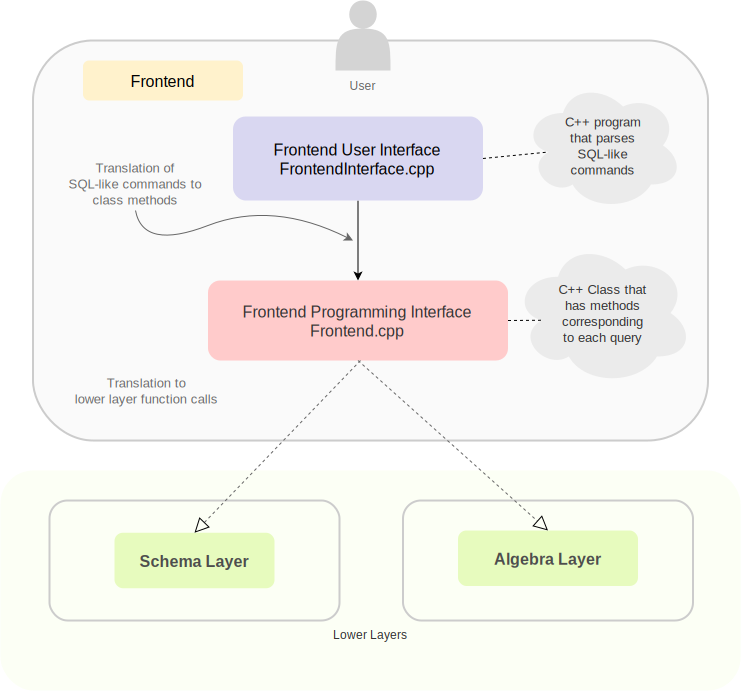

## Introduction

The RDBMS code must include a frontend code that interacts with the user and accepts user commands to the RDBMS. This frontend code needs to translate the Data Definition Language (DDL), Data Manipulation Language (DML) and script commands from the user to function calls at the lower layers.

The code for the frontend of NITCbase is divided into two sub-modules:

- **Frontend user interface**
- **Frontend programming interface**

The part of the frontend that interacts with the user directly is already implemented and is supplied to you along with the documentation for the project. This part is called the frontend user interface sub-module and its implementation can be found in the file `frontend-runner.cpp`.

_The frontend user interface translates each high level DDL and DML commands from the user to invocations of specific functions which are part of the second sub-module called front-end programming interface_. A C++ class file that contains the declarations of various functions of the frontend programming interface can be found in the file `Frontend.cpp`.

The code implementing the functions of the front end programming interface sub-module is **not** supplied as part of the documentation. Each function of this sub-module must be designed by the student to invoke lower layer functions of schema layer and algebra layer for meeting their functional requirements, and must return appropriate values to the front end user interface sub-module.



## Frontend User Interface

The Frontend user interface sub-module supplied to you interacts with the user and translates the SQL-like queries given as input to a set of lower-layer function calls by extracting the arguments and calling the appropriate methods of the Frontend Class / Frontend Programming Interface sub-module.
Frontend User Interface supports the following types of commands:

1. [Data Definition Language(DDL) Commands ](../User%20Interface%20Commands/ddl.md)
2. [Data Manipulation Language(DML) Commands](../User%20Interface%20Commands/dml.md)
3. [Script Commands](../User%20Interface%20Commands/script-cmds.md)

All the above command documents are linked to various sections of the [NITCbase Commands page](../User%20Interface%20Commands/introduction.md).

Among the above commands, the script command `run` helps the user to execute a sequence of commands from a file - hence translating them into a sequence of calls to other commands supported by Frontend interface. The echo command simply echoes back the message typed in by the user back to the console. **The translation and execution of lower layer method calls corresponding to these script commands have already been implemented and provided to you**. Hence further documentation for Frontend Class focusses only on the specifications for DDL and DML commands.

## Frontend Programming Interface

Frontend programming interface sub-module is implemented as a C++ Class called `Frontend`. The code for the same is available in `Frontend.cpp` file. Methods of this class are invoked corresponding to each command given as input to the Frontend user interface sub-module.

### Frontend Class

The implementations for Frontend class methods are not provided. The specification for the same is given in this section, based on which you will have to do the implementation.

All the methods of frontend class are static and it has the following C++ declaration:

```cpp
class Frontend {
public:
    // Data Definition Language (DDL) Commands
    static int create_table(char relname[ATTR_SIZE],
                            int no_attrs,
                            char attributes[][ATTR_SIZE],
                            int type_attrs[]);

    static int drop_table(char relname[ATTR_SIZE]);

    static int open_table(char relname[ATTR_SIZE]);

    static int close_table(char relname[ATTR_SIZE]);

    static int create_index(char relname[ATTR_SIZE],
                            char attrname[ATTR_SIZE]);

    static int drop_index(char relname[ATTR_SIZE],
                          char attrname[ATTR_SIZE]);

    static int alter_table_rename(char relname_from[ATTR_SIZE],
                                  char relname_to[ATTR_SIZE]);

    static int alter_table_rename_column(char relname[ATTR_SIZE],
                                         char attrname_from[ATTR_SIZE],
                                         char attrname_to[ATTR_SIZE]);

    // Data Manipulaiton Language (DML) Commands
    static int insert_into_table_values(char relname[ATTR_SIZE],
                                        int attr_count, char attr_values[][ATTR_SIZE]);

    static int select_from_table(char relname_source[ATTR_SIZE],
                                 char relname_target[ATTR_SIZE]);

    static int select_attrlist_from_table(char relname_source[ATTR_SIZE],
                                          char relname_target[ATTR_SIZE],
                                          int attr_count,
                                          char attr_list[][ATTR_SIZE]);

    static int select_from_table_where(char relname_source[ATTR_SIZE],
                                       char relname_target[ATTR_SIZE],
                                       char attribute[ATTR_SIZE],
                                       int op,
                                       char value[ATTR_SIZE]);

    static int select_attrlist_from_table_where(char relname_source[ATTR_SIZE],
                                                char relname_target[ATTR_SIZE],
                                                int attr_count,
                                                char attr_list[][ATTR_SIZE],
                                                char attribute[ATTR_SIZE],
                                                int op,
                                                char value[ATTR_SIZE]);

    static int select_from_join_where(char relname_source_one[ATTR_SIZE],
                                      char relname_source_two[ATTR_SIZE],
                                      char relname_target[ATTR_SIZE],
                                      char join_attr_one[ATTR_SIZE],
                                      char join_attr_two[ATTR_SIZE]);

    static int select_attrlist_from_join_where(char relname_source_one[ATTR_SIZE],
                                               char relname_source_two[ATTR_SIZE],
                                               char relname_target[ATTR_SIZE],
                                               char join_attr_one[ATTR_SIZE],
                                               char join_attr_two[ATTR_SIZE],
                                               int attr_count,
                                               char attr_list[][ATTR_SIZE]);
};
```

The specifications for each method of this class is provided in the following sections.

:::note
Make sure to return the correct value from the methods, preferably sticking to the [global constants mentioned here](<https://nitcbase.github.io(/constants).html>).
:::

### Frontend :: create_table()

#### Description

- The `CREATE TABLE` command is translated to this method call.
- This method calls the appropriate methods from the lower layer (Schema Layer) to create a table with the arguments given below.

#### Arguments

| Attribute  | Type                | Description                                                            |
| ---------- | ------------------- | ---------------------------------------------------------------------- |
| relname    | `char[ATTR_SIZE]`   | Name of the relation/table to be created                               |
| no_attrs   | `int`               | Number of attributes of the relation to be created                     |
| attributes | `char[][ATTR_SIZE]` | Names of each attribute of the relation                                |
| type_attrs | `int[]`             | Data type of each attribute, in the same order as the attributes array |

#### Return Values

| Value           | Description                                                                     |
| --------------- | ------------------------------------------------------------------------------- |
| SUCCESS         | Indicates successful creation of the relation                                   |
| E_RELEXIST      | If a relation of the same name already exists                                   |
| E_DUPLICATEATTR | If two or more attributes of the relation have the same name                    |
| E_DISKFULL      | If there is insufficient disk space to create the relation                      |
| E MAXRELATIONS  | If maximum number of relations possible already exists; currently limited to 20 |

#### Algorithm

```cpp
int Frontend::create_table(char relname[ATTR_SIZE],
                           int no_attrs,
                           char attributes[][ATTR_SIZE],
                           int type_attrs[]) {

    // Call createRel() method of the Schema Layer with correct arguments

    // Return Success and Error values appropriately

}
```

---

### Frontend :: drop_table()

#### Description

- The `DROP TABLE` command is translated to this method call.
- This method calls the appropriate methods from the lower layer (Schema Layer) to delete the table with the arguments given below and also returns the error values accordingly.

#### Arguments

| Attribute | Type              | Description                              |
| --------- | ----------------- | ---------------------------------------- |
| relname   | `char[ATTR_SIZE]` | Name of the relation/table to be deleted |

#### Return Values

| Value         | Description                                             |
| ------------- | ------------------------------------------------------- |
| SUCCESS       | Indicates successful deletion of the relation           |
| E_RELOPEN     | If the relation is open (SUBJECT TO CHANGE)             |
| E_RELNOTEXIST | If the relation with the given name does not exist      |
| E_INVALID     | If the relation name is `RELATIONCAT` or `ATTRIBUTECAT` |

#### Algorithm

```cpp
int Frontend::drop_table(char relname[ATTR_SIZE]) {
    // Call deleteRel() method of the Schema Layer with correct arguments

    // Return Success and Error values appropriately
}
```

---

### Frontend :: open_table()

#### Description

- The `OPEN TABLE` command is translated to this method call.
- This method calls the appropriate methods from the lower layer (Schema Layer) to open the table with the arguments given below and also returns the error values accordingly.

#### Arguments

| Attribute | Type              | Description                             |
| --------- | ----------------- | --------------------------------------- |
| relname   | `char[ATTR_SIZE]` | Name of the relation/table to be opened |

#### Return Values

| Value         | Description                                                  |
| ------------- | ------------------------------------------------------------ |
| relId         | relId is returned upon succesful opening of the relation     |
| E_RELNOTEXIST | If the relation with the given name does not exist           |
| E_CACHEFULL   | If there are no free slots left in the `Open Relation table` |

#### Algorithm

```cpp
int Frontend::open_table(char relname[ATTR_SIZE]) {
    // Call openRel() method of the Schema Layer with correct arguments

    // Return Success and Error values appropriately
}
```

---

### Frontend :: close_table()

#### Description

- The `CLOSE TABLE` command is translated to this method call.
- This method calls the appropriate methods from the lower layer (Schema Layer) to close the table with the arguments given below and also returns the error values accordingly.

#### Arguments

| Attribute | Type              | Description                             |
| --------- | ----------------- | --------------------------------------- |
| relname   | `char[ATTR_SIZE]` | Name of the relation/table to be opened |

#### Return Values

| Value        | Description                                                                                                              |
| ------------ | ------------------------------------------------------------------------------------------------------------------------ |
| SUCCESS      | Indicates successful closing of the relation                                                                             |
| E_RELNOTOPEN | If relation with the given name is not open                                                                              |
| E_INVALID    | If the relation name is either `RELATIONCAT` or `ATTRIBUTECAT`. i.e, when the user tries to close either of the catalogs |

#### Algorithm

```cpp
int Frontend::close_table(char relname[ATTR_SIZE]) {
    // Call closeRel() method of the Schema Layer with correct arguments

    // Return Success and Error values appropriately
}
```

---

### Frontend :: create_index()

#### Description

- The `CREATE INDEX` command is translated to this method call.
- This method calls the appropriate methods from the lower layer (Schema Layer) to create index on the attribute of the relation given as argument and also returns the error values accordingly.
- [B+ trees](https://nitcbase.github.io/design/Bplustreedetails.html) are used for creating indexes. Before executing this query, the relation must be opened using the `OPEN TABLE` command.

#### Arguments

| Attribute | Type              | Description                                                         |
| --------- | ----------------- | ------------------------------------------------------------------- |
| relname   | `char[ATTR_SIZE]` | Name of the relation that contains the attribute to create index on |
| attrname  | `char[ATTR_SIZE]` | Attribute to create index on                                        |

#### Return Values

| Value          | Description                                                                                                              |
| -------------- | ------------------------------------------------------------------------------------------------------------------------ |
| SUCCESS        | Indicates successful creation of B+ tree Index                                                                           |
| E_RELNOTOPEN   | If the relation is not open                                                                                              |
| E_ATTRNOTEXIST | If the given attribute does not exist                                                                                    |
| E_DISKFULL     | If there is not enough space in the disk to create the tree                                                              |
| E_INVALID      | If the relation name is either `RELATIONCAT` or `ATTRIBUTECAT`. i.e, when the user tries to create an index for catalogs |

#### Algorithm

```cpp
int create_index(char relname[ATTR_SIZE], char attrname[ATTR_SIZE]) {
    // Call createIndex() method of the Schema Layer with correct arguments

    // Return Success and Error values appropriately
}
```

---

### Frontend :: drop_index()

#### Description

- The `DROP INDEX` command is translated to this method call.
- This method calls the appropriate methods from the lower layer (Schema Layer) to drop index on the attribute of the relation given as argument and also returns the error values accordingly.

#### Arguments

| Attribute | Type              | Description                                                       |
| --------- | ----------------- | ----------------------------------------------------------------- |
| relname   | `char[ATTR_SIZE]` | Name of the relation that remove the attribute to create index on |
| attrname  | `char[ATTR_SIZE]` | Attribute to create index on                                      |

#### Return Values

| Value          | Description                                                                                                             |
| -------------- | ----------------------------------------------------------------------------------------------------------------------- |
| SUCCESS        | Indicates successful deletion of B+ tree index                                                                          |
| E_RELNOTOPEN   | If the relation is not open                                                                                             |
| E_ATTRNOTEXIST | If the given attribute does not exist                                                                                   |
| E_NOINDEX      | If index on the given attribute of the relation has not been created                                                    |
| E_INVALID      | If the relation name is either `RELATIONCAT` or `ATTRIBUTECAT`. i.e when the user tries to create an index for catalogs |

#### Algorithm

```cpp
int drop_index(char relname[ATTR_SIZE], char attrname[ATTR_SIZE]) {
    // Call dropIndex() method of the Schema Layer with correct arguments

    // Return Success and Error values appropriately
}
```

---

### Frontend :: alter_table_rename()

#### Description

- The `ALTER TABLE RENAME` command is translated to this method call.
- This method calls the appropriate methods from the lower layer (Schema Layer) to rename the table and also returns the error values accordingly.

char relname_from[ATTR_SIZE], char relname_to[ATTR_SIZE]

#### Arguments

| Attribute    | Type              | Description                        |
| ------------ | ----------------- | ---------------------------------- |
| relname_from | `char[ATTR_SIZE]` | Name of the relation to be renamed |
| relname_to   | `char[ATTR_SIZE]` | New name of the relation           |

#### Return Values

| Value         | Description                                                                                                     |
| ------------- | --------------------------------------------------------------------------------------------------------------- |
| SUCCESS       | Indicates successful renaming of the relation                                                                   |
| E_RELOPEN     | If the relation is open                                                                                         |
| E_RELNOTEXIST | If the relation that is to be renamed does not exist                                                            |
| E_RELEXIST    | If another relation already exists with the name new_tablename                                                  |
| E_INVALID     | If the relation name is either `RELATIONCAT` or `ATTRIBUTECAT`. i.e, when the user tries to rename the catalogs |

#### Algorithm

```cpp
int Frontend::alter_table_rename(char relname_from[ATTR_SIZE], char relname_to[ATTR_SIZE]) {
    // Call renameRel() method of the Schema Layer with correct arguments

    // Return Success and Error values appropriately
}
```

---

### Frontend :: alter_table_rename_column()

#### Description

- The `ALTER TABLE RENAME COLUMN` command is translated to this method call.
- This method calls the appropriate methods from the lower layer (Schema Layer) to rename the column of the table given as argument and also returns the error values accordingly.

#### Arguments

| Attribute     | Type              | Description                                                 |
| ------------- | ----------------- | ----------------------------------------------------------- |
| relname       | `char[ATTR_SIZE]` | Name of the relation containing the attribute to be renamed |
| attrname_from | `char[ATTR_SIZE]` | Name of the attribute to be renamed                         |
| attrname_to   | `char[ATTR_SIZE]` | New name of the attribute                                   |

#### Return Values

| Value          | Description                                                                                                                       |
| -------------- | --------------------------------------------------------------------------------------------------------------------------------- |
| SUCCESS        | Indicates successful renaming of the attribute of the relation                                                                    |
| E_RELOPEN      | If the relation is open                                                                                                           |
| E_RELNOTEXIST  | If the relation with name tablename does not exist                                                                                |
| E_ATTRNOTEXIST | If the attribute with name column_name does not exist                                                                             |
| E_ATTREXIST    | If the attribute with name new_column_name already exists                                                                         |
| E_INVALID      | If the relation name is either `RELATIONCAT` or `ATTRIBUTECAT`. i.e, when the user tries to rename the attributes of the catalogs |

#### Algorithm

```cpp
int Frontend::alter_table_rename_column(char relname[ATTR_SIZE], char attrname_from[ATTR_SIZE],
                                        char attrname_to[ATTR_SIZE]) {
    // Call renameAttr() method of the Schema Layer with correct arguments

    // Return Success and Error values appropriately
}
```

---

### Frontend :: insert_into_table_values()

#### Description

- The `INSERT INTO TABLE VALUES` command is translated to this method call.
- This method inserts the given record into the specified Relation. This function inserts a record into the Relation, only if the Relation is opened.

#### Arguments

| Attribute   | Type              | Description                                                                            |
| ----------- | ----------------- | -------------------------------------------------------------------------------------- |
| relname     | `char[ATTR_SIZE]` | Name of the relation into which insert operation has to be performed                   |
| attr_values | `vector<string>`  | Vector of type string, whose each string contains value of the corresponding attribute |

#### Return Values

| Value              | Description                                                                                                         |
| ------------------ | ------------------------------------------------------------------------------------------------------------------- |
| SUCCESS            | Indicating successful insertion of the record                                                                       |
| E_RELNOTOPEN       | If the relation is not open                                                                                         |
| E_NATTRMISMATCH    | If the actual number of attributes in the relation is different from the provided number of attributes              |
| E_ATTRTYPEMISMATCH | If the actual type of the attribute in the relation is different from the type of provided attribute in the record. |
| E_DISKFULL         | If disk space is not sufficient for inserting the record / index                                                    |

#### Algorithm

```cpp
int Frontend::insert_into_table_values(char relname[ATTR_SIZE],
  vector<string> attr_values) {


    // Call insert() method of the Algebra Layer with correct arguments

    // Return Success or Error values appropriately

}
```

---

### Frontend :: select_from_table()

#### Description

- The `SELECT * FROM TABLE` command is translated to this method call.
- This command creates a new target relation with the same attributes as that of source relation,and inserts into it all records from the source relation

#### Arguments

| Attribute   | Type              | Description                                                                            |
| ----------- | ----------------- | -------------------------------------------------------------------------------------- |
| relname     | `char[ATTR_SIZE]` | Name of the relation into which insert operation has to be performed                   |
| attr_values | `vector<string>`  | Vector of type string, whose each string contains value of the corresponding attribute |

#### Return Values

| Value        | Description                                                                                                                            |
| ------------ | -------------------------------------------------------------------------------------------------------------------------------------- |
| SUCCESS      | Indicating successful selection into the new target relation relation.                                                                 |
| E_RELNOTOPEN | If the source relation is not open                                                                                                     |
| E_RELEXIST   | If a relation with name targetrel already exists                                                                                       |
| E_CACHEFULL  | If the `openRel()` fails because of no free slots in open relation table                                                               |
| E_DISKFULL   | If disk space is not sufficient for creating the new relation                                                                          |
| E_INVALID    | If the target relation is either `RELATIONCAT` or `ATTRIBUTECAT`. i.e., when the user tries to select records into any of the catalogs |

#### Algorithm

```cpp
int Frontend::select_from_table(char relname_source[ATTR_SIZE], char relname_target[ATTR_SIZE]) {

    // Call project() method of the Algebra Layer

    // Return Success or Error values appropriately

}
```

---

### Frontend :: select_attrlist_from_table()

#### Description

- The `SELECT Attrlist FROM TABLE` command is translated to this method call.
- This command creates a new target relation with the attributes specified in Attrlist,and inserts all records(only the values corresponding to the specified attributes) of the source relation, into the newly created target relation.

#### Arguments

| Attribute      | Type                | Description                                                                                                                |
| -------------- | ------------------- | -------------------------------------------------------------------------------------------------------------------------- |
| relname_source | `char[ATTR_SIZE]`   | Name of Source Relation                                                                                                    |
| relname_target | `char[ATTR_SIZE]`   | Name of the Target Relation                                                                                                |
| attr_count     | `int`               | No. of attributes that have to be projected from source relation to target relation.                                       |
| attr_list      | `char[][ATTR_SIZE]` | Pointer to attribute names array, (array of attributes that have to be projected from source relation to target relation.) |

#### Return Values

| Value          | Description                                                                                                                            |
| -------------- | -------------------------------------------------------------------------------------------------------------------------------------- |
| SUCCESS        | Indicating successful selection into the new target relation relation.                                                                 |
| E_RELNOTOPEN   | If the source relation is not open                                                                                                     |
| E_RELEXIST     | If a relation with name targetrel already exists                                                                                       |
| E_ATTRNOTEXIST | If any of the attributes in Attrlist does not exist                                                                                    |
| E_CACHEFULL    | If the `openRel()` fails because of no free slots in open relation table                                                               |
| E_DISKFULL     | If disk space is not sufficient for creating the new relation                                                                          |
| E_INVALID      | If the target relation is either `RELATIONCAT` or `ATTRIBUTECAT`. i.e., when the user tries to select records into any of the catalogs |

#### Algorithm

```cpp
int Frontend::select_attrlist_from_table(char relname_source[ATTR_SIZE],
char relname_target[ATTR_SIZE],
int attr_count,
char attr_list[][ATTR_SIZE]) {


    // Call project() method of the Algebra Layer

    // Return Success or Error values appropriately

}
```

---

### Frontend :: select_from_table_where()

#### Description

- The `SELECT * FROM TABLE WHERE` command is translated to this method call.
- This command is used to retrieve all records of a given source relation, and insert them into a target relation, based on the the given condition. All records in the source relation that satisfy the condition, will be inserted into the newly created target relation.

#### Arguments

| Attribute      | Type              | Description                                                                                                                                                      |
| -------------- | ----------------- | ---------------------------------------------------------------------------------------------------------------------------------------------------------------- |
| relname_source | `char[ATTR_SIZE]` | Name of Source Relation                                                                                                                                          |
| relname_target | `char[ATTR_SIZE]` | Name of the Target Relation                                                                                                                                      |
| attribute      | `char[ATTR_SIZE]` | Attribute/column name to which 'select' condition need to be checked with.                                                                                       |
| op             | `int`             | Conditional Operator(can be one among EQ,LE,LT,GE,GT,NE corresponding to equal,lesthan equal, lessthan ,greaterthan equal, greaterthan, Not equal respectively). |
| value          | `char[ATTR_SIZE]` | value of attribute                                                                                                                                               |

#### Return Values

| Value              | Description                                                                                                                            |
| ------------------ | -------------------------------------------------------------------------------------------------------------------------------------- |
| SUCCESS            | Indicating successful selection into the new target relation relation.                                                                 |
| E_RELNOTOPEN       | If the source relation is not open                                                                                                     |
| E_RELEXIST         | If a relation with name targetrel already exists                                                                                       |
| E_ATTRNOTEXIST     | If the attribute given by attrnamedoes not exist                                                                                       |
| E_ATTRTYPEMISMATCH | If the actual type of the attribute in the relation is different from the type of provided attribute                                   |
| E_CACHEFULL        | If the `openRel()` fails because of no free slots in open relation table                                                               |
| E_DISKFULL         | If disk space is not sufficient for creating the new relation                                                                          |
| E_INVALID          | If the target relation is either `RELATIONCAT` or `ATTRIBUTECAT`. i.e., when the user tries to select records into any of the catalogs |

#### Algorithm

```cpp
int Frontend::select_from_table_where(char relname_source[ATTR_SIZE],
char relname_target[ATTR_SIZE],
char attribute[ATTR_SIZE], int op, char value[ATTR_SIZE]) {


    // Call select() method of the Algebra Layer with correct arguments

    // Return Success or Error values appropriately

}
```

---

### Frontend :: select_attrlist_from_table_where()

#### Description

- The `SELECT Attrlist FROM TABLE WHERE` command is translated to this method call.
- This command creates a new target relation with the attributes specified in Attrlist ,and inserts those records(only the values corresponding to the attributes specified in the Attrlist) from the source relation which satisfy the given condition.

#### Arguments

| Attribute      | Type              | Description                                                                                                                                                      |
| -------------- | ----------------- | ---------------------------------------------------------------------------------------------------------------------------------------------------------------- |
| relname_source | `char[ATTR_SIZE]` | Name of Source Relation                                                                                                                                          |
| relname_target | `char[ATTR_SIZE]` | Name of the Target Relation                                                                                                                                      |
| attribute      | `char[ATTR_SIZE]` | Attribute/column name to which 'select' condition need to be checked with.                                                                                       |
| op             | `int`             | Conditional Operator(can be one among EQ,LE,LT,GE,GT,NE corresponding to equal,lesthan equal, lessthan ,greaterthan equal, greaterthan, Not equal respectively). |
| value          | `char[ATTR_SIZE]` | value of attribute                                                                                                                                               |

#### Return Values

| Value              | Description                                                                                                                            |
| ------------------ | -------------------------------------------------------------------------------------------------------------------------------------- |
| SUCCESS            | Indicating successful selection into the new target relation relation.                                                                 |
| E_RELNOTOPEN       | If the source relation is not open                                                                                                     |
| E_RELEXIST         | If a relation with name targetrel already exists                                                                                       |
| E_ATTRNOTEXIST     | If the attribute given by attrnamedoes not exist                                                                                       |
| E_ATTRTYPEMISMATCH | If the actual type of the attribute in the relation is different from the type of provided attribute                                   |
| E_CACHEFULL        | If the `openRel()` fails because of no free slots in open relation table                                                               |
| E_DISKFULL         | If disk space is not sufficient for creating the new relation                                                                          |
| E_INVALID          | If the target relation is either `RELATIONCAT` or `ATTRIBUTECAT`. i.e., when the user tries to select records into any of the catalogs |

#### Algorithm

```cpp
nt Frontend::select_attrlist_from_table_where(
    char relname_source[ATTR_SIZE], char relname_target[ATTR_SIZE],
    int attr_count, char attr_list[][ATTR_SIZE],
    char attribute[ATTR_SIZE], int op, char value[ATTR_SIZE]) {


    // Step 1- Call select() method of the Algebra Layer with correct arguments to create a temporary target relation with name ".temp".
    // ".temp" results from the select operation on the source relation (and hence it contains all attributes of the source relations)

    // Return Error values, if not successful

    // Step 2- Call project() method of the Algebra Layer with correct arguments to create the actual target relation from the ".temp" relation.
    // The final target relation contains only those attributes mentioned in attr_list)

    // Return Success or Error values appropriately
}
```

---

### Frontend :: select_from_join_where()

#### Description

- The `SELECT * FROM JOIN WHERE` command is translated to this method call.
- This command creates a new target relation with attributes constituting from both the source relations(excluding specified attribute from 2nd src relation).It inserts the records obtained by equi-join of both the source relations(an attribute from each relation specified in arguments are used for equi-join) into the target relation.

Note that attribute1 should belong to source_relation1 and attribute2 should belong to source_relation2.

#### Arguments

| Attribute          | Type              | Description                                        |
| ------------------ | ----------------- | -------------------------------------------------- |
| relname_source_one | `char[ATTR_SIZE]` | Name of 1st Source Relation.                       |
| relname_source_two | `char[ATTR_SIZE]` | Name of 2nd Source Relation.                       |
| targetrel          | `char[ATTR_SIZE]` | Name of the target Relation                        |
| join_attr_one      | `char[ATTR_SIZE]` | Join attribute/column name in 1st Source Relation. |
| join_attr_two      | `char[ATTR_SIZE]` | Join attribute/column name in 2nd Source Relation. |

#### Return Values

| Value              | Description                                                                                                                            |
| ------------------ | -------------------------------------------------------------------------------------------------------------------------------------- |
| SUCCESS            | Indicating successful selection into the new target relation relation resulting from join.                                             |
| E_RELNOTOPEN       | If the source relation is not open                                                                                                     |
| E_RELEXIST         | If a relation with name target_relation already exists                                                                                 |
| E_ATTRNOTEXIST     | If attribute1 or attribute2does not exist                                                                                              |
| E_ATTRTYPEMISMATCH | If the actual type of any of the attributes in the source relations is different from the type of provided attribute.                  |
| E_DUPLICATEATTR    | If one or more pairs of attributes(other than join attributes) in the source relations have the same name                              |
| E_CACHEFULL        | If the `openRel()` fails because of no free slots in open relation table                                                               |
| E_DISKFULL         | If disk space is not sufficient for creating the new relation                                                                          |
| E_INVALID          | If the target relation is either `RELATIONCAT` or `ATTRIBUTECAT`. i.e., when the user tries to select records into any of the catalogs |

#### Algorithm

```cpp
int Frontend::select_from_join_where(char relname_source_one[ATTR_SIZE],
char relname_source_two[ATTR_SIZE], char relname_target[ATTR_SIZE],
char join_attr_one[ATTR_SIZE], char join_attr_two[ATTR_SIZE]) {

    // Call join() method of the Algebra Layer with correct arguments

    // Return Success or Error values appropriately

}
```

---

### Frontend :: select_attrlist_from_join_where()

#### Description

- The `SELECT Attrlist FROM JOIN WHERE` command is translated to this method call.
- This command creates a new target relation with attributes given in Attrlist.It inserts the records(only the values of the specified attributes in Attrlist obtained by equi-join of both the source relations(an attribute from each relation specified in arguments are used for equi-join) into the target relation.

Note that attribute1 should belong to source_relation1 and attribute2 should belong to source_relation2.

#### Arguments

| Attribute          | Type              | Description                                        |
| ------------------ | ----------------- | -------------------------------------------------- |
| relname_source_one | `char[ATTR_SIZE]` | Name of 1st Source Relation.                       |
| relname_source_two | `char[ATTR_SIZE]` | Name of 2nd Source Relation.                       |
| targetrel          | `char[ATTR_SIZE]` | Name of the target Relation                        |
| join_attr_one      | `char[ATTR_SIZE]` | Join attribute/column name in 1st Source Relation. |
| join_attr_two      | `char[ATTR_SIZE]` | Join attribute/column name in 2nd Source Relation. |

#### Return Values

| Value              | Description                                                                                                                            |
| ------------------ | -------------------------------------------------------------------------------------------------------------------------------------- |
| SUCCESS            | Indicating successful selection into the new target relation relation resulting from join.                                             |
| E_RELNOTOPEN       | If the source relation is not open                                                                                                     |
| E_RELEXIST         | If a relation with name target_relation already exists                                                                                 |
| E_ATTRNOTEXIST     | If attribute1 or attribute2does not exist                                                                                              |
| E_ATTRTYPEMISMATCH | If the actual type of any of the attributes in the source relations is different from the type of provided attribute.                  |
| E_DUPLICATEATTR    | If one or more pairs of attributes(other than join attributes) in the source relations have the same name                              |
| E_CACHEFULL        | If the `openRel()` fails because of no free slots in open relation table                                                               |
| E_DISKFULL         | If disk space is not sufficient for creating the new relation                                                                          |
| E_INVALID          | If the target relation is either `RELATIONCAT` or `ATTRIBUTECAT`. i.e., when the user tries to select records into any of the catalogs |

#### Algorithm

```cpp
int Frontend::select_attrlist_from_join_where(
    char relname_source_one[ATTR_SIZE], char relname_source_two[ATTR_SIZE],
    char relname_target[ATTR_SIZE], char join_attr_one[ATTR_SIZE],
    char join_attr_two[ATTR_SIZE], int attr_count, char attr_list[][ATTR_SIZE]) {

    // Step 1- Call join() method of the Algebra Layer with correct arguments to create a temporary target relation with name ".temp".
    // ".temp" results from the join of the two source relation (and hence it contains all attributes of the source relations except the join attribute of the second source relation)

    // Return Error values, if not successful

    // Step 2- Call project() method of the Algebra Layer with correct arguments to create the actual target relation from the ".temp" relation.
    // The final target relation contains only those attributes mentioned in attr_list)

    // Return Success or Error values appropriately
}
```
