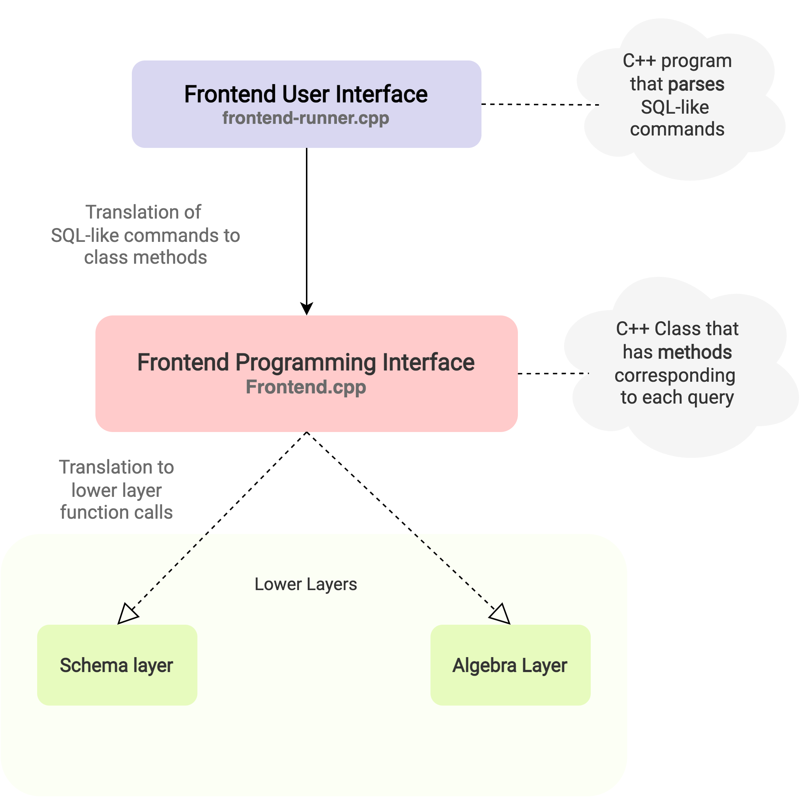

Frontend layer is the highest layer among the [7 layers of NITCbase](../DesignDiagram.md). It consists of 2 parts - [Frontend User Interface](Frontend%20User%20Interface) and the [Frontend Programming Interface](Frontend%20Programming%20Interface) as seen in the below figure.
<!--  -->

Frontend user interface is supplied to you and hence you do not need to implement. It will translate the input SQL-like queries, extracts the arguments and calls the appropriate methods of the Frontend Class/Frontend Programming Interface. Refer to the [Frontend Programming Interface](Frontend%20Programming%20Interface) section for specifications of the C++ Frontend Class.

