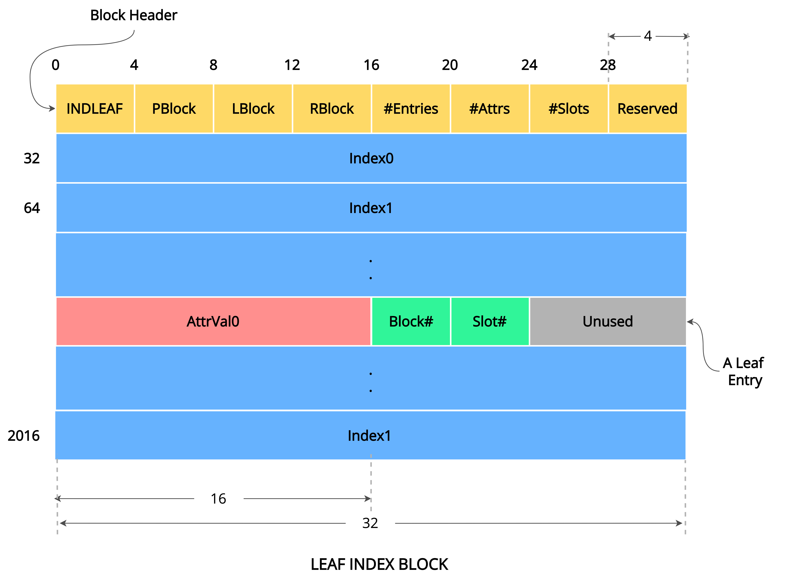
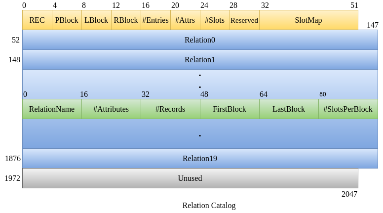
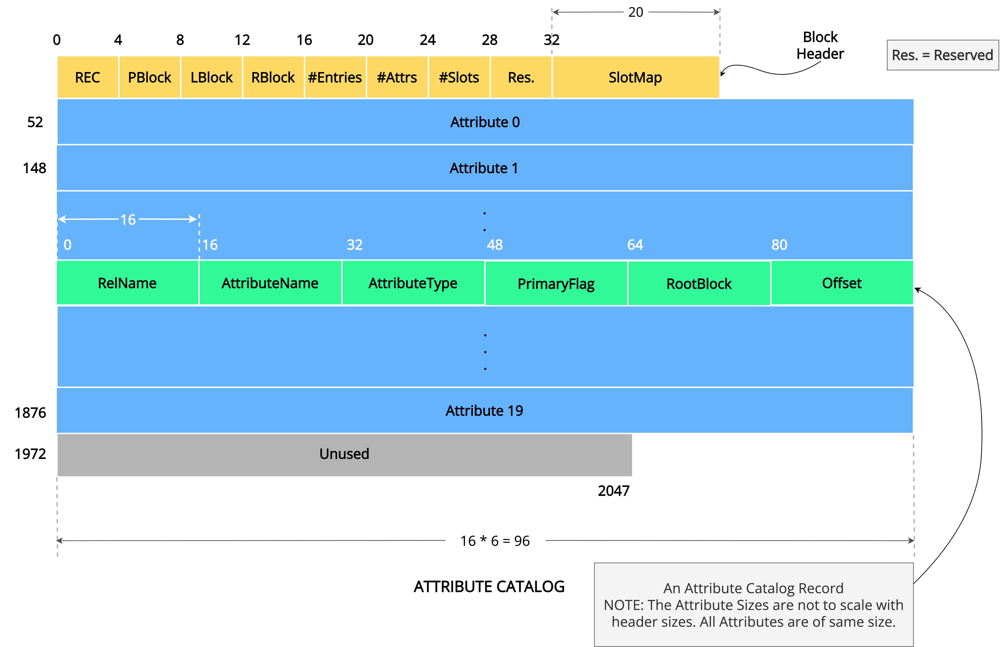

import diskModel from '../../static/img/DiskModel.png';

https://nitcbase.github.io/archived-site/storage-model.html

:::info NOTE

The `disk` binary file that simulates the NITCbase disk (and the run copy of disk called `disk_run_copy`) is located in the `Disk/` directory.
The C++ Disk class that initiates the run copy of disk and also provides read/write access to the disk is located in the `Disk.cpp` file of `Disk_Class/` directory. [**The Disk Class has been fully implemented and the code can be found here.**](/Disk_Class_Impl)

:::

## Disk Model

NITCbase assumes that the disk is a sequence of blocks, and a block is a sequence of bytes. The disk consists of **8192 blocks**, and each block is of **2048 bytes**, resulting in a total of 16MB of storage. Disk blocks are **indexed from 0 to 8191.**

**Block Allocation Map** tells us whether a particular block is **free** or **occupied**. If occupied, it stores the type ([`REC` / `IND_INTERNAL` / `IND_LEAF`](<https://nitcbase.github.io(/constants).html>)) of the block. _It requires one byte per each block_. **Hence a total of 8192 / 2048 = 4 blocks are required for Block Allocation Map**. The following figure summarizes the disk structure.

Blocks 0-3 are reserved for storing _Block Allocation Map_, whereas Blocks 4 and 5 are reserved for storing the block of [Relation Catalog](#relation-catalog) and the first block of [Attribute Catalog](#attribute-catalog), respectively.

The first four blocks of the disk are used for storing the Block Allocation Map and hence **the first four entries in the Block Allocation Map are marked as occupied.**
This is done when the XFS interface command of [`fdisk`](../User%20Interface%20Commands/efs.md#format-disk) is executed to generate the disk file. Marking of block 4 and block 5 as `REC` type in Block Allocation Map is also done during the `fdisk` command.

<br/>

<br/>

## Disk Class

Higher layers access the disk through the disk class. **The class contains a constructor, a destructor, a function to read from the disk**([`readBlock`](#disk--readblock)), **and a function to write to the disk** ([`writeBlock`](#disk--writeblock)).

Out of these functions, `readBlock` and `writeBlock` are `static`. C++ allows static functions to be accessed using the semantics `classname::functionname()` (instead of `objectinstance -> functionname()` as in the case of methods that are not declared statically), thus enabling to access the disk functions without referring to specific class instances / objects.

**These are the only functions through which the disk can be accessed.** These functions are supplied to you in the NITCbase package, and hence you do not need to implement them. A single object of the class needs to be declared at the start of the session, whose sole purpose is to run the constructor and the destructor of the class.

```cpp
class Disk {
public:
    Disk();
    ~Disk();
    static int readBlock(unsigned char *block, int blockNum);
    static int writeBlock(unsigned char *block, int blockNum);
};
```

---

### Disk :: Disk()

#### Description

Used to make a temporary copy of the disk contents before the starting of a new session. This ensures that if the system has a forced shutdown during the course of the session, the previous state of the disk is not lost.

#### Arguments

Nil

#### Return Values

Nil

---

### Disk :: ~Disk()

#### Description

Used to update the changes made to the disk on graceful termination of the latest session. This ensures that these changes are visible in future sessions.

#### Arguments

Nil

#### Return Values

Nil

---

### Disk :: readBlock()

#### Description

Transfers the contents of the specified disk block to the input memory buffer. Used in buffer layer to load disk block to buffer.

:::caution
Higher layers must allocate memory for the unsigned character array of size 2048 before passing its pointer to the function.
:::

#### Arguments

| Name     | Type              | Description                                                                    |
| -------- | ----------------- | ------------------------------------------------------------------------------ |
| buffer   | `unsigned char *` | Memory pointer of the buffer to which the block contents is to be loaded/read. |
| blockNum | `int`             | Block number of the disk block to be read.                                     |

#### Return Values

| Value                        | Description                                            |
| ---------------------------- | ------------------------------------------------------ |
| [`SUCCESS`](/constants)      | Successful loading/reading of the block to the buffer. |
| [`E_OUTOFBOUND`](/constants) | Block number is out of range.                          |

---

### Disk :: writeBlock()

#### Description

Transfers the contents of the input memory buffer memory buffer to the specified disk block. Used in buffer layer to write buffer contents to disk.

:::caution
Higher layers must allocate memory for the unsigned character array of size 2048 before passing its pointer to the function.
:::

#### Arguments

| Name     | Type              | Description                                                                     |
| -------- | ----------------- | ------------------------------------------------------------------------------- |
| buffer   | `unsigned char *` | Memory pointer of the buffer from which contents is to be written to the block. |
| blockNum | `int`             | Block number of the disk block to be written to.                                |

#### Return Values

| Value                        | Description                                  |
| ---------------------------- | -------------------------------------------- |
| [`SUCCESS`](/constants)      | Successful writing of the block to the disk. |
| [`E_OUTOFBOUND`](/constants) | Block number is out of range.                |

---

## Blocks and Block Types

NITCbase assumes that the disk is a sequence of blocks, and a block is a sequence of bytes. Apart from the four initial blocks (Block Numbers 0 to 3 which are used for the Block Allocation Map), each block can only be one of the following _three_ types based on the type of information being stored:

1. [Record Block](#record-block-structure)
2. [Internal Index Block](#internal-index-block-structure)
3. [Leaf Index Block](#leaf-index-block-structure)

The structure and function of each block type is explained below.

---

### Record block structure

NITCbase is a collection of relations, and each relation is a collection of records. The DBMS must store relations in the disk and the strategy is to store each relation in a set of blocks in the disk, organized as a linked list. Each block in such a linked list will be called a **record block**. The block will contain some metadata as well, for instance, the indices of the left block and right blocks in the linked list.

Records in a relation are composed of fields known as _attributes_, each of which contains one item of information. **NITCbase fixes the size of attribute as 16 bytes**, but the **records of a relation can be of variable size** - varying from 16 bytes (for a record with single attribute) to the size of the larget record that can fit into a block.

_A record block stores the actual data records._ In addition to data records, some metadata is also stored in the **preamble/header** of each block.

The following figure shows the record block structure for a relation with `K` attributes. Let L be the number of records stored in a block (given `K`, `L` can be determined, which is explained later.). Since each attribute requires 16 bytes of storage space, to store each record of this relation `16 * K bytes` must be allocated.

:::note

In real-world database systems, the _size of an attribute will vary depending on the type of the attribute_. For instance, an integer type attribute will require less storage space than a string type attribute.

In NITCbase, _we fix the size of all attributes to the same value to simplify the implementation._ It is a conceptually straightforward (but cumbersome from the point of implementation) task to modify the DBMS to support variable-sized attributes.

:::

<br/>


- First four bytes (0-3) of header are used to identify the type of block (`REC` / `IND_INTERNAL` / `IND_LEAF`) where [`REC`](<https://nitcbase.github.io(/constants).html>) represents a record block.
- Next four bytes (4-7) are used for storing parent block pointer, which has no significance for a record block and can be set to `-1`.
- Bytes 8-11 and 12-15 are used for storing Left and right block numbers respectively.
- Next four bytes are used for storing the number of records currently stored in the block.
- Bytes 20-23 and 24-27 are used for storing `#Attr` (Number of attributes of the records of the relation that are stored in this block) and `#Slots` (Number of slots in this block) respectively.
- Bytes 28-31 are reserved for future use.

**Each record block is divided into slots of variable record size. Each slot stores a single record** (and hence requires `16 * K bytes` for a relation with `K` attributes). Each block can have an arbitrary number of slots depending on the number of attributes in the relation. Number of slots (Maximum number of records, `L`) that fits in a block for any given relation can be calculated as:

$$
32+L+L*(16*K) \leq 2048 \\
                                L*(16*K + 1 ) \leq 2016 \\
                                \#Slots = L = \left \lfloor \frac {2016} {((16 * \#Attributes(K)) + 1)} \right \rfloor


$$

The **slotmap**, which appears at the end of the header is used for _indicating whether a slot is occupied or free_. Size of the slotmap is equal to the number of slots, `L`, that fits in the block. If a slot is free, its corresponding entry in slotmap will be [`SLOT_UNOCCUPIED`](/constants) or else it will be [`SLOT_OCCUPIED`](/constants). Slotmap starts from byte 32 of the header followed by slots which store the actual records. Some amount of space may be left unused at the end whose size is less than the size of a record.

The record block must be loaded from the disk to the main memory before its data can be accessed/modified. The Buffer Layer provides the necessary data structures for this purpose. The RecBuffer class is used to access a record block. The header of the block is stored in the struct HeadInfo. Each record in a record block is treated as an array of union Attributes.

:::info Question 1

**Q1**. Calculate the number of slots and slotmap size for a relation with 5 attributes.

<details>
<summary>
View solution
</summary>
<p>

$$
\#Slots = \left \lfloor \frac{2016}{(16*5)+1} \right \rfloor = 24
$$

- Since the slotmap size is equal to the number of slots in a block, _slotmap size = 24 bytes_.

</p>
</details>

:::

:::info Question 2

**Q2**. What is the maximum number of attributes possible for a relation in NITCbase?

<details>
<summary>
View solution
</summary>
<p>

In NITCbase, size of the record in any relation is bounded by the size of a block. Hence the number of attributes is maximum when a record fits in a block.
It is calculated as:

$$
16*K+1 \leq 2016 \\
K = \left \lfloor \frac{2015}{16} \right \rfloor \\
K = 125 \\
$$

</p>
</details>

:::

:::info Question 3

**Q3**. What is the maximum number of slots possible for a record block in NITCbase?

<details>
<summary>
View solution
</summary>
<p>

A record block has the maximum number of slots when number of attributes of the corresponding relation is 1. Hence the maximum number of slots can be calculated as 118.

</p>
</details>

:::

---

### Internal Index Block Structure

NITCbase uses the [B+ tree](../Misc/B+%20Trees.md) data structure for indexing records in a relation. _The DBMS may maintain zero or more indices per relation_. There are **two types** of nodes for a B+ tree. These are called internal nodes and leaf nodes. A disk block that stores an internal node of the B+ tree is called an **Internal Index block**.

_Each internal index block in NITCbase stores a maximum of 100 attribute(key) values. Each of these values has an associated pair of left and right child pointers. Hence each internal index block is also required to store 101 child pointers (Only 101 Child pointers are required because the right child of one value is the same as the left child of the next value)._

<br/>


An Internal index block is divided into two parts. The first 32 bytes stores header followed by actual attribute(key) values and child pointers arranged alternatively as shown in the figure. The header metadata is similar to that of a record block. The first four bytes of the header stores the value [`INDINT`](<https://nitcbase.github.io(/constants).html>). `PBlock` is the block number of parent block in the corresponding B+ tree. `LBlock` and `RBlock` have no significance for an internal index block. `#Entries` field stores the actual number of attribute values (of maximum 100) stored in the block. `#Attrs` and `#Slots` fields also have no significance for an internal index block. The remaining space in the header is left unused.

The Internal index block must be loaded from the disk to the main memory before its data can be accessed/modified. The [Buffer Layer](./Buffer%20Layer.md) provides the necessary data structures for this purpose. The [IndInternal class](./Buffer%20Layer.md) is used to access a internal index block. The header of the block is stored in the [struct HeadInfo](./Buffer%20Layer.md). Each entry in an internal index block is accessed through a structure [struct InternalEntry](./Buffer%20Layer.md).

---

### Leaf Index Block Structure

**A leaf node in the B+ tree stores the actual indices for the records in a relation**. A disk block that stores a leaf node of a B+ tree is called a leaf index Block. _Each leaf index block in NITCbase stores a maximum of 63 indices_. An index is a 3-tuple: `(attribute value, block number, slot number)`. The size of an index in nitcbase is 32 bytes (the last 8 bytes are unused)



Any Leaf Index Block is also divided into a header part of 32 bytes followed by a part containing actual indices. The header is similar to that of any other block. The first four bytes of the header stores the value [`INDLEAF`](<https://nitcbase.github.io(/constants).html>). `PBlock` is the block number of the parent block in the corresponding B+ tree. This entry must always contain block number of an Internal Index block. Since all leaf nodes are connected in a B+ tree, `LBlock` and `RBlock` point to left and right Leaf Index blocks respectively. `#Entries` stores the actual number of indices (of maximum 63) stored in the block. `#Attrs` and `#Slots` fields have no significance for a Leaf index block. The remaining space in the header is left unused.

The Leaf index block must be loaded from the disk to the main memory before its data can be accessed/modified. The [Buffer Layer](./Buffer%20Layer.md) provides the necessary data structures for this purpose. The [IndLeaf class](./Buffer%20Layer.md) is used to access a leaf index block. The header of the block is stored in the [struct HeadInfo](./Buffer%20Layer.md). Each entry in a leaf index block is accessed through a structure [struct Index](./Buffer%20Layer.md).

---

## Catalog Structures

NITCbase maintains two catalogs in the disk for storing metadata information about relations, attributes, indices, etc. These catalogs are:

1. Relation Catalog
2. Attribute Catalog

In an RDBMS,

- A relation refers to a collection of records where each record is an n-tuple of attribute values.
- An attribute is a column or a field in a relation.
- A database is a collection of relations.

_NITCbase organizes these catalogs as relations. Hence the block structures used for the catalogs are record block structures._

---

### Relation Catalog

NITCbase has alloted _a single block_ for the storage of Relation Catalog. **Block 4 of the disk is used for this purpose**.

Relation Catalog is used for storing meta-information of the relations in a database. Each entry in the Relation Catalog has a _size of 96 bytes_ and has the following six attributes:

1. `RelName`
2. `#Attributes`
3. `#Records`
4. `FirstBlock`
5. `LastBlock`
6. `#Slots`

:::note
The name strings for the relation catalog attributes and attribute catalog attributes are defined in the [global constants page](/constants).
For example to do linear search on the relation catalog where relation name matches a particular relaiton name, you must provide the attribute name argument as "RelName" / `RELCAT_ATTR_RELNAME` constant.
:::

`RelName` (bytes 0-15) stores the name of the relation, `#Attributes` (bytes 16-31) stores the number of attributes of that relation, and `#Records` (bytes 32-47) stores the number of records currently stored in that relation. The record blocks of a relation are arranged as a linked list.

`FirstBlock` (bytes 48-63), which stores the block number of the first record block of the relation, essentially points to the head of the linked list. `LastBlock` (bytes 64-79), which stores the block number of the last record block of the relation, indicates the tail of the linked list. `#Slots` (bytes 80-95) stores the number of slots a record block of that relation has.

Note that `#Slots` can be calculated from `#Attributes` as described [earlier](#record-block-structure).



:::note
Since the Relation Catalog is internally implemented as a relation, it's block structure is identical to that of any record block with **six** attributes.
:::

:::info Question 1

**Q1**. What are the values of the header fields `#Attrs` and `#Slots` for a Relation Catalog block?

<details>
<summary>
View solution
</summary>
<p>

`#Attrs` = 6

`#Slots` = $\left \lfloor \frac{2016}{(16*6)+1} \right \rfloor = 20$

</p>
</details>

:::

:::info Question 2

**Q2**. What is the minimum number of entries allowed in the Relation Catalog? What relations do these entries correspond to?

<details>
<summary>
View solution
</summary>
<p>

**The minimum number of entries in the Relation Catalog is two**, even in the absence of other relations in the database. These entries correspond to Relation Catalog and Attribute Catalog since they are also treated as relations and should be in the disk at all times. Thus, **the maximum number of relations allowed in NITCbase is 18 (why?).**

</p>
</details>

:::

---

### Attribute Catalog

Attribute Catalog stores meta-information regarding all the attributes of each relation. NITCbase allows Attribute Catalog to be stored over multiple blocks arranged as a linked list.

The `LBlock` and `RBlock` fields in the header are used to traverse the linked list.
Each entry of the Attribute Catalog has the following six attributes:

1. `RelName`
2. `AttributeName`
3. `AttributeType`
4. `PrimaryFlag`
5. `RootBlock`
6. `Offset`

:::note
The name strings for the relation catalog attributes and attribute catalog attributes are defined in the [global constants page](/constants).
For example to do linear search on the attribute catalog where attribute name matches a particular attrbute name, you must provide the attribute name argument as "AttributeName" / `ATTRCAT_ATTR_ATTRIBUTE_NAME` constant.
:::

`RelName` is the name of the relation corresponding to the attribute, `AttributeName` is the name of the attribute and `AttributeType` is the data type of the attribute. Only two data types are permitted in NITCbase- numbers (`NUM`) and strings (`STR`) of maximum length 16. The `PrimaryFlag` is presently unused \*.

NITCbase employes [B+ tree](../Misc/B+%20Trees.md) for indexing. `RootBlock` stores the root block number of the B+ tree if there is an index created on the attribute; and contains `-1` otherwise. `Offset` is an integer that specifies the relative offset of the attribute in the record (0 for the first attribute, 1 for the second attribute and so on).

\* At present, **NITCbase does not support the notion of a [primary key](https://en.wikipedia.org/wiki/Primary_key)**. The `flag` is kept in the slot for future support of primary keys.



:::note

1. Attribute Catalog is internally implemented as a relation. Hence, it's block structure is identical to that of any record block with six attributes.
2. NITCbase does not create indices for accessing the Attribute Catalog and Relation Catalog. Access to these catalogs is possible only through a sequential search of the record blocks of the respective catalogs.

:::

:::info Question 1

**Q1**. What is the minimum number of entries allowed in the Attribute Catalog? What relations and attributes do these entries correspond to?

<details>
<summary>
View solution
</summary>
<p>

**The minimum number of entries in the attribute catalog is 12**, even in the absence of other relations in the database. 6 out of these 12 correspond to the 6 attributes of Relation Catalog and the remaining 6 corresponds to the 6 attributes of Attribute Catalog. This is because the catalogs are also treated as relations and should be in the disk at all times.

</p>
</details>

:::
