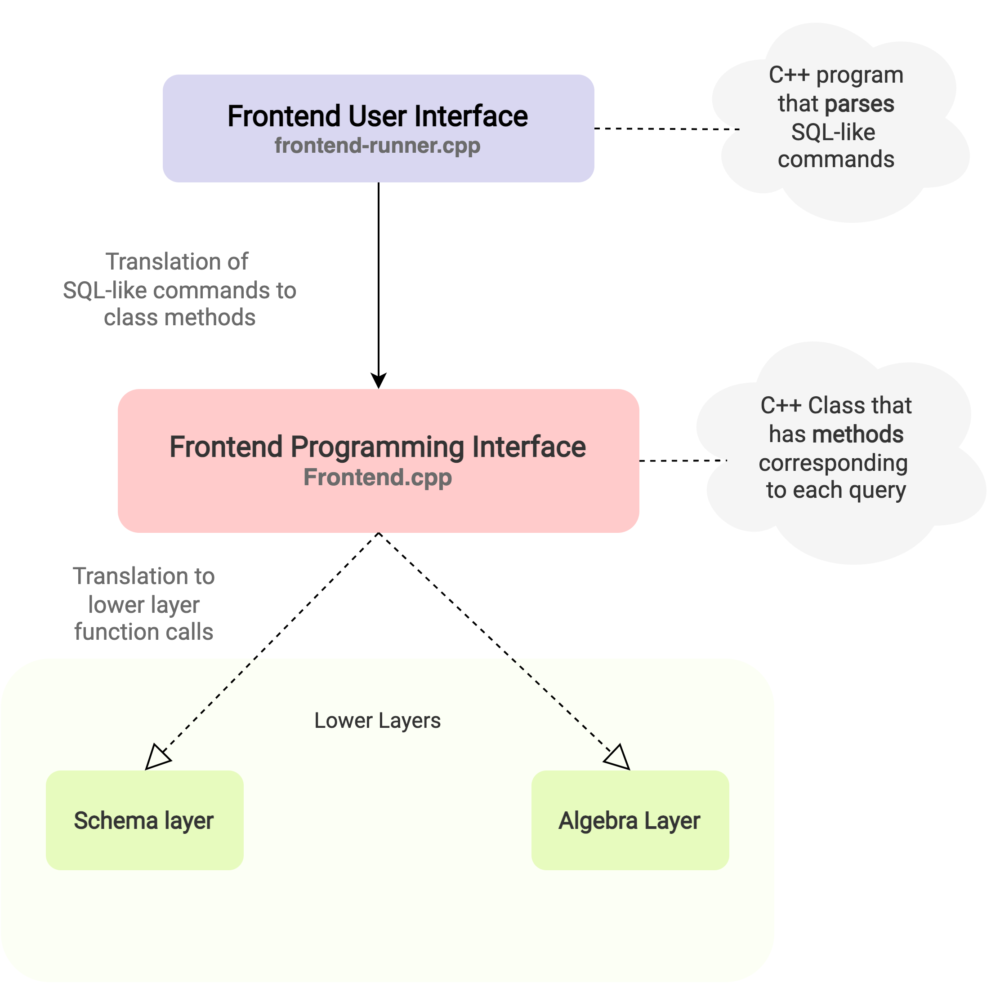

Frontend layer is the highest layer among the [7 layers of NITCbase](../System%20Design/DesignDiagram.md). It consists of 2 parts - [Frontend User Interface](../Frontend%20User%20Interface/introduction.md) and the Frontend Programming Interface as seen in the below figure.
<!--  -->


Frontend user interface is supplied to you and hence you do not need to implement. It will translate the input SQL-like queries, extracts the arguments and calls the appropriate methods of the Frontend Class/Frontend Programming Interface. The C++ Frontend Class specification is given below.

## Frontend Class
The C++ Frontend Class (`Frontend.cpp`) given to you is utilized by the Frontend User Interface (`frontend-runner.cpp`). The Frontend Class given has to be implemented by you by following the specification of all the class methods given in this section. All the methods of frontend class are static and it has the following C++ declaration:

```cpp
class Frontend {
public:
    // Data Definition Language (DDL) Commands
    static int create_table(char relname[ATTR_SIZE], 
                            int no_attrs, 
                            char attribute[no_attrs][ATTR_SIZE], 
                            int type_attr[no_attrs]);

    static int drop_table(char relname[ATTR_SIZE]);

    static int open_table(char relname[ATTR_SIZE]);

    static int close_table(char relname[ATTR_SIZE]);

    static int create_index(char relname[ATTR_SIZE],
                            char attrname[ATTR_SIZE]);

    static int drop_index(char relname[ATTR_SIZE], 
                          char attrname[ATTR_SIZE]);

    static int alter_table_rename(char relname_from[ATTR_SIZE], 
                                  char relname_to[ATTR_SIZE]);

    static int alter_table_rename_column(char relname[ATTR_SIZE], 
                                         char attrname_from[ATTR_SIZE], 
                                         char attrname_to[ATTR_SIZE]);

    // Data Manipulaiton Language (DML) Commands
    static int insert_into_table_from_file(char relname[ATTR_SIZE], 
                                           char filepath[ATTR_SIZE]);

    static int insert_into_table_values(char relname[ATTR_SIZE],
                                        vector<string> attr_values);

    static int select_from_table(char relname_source[ATTR_SIZE], 
                                 char relname_target[ATTR_SIZE]);

    static int select_attrlist_from_table(char relname_source[ATTR_SIZE], 
                                          char relname_target[ATTR_SIZE],
                                          int attr_count, 
                                          char attr_list[attr_count][ATTR_SIZE]);

    static int select_from_table_where(char relname_source[ATTR_SIZE], 
                                       char relname_target[ATTR_SIZE],
                                       char attribute[ATTR_SIZE], 
                                       int op, 
                                       char value[ATTR_SIZE]);

    static int select_attrlist_from_table_where(char relname_source[ATTR_SIZE], 
                                                char relname_target[ATTR_SIZE],
                                                int attr_count, 
                                                char attr_list[attr_count][ATTR_SIZE],
                                                char attribute[ATTR_SIZE], 
                                                int op, 
                                                char value[ATTR_SIZE]);

    static int select_from_join_where(char relname_source_one[ATTR_SIZE], 
                                      char relname_source_two[ATTR_SIZE],
                                      char relname_target[ATTR_SIZE],
                                      char join_attr_one[ATTR_SIZE], 
                                      char join_attr_two[ATTR_SIZE]);

    static int select_attrlist_from_join_where(char relname_source_one[ATTR_SIZE], 
                                               char relname_source_two[ATTR_SIZE],
                                               char relname_target[ATTR_SIZE],
                                               char join_attr_one[ATTR_SIZE], 
                                               char join_attr_two[ATTR_SIZE],
                                               int attr_count, 
                                               char attr_list[attr_count][ATTR_SIZE]);
};
```

The specifications for each method of this class is provided in the following sections.