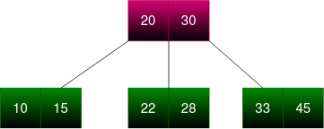
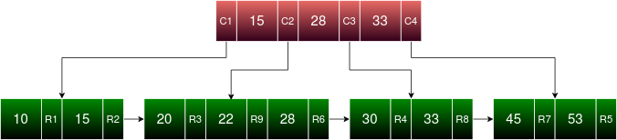
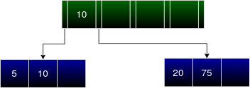
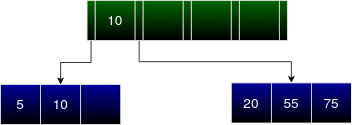
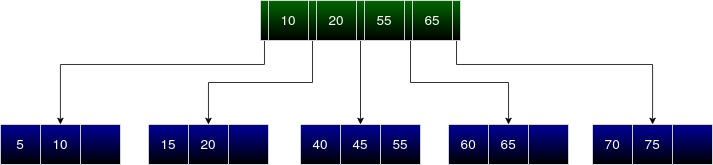
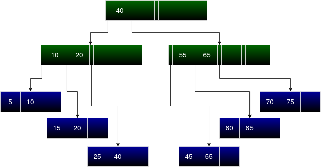

# B+ Trees

We know that the objective of indexing is to make the retrieval of records quicker. The key to achieve this lies in the choice of a suitable underlying data structure that defines the structure of index in the disk. Let us explore B+ Tree, which is the indexing data structure used in NITCbase.

## Introduction

We all are aware of how easy it is to locate a page or a topic in a book if you have an index. We can say that accessing each record in a database is also very easy when you have an index structure for the same. Creating an index is basically creating a data structure that holds the attribute value and a pointer to the records, i.e. a 'key-pointer' pair. We store the index in the disk so that, each time one needs to access the records, they can do so by searching these index blocks. The disk blocks required for the index is lesser, as the index record size is lesser. The advantage of indexing is that records could be fetched from the disk with fewer disk accesses.

Consider a disk having blocks of size 512 bytes. You need to store a relation `Student` having 5 attributes (`Roll No`, `Name`, `Marks`, `Grade`, `Attendance`) and 1000 records. If the size of the attribute is 4 bytes each, then each record requires 20 bytes. In turn, the whole relation requires 2000 bytes for storage.

The number of records that can be stored in a block $= \lfloor 512/20 \rfloor = 25$.

The number of blocks required for the storage of the whole relation $= \lceil 1000/25 \rceil = 40$.

Suppose we need to fetch records of students who have secured more than 50 marks.

Generally, one must access each of the records in these 40 blocks and check if they satisfy the search condition. The number of disk accesses can be reduced if an index is created for the attribute `Marks`. First, the index blocks are fetched. Then from it, based on each key that satisfies our search condition (key > 50), the records are fetched using the pointers. The number of index blocks would be considerably lesser than the number of record blocks i.e. 40, thereby increasing the performance of the database.

## Indexing Data Structures

For an exhaustive search on a linearly structured Index like an array, the time required for disk accesses is of complexity O(n), where n is the number of blocks that store the Index. In the case of a [Binary Search Tree](https://en.wikipedia.org/wiki/Binary_search_tree), the time required for the search of any entry in the array is reduced to $log_2 n$. The number of entries in each node of a BST is restricted to 1. Suppose we can increase this number and can introduce more branches to a single node so that the height of the tree as well as the number of accesses decreases. Such a tree is called the _m-way search tree_. Suppose you have 2 entries on a single node, then it can have at most 3 child nodes. For, eg:

This is known as a 3-way search tree with 2 keys. 
The _Order_ of a tree is the maximum number of children that a node in a tree can have. 
For a Multi-way search tree of order m, each node can have a maximum of m children and m-1 entries. The entries in each node are sorted. Similar to a BST all the entries on the left of a key in the node as well as their children, will be lesser than key. Consecutively, all the entries to the key’s right as well as its children will be greater than it.

How can we connect this to the database and relation? 
Assume each entry in the node of the tree to be the key that stores a record pointer along with it that points to the original record in the Record block of the disk. The height of the tree will determine the number of disk accesses required. Each node in the tree is now an Index block in the disk.

The disadvantage of m-way search trees is that they are _unbalanced_. i.e. every path from the root node to a leaf node is not of the same length. Since there are no rules for insertion of elements into an m-way search tree, it could be skewed to one side, i.e. every node could fall on one side increasing the time complexity of search from log(n) to O(n) in the worst case. 
B Trees and B+ Trees are [self-balancing](https://en.wikipedia.org/wiki/Self-balancing_binary_search_tree) m-way search trees confined to rules of insertion and deletion. So, every root to leaf paths is of the same length.

The properties of a _**B Tree**_ with order _m_ are :

- In a B tree, there are two kinds of nodes, Leaf Nodes and Internal(Non-Leaf) Nodes.
- Every Internal node has at most m children.
- An Internal Node with k children contains k-1 entries.
- Each entry in an Internal Node is (Left Child Pointer, Key Value, Record Pointer, Right Child Pointer). The key value is the attribute value and Record pointer points to the corresponding record in the disk. Left Child Pointer and Right Child Pointer contain the pointer to the respective child nodes. The key value is greater than all the elements in the left child node and is lesser than all the elements in the right child node.
- Each entry in a Leaf Node is (Key Value, Record Pointer).
- All Leaf Nodes appear on the same level. This is because when a node is full, we split them into two such that each node is always at least half full.
- The root has at least two children if it is not a leaf node.

The creation of a B Tree is bottom-up. We can visualize the tree as a multi-level index. The bottom layer can be considered the first level indexing, the layer above it as the second level indexing, so on.

Consider a table of 9 records that need to be indexed by a particular attribute. Let’s use a B-tree of order 4. If the attribute values corresponding to each record are inserted, we get a B Tree as shown below.
Entries : **15, 20, 22, 30, 33, 45, 10, 53, 28.**

R1-R9 are the record pointers pointing to the records corresponding to each entry on its left. C1-C3 are the pointers to each of the child nodes from the internal node.

As you can see, a record pointer is required at each node. This is a disadvantage because it reduces the number of entries that can be stored in a single node. It also increases the number of levels in the tree thereby increasing the complexity of the search._A solution to this problem is **B+ Tree.**_

## B+ Tree

A B+ Tree is fundamentally a B-Tree, having some additional properties.
The distinguishing features of a B+ Tree from a B Tree are:

- **In a B+ Tree, the Internal node can store more keys on the block of memory in comparison to a B Tree.**
  Each Leaf Node entry in a B+ Tree is ( Key Value, Record Pointer) similar to a B Tree. Each entry in an Internal Node of B+ Tree is (Left Child Pointer, Key Value, Right Child Pointer). Here, Record Pointers are stored only in Leaf Nodes in contrast to a B Tree where it is stored in both Leaf Nodes and Internal Nodes. This allows more keys to be stored in Internal Nodes, thereby reducing disk accesses.

- **In a B+ Tree, all the keys appear in the leaf nodes, unlike a B Tree.**
  In a B Tree, when a node is full (regardless of being a leaf node or internal node), the node is split and the middle entry is moved to the parent node. Whereas in a B+ Tree, when a leaf node becomes full and is split, the middle entry is stored in both the parent node and the leaf node. In the case of a split in the internal node, the middle entry is stored only in the parent similar to B Tree. So, now all keys appear in leaf nodes and all leaf nodes appear on the same level. As all paths from the root node to a leaf node are the same length, the tree is said to be balanced. A balanced tree guarantees that the number of disk accesses required to fetch any record is equal because all the paths from the root to the leaf nodes are the same length.

- **Search is quicker in a B+ Tree**
  The leaf nodes of B+ trees are maintained as a linked list maintaining key values in sorted order, so doing a linear scan of all keys will require just one pass through all the leaf nodes. A B tree, on the other hand, would require a traversal of every level in the tree. This property can be utilized for efficient search as well since Record Pointers are stored only in leaf nodes. For example, Consider a query to fetch records with a particular attribute value greater than _X_. At first, we traverse down the tree, starting from the root, to find the first key value in the leaf node that succeeds in satisfying our search condition and fetch that record using its record pointer. Since the keys are maintained in a sorted linked list manner, we can linearly scan further from our first success point.

:::info Question
**Q.** How many keys can be stored in an internal block of a B Tree and B+ Tree? (Block size: 1024 bytes, Record and Child pointer: 6 bytes)

View solution

**B Tree**:- An entry in an internal node can be considered as a set of a key, record pointer, and child pointer. Hence its size is 22 bytes (10+6+6). Hence number of entries is

$$
\left \lfloor \frac {1024} {22} \right \rfloor = 46
$$

We also need the remaining bytes to store the last child pointer. Therefore 46 keys in an internal node in a B Tree.

**B+ Tree**:- An entry in an internal node can have a key and a child pointer. This accounts for 16 bytes (10+6). Hence the number of entries is

$$
\left \lfloor \frac {1024} {16} \right \rfloor = 64
$$

Since we need to store an extra child pointer too, we can only store 63 keys.

:::

We can see that more keys can be stored in a B+ Tree than in a B Tree. This becomes a huge difference as the block size and record pointer size increases.

The above B Tree, when converted to a B+ Tree will look something like this. As discussed earlier, each of the entries in the B+ Tree corresponds to a particular attribute value in the relation.

## Insertion in a B+ Tree

Let's consider a B+ tree with 4 keys in each internal node and a maximum of 3 keys in a leaf node. Every insertion guarantees that all the entries are in sorted order in the linked list created by the leaf nodes. A concise algorithm for the insertion of a single entry is given below.

#### Algorithm

Firstly, we traverse down the tree from the root node to find the Leaf Node where our new entry is to be inserted.

1.  If the Leaf Node is not full, add the entry.
2.  Otherwise, split the Leaf Node.
    - Allocate new leaf and move half the elements of current leaf node to the new leaf node.
    - Insert a copy of the current Leaf Node's largest key(i.e. the middle key before split) into the parent.
    - If the parent is full, split it too. Add the middle key to its parent node.
    - Repeat until a parent is found that need not be split.

#### Example

Let’s understand B+ Tree creation and insertion using the following data. 
**10, 5, 75, 20, 55, 60, 65, 15, 40, 70, 45, 25, 40**

For inserting any new entry, first, we traverse the B+ Tree from its root node and find its position in the corresponding leaf node. If the leaf node can accommodate the new entry, it is inserted without much thought. 
As there is no tree initially, the first entry is inserted into a leaf node. Similarly, the rest of the insertion takes place until the leaf node is full. Maintain a sorted order in every node.

Let's insert : **10, 5,** and **75**.

This leaf node is now the root node of the B+ Tree.

Next, we must insert **20** into it. 
As you can see the leaf node is full. Hence we must create a new leaf node and redistribute the keys. Sort the entries (**5, 10, 20, 75**) and insert the first half (2 entries i.e. **5** and **10**) in the previous leaf node followed by the second half (i.e. **20** and **75**) in the new leaf node. The last entry of the first leaf node is stored in the internal node as the first entry whose left child points to the older leaf node and right child points to the new leaf node. This new internal node is the root node of the tree. 
You may see that a copy of the internal entries is always stored in the left child of the entry. Thus all the entries on its left child will be less than or equal to it as well as all the entries in its right child will be greater than it.

Now let’s insert **55** into the above created B+ Tree. 
Always remember that insertion happens only in the leaf nodes. The first step is to find the child node from the root node where the new entry will belong. Here **55** is greater than **10**, hence we check the right child of **10**. Since we have reached the leaf node we can insert the new entry if there is a vacant slot. Here we can insert **55** between **20** and **75**.

The next entry to be inserted is **60**. 
Traversing down the tree from the root node, **60** is to be inserted in the right child of **10** i.e. leaf node containing **20, 55, 75**. The leaf node is full hence we must split this into 2 leaf nodes and update the internal node. As explained above we can see **20** and **55** remain in the previous leaf node and **60** and **75** are stored in the new leaf node. **55** becomes the new entry to the internal node.

The next entry to be inserted is **65**. 
Traversing down the tree from the root node, we can infer that **65** must be inserted in the right child of **55**. In that leaf node, we have to insert **65** between **60** and **75**. Since the leaf node is not full, we can directly insert **65**.

The next insertion is of entry **15**. 
At a single glance, we can see a vacant slot after **10**. But we cannot insert **15** there. On traversing down the tree from the root node, **15** must be inserted in the child node between **10** and **55**. The said node is not full hence **15** can be inserted directly.

Next, we have to insert **40**. 
Consider the root node. **40** must be inserted in the leaf node between **10** and **55**. Since this leaf node is full, split the leaf node into 2 and distribute the 4 entries (**15, 20, 40, 55**) as explained before into these leaf nodes. Now the new entry to the internal node is **20**. Since the internal node has vacant slots, we can insert **20** into it. We must make sure that the entries in internal nodes are also in sorted order.

The next entry is **70**. 
The new entry is greater than all the entries in the root node. Hence it must be inserted in the child node after **55**. But the node is already full. Let’s split this node, insert the entries (**60, 65, 70, 75**) and update the parent node accordingly.

We must insert **45** next. 
It must be inserted in the child node between **20** and **55**. Here we can directly insert **45** between **40** and **55**.

The new entry is **25**. 
At the root node, we infer it must be inserted in the child node between **20** and **55**. This leaf node is already full. Hence must be split in order to accommodate **25**. **25** and **40** remain in the leaf node. **45** and **55** are written to a new node. 
**40** is the new entry to the internal node. Here we can see that the internal node is full. Therefore it must be split into 2 internal nodes and use another internal node as a parent to both these nodes. Sort all the internal node entries along with the new entry (**10, 20, 40, 55, 65**). 
Entries before the middle entry (**10** and **20**) are written back to the first (old) internal node whereas entries after the middle entry (**55** and **65**) are written to the 2nd (new) internal node. Make sure that the pointers to child nodes are updated correspondingly. The middle entry **40** becomes the first entry to the parent internal node.

Next insertion is again **40**. 
**40** is equal to the entry in the root node, and it is greater than all the entries in its left child. Hence we get the required leaf node which contains **25** and **40**. Since the leaf node is not full, **40** is inserted into it.

