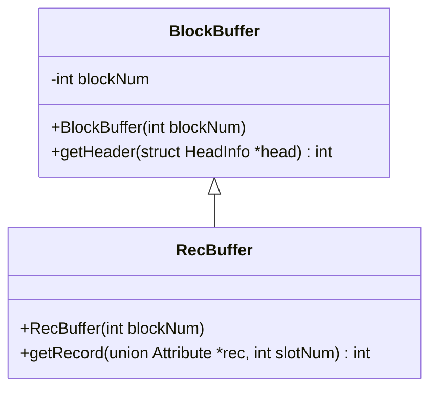

# Stage 2: Record Blocks and Catalogs (6 hours)

:::note Learning Objectives

- Understand in detail about record blocks in NITCbase
- Learn in detail about the catalog data structures used in NITCbase - relation and attribute catalog
- Learn to create relations using the XFS interface
- Learn to read from record blocks and display the values

:::

## Introduction

The main purpose of a relational database is to store and retrieve records. When we initially start adding entries to a database, we can obtain a random free disk block and start dumping the values into it one after another and we can traverse it just as easily. But, we are soon going to run out of space on the disk block. What will we do then? We'll get another random disk block and continue our process. But there's now a complication. How will we traverse between these two disk blocks while reading these entries. Clearly, we'll need to store the preceding and following disk block as some metadata in each block. You might've realized that this is in fact just a linked list and you're right. Records in NITCbase are stored in a linked list of disk blocks.

Now, what exactly is a **record**? It is just an array of **attribute values**. Each relation can have a different number of attributes and the total number of records per disk block of a relation varies based on that. Each record block is divided into **slots** of variable record size and each slot stores a single record.

So, now we have a lot of relations each having their own records stored on the disk across multiple blocks. How do we identify and organise these blocks? The **relation catalog** solves this problem in NITCbase. It stores the relation name, the number of attributes and other information related to the record blocks for all the relations in the database.

We now have a provision to keep track of the list of relations that we have stored in the database. But we don't have any information regarding the attributes of each relation. In a production database, an attribute can be one of a myriad of possible types, but here in NITCbase, we'll restrict that to two possible **types**: `NUM` and `STR`. Numbers and strings, as the name would suggest. Both of these types are fixed at a size **16 bytes** for the sake of simplicity. The **attribute catalog** stores these details of all the attributes of every relation in the database. It also stores details about indices created on attributes. We'll get into the details of indexing later.

The relation catalog and attribute catalog together allows us to get all the relations and their respective schemas from our disk. If you didn't realise it yet, the relation and attribute catalog themselves are just relations on our disk! And as such, the blocks storing all the data we mentioned are just record blocks. The first entries in the relation catalog are for itself and the attribute catalog. And the first entries in the attribute catalog are the attributes of the relation catalog and the attributes of itself. Recall the [Disk Model](../Design/Physical%20Layer.md#disk-model) where you read that the first few blocks are reserved for these data structures.

**Read the documentation for [record blocks](../Design/Physical%20Layer.md#record-block-structure) and [catalog structures](../Design/Physical%20Layer.md#catalog-structures) before proceeding further.**

<details>
<summary>
Q. Consider the following catalog entries and record for a relation.

<table>
<thead><tr><th colspan="6">Relation Catalog Entry</th></tr></thead>
<tbody>
  <tr><th>RelName</th> <th>#Attrs</th> <th>#Records</th> <th>FirstBlock</th> <th>LastBlock</th> <th>#Slots</th></tr>
  <tr><td>Students</td> <td>?</td> <td>?</td> <td>34</td> <td>35</td> <td>?</td></tr>
</tbody>
</table>
<table>
<thead><tr><th colspan="6">Attribute Catalog Entry</th></tr></thead>
<tbody>
  <tr><th>RelName</th> <th>AttrName</th> <th>AttrType</th> <th>PrimaryFlag</th> <th>RootBlock</th> <th>Offset</th></tr>
  <tr><td>Students</td> <td>Name</td> <td>?</td> <td>-</td> <td>-1</td> <td>?</td></tr>
  <tr><td>Students</td> <td>RollNo</td> <td>?</td> <td>-</td> <td>-1</td> <td>?</td></tr>
  <tr><td>Students</td> <td>Marks</td> <td>?</td> <td>-</td> <td>-1</td> <td>?</td></tr>
</tbody>
</table>

<table>
<thead><tr><th colspan="6">section from the record block</th></tr></thead>
<tbody>
  <tr><td>...</td> <td>B190539CS</td> <td>Jacques</td> <td>91.08</td> <td>...</td></tr>
</tbody>
</table>

Assume that the relation has only two record blocks and both are fully filled. Find all the missing values (marked with `?`).

(click to view answer)

</summary>

Since we have three entries in the attribute catalog, we can conclude that `#Attrs` = 3.

`#Slots` = $\left \lfloor \frac{2016}{(16*3)+1} \right \rfloor = 41$

Given that there are two fully filled records, `#Records` = 82.

From looking at the record block, we can infer the attribute catalog entries as so.

| AttrName | AttrType | Offset |
| -------- | -------- | ------ |
| Name     | STR      | 1      |
| RollNo   | STR      | 0      |
| Marks    | NUM      | 2      |

</details>

## Architecture

What we just covered is part of the [Physical Layer](../Design/Physical%20Layer.md) of NITCbase. NITCbase follows a 7-layer object oriented architecture. The layers are as described below:

1. Algebra Layer: Handles the high level relational algebraic operations of our database
2. Schema Layer: Handles the schema operations such as creation, deletion
3. Block Access Layer: Handles high-level operations on the disk such as search and insert
4. B+ Tree Layer: Handles all index related operations.
5. Cache Layer: Handles caching of the relation and attribute catalog
6. Buffer Layer: Handles buffered operations on all disk blocks
7. Physical Layer: Provides the low-level operations on the disk blocks.

We also have a frontend interface which is responsible for calling the appropriate function in the Schema/Algebra layer.

**Read the [home page](/) and [architecture page](../Design/Architecture.md) if you have not done so already.**

## Creating Relations

One of the critical features of a database is creating tables. In NITCbase, we can use the `CREATE TABLE` command to create a table. **Read [the documentation](../User%20Interface%20Commands/ddl.md#create-table) for the command before proceeding further.**

At this stage, we will not be implementing this functionality and will instead be using the XFS Interface to do this operation. Recall that the XFS interface already implements all the functionality of NITCbase.

Switch to the `XFS_Interface` folder and run `./xfs-interface` to access the prompt. Once in the prompt, we'll create a relation as follows

```plain
$ ./xfs-interface
//highlight-start
# CREATE TABLE Students(RollNumber STR, Name STR, Marks NUM, Class STR)
Relation Students created successfully
# exit
//highlight-end
```

We can verify the schema of the relation by running the [`schema` command](../User%20Interface%20Commands/efs.md#show-schema) in the XFS Interface

```plain
# schema Students
Relation: Students
Attribute        Type Index
---------------- ---- -----
RollNumber       STR  no
Name             STR  no
Marks            NUM  no
Class            STR  no
```

## Displaying the Relations

We have some relations in our DBMS now. Let's try to implement a way to see all the relations we created. To see the details of a relation, we just need to read the records stored in the relation and attribute catalogs. How do we do that?

Since we want to handle any number of relations, we need to be able to fetch the total number of relations on the disk. Where do we find this information? Recall that the header of each record block stores the number of entries in that block. Checking the header of the relation catalog should give us this number. Once we have this value (let it be `N`), we can get the names of the relations by reading the records at the first `N` slots of the relation catalog block. We will be implementing a rudimentary version of the `getHeader()` and `getRecord()` function of the [Buffer Layer](../Design/Buffer%20Layer.md) to do these operations.<br/>
A simplified class diagram with the functions we need to implement is shown below.



We have two classes, `BlockBuffer` and `RecBuffer`. An object of either of those classes allows us to work with a particular disk block (the `blockNum` member field). The `BlockBuffer` class implements the common operations available to all disk blocks. The `RecBuffer` class extends `BlockBuffer` to add functionality specific to a record block. We will implement the `BlockBuffer::getHeader()` and `RecBuffer::getRecord()` functions using the Disk operations that we are familiar with. These functions will assume that memory for it's arguments has been already allocated by the calling function.

We will also be makings use of two data structures for representing the data. **Read the documentation for [struct HeadInfo](../Design/Buffer%20Layer.md#headinfo) and [union Attribute](../Design/Buffer%20Layer.md#attribute) before proceeding further.**

:::info NOTE
All commonly used values have already been defined as [constants](/constants) and can be used throughout your implementation.

:::

Open the `BlockAccess.cpp` file in the `Buffer` folder and complete the following.

```cpp title="Buffer/BlockAccess.cp"

BlockBuffer::BlockBuffer(int blockNum) {
  // initialise this.blockNum with the argument
}

// calls the parent class constructor
RecBuffer::RecBuffer(int blockNum) : BlockBuffer::BlockBuffer(blockNum) {}

// load the block header into the argument pointer
int BlockBuffer::getHeader(struct HeadInfo *head) {
  unsigned char buffer[BLOCK_SIZE];

  // read the block at this.blockNum into the buffer

  // populate the numEntries, numAttrs and numSlots fields in *head
  memcpy(&head->numSlots, buffer + 24, 4);
  memcpy(&head->numEntries, /* fill this */, 4);
  memcpy(&head->numAttrs, /* fill this */, 4);
  memcpy(&head->rblock, /* fill this */, 4);
  memcpy(&head->lblock, /* fill this */, 4);

  return SUCCESS;
}

// load the record at slotNum into the argument pointer
int RecBuffer::getRecord(union Attribute *rec, int slotNum) {
  struct HeadInfo head;

  // get the header using this.getHeader() function

  int attrCount = head.numAttrs;
  int slotCount = head.numSlots;

  // read the block at this.blockNum into a buffer

  /* record at slotNum will be at offset HEADER_SIZE + slotMapSize + (recordSize * slotNum)
     - each record will have size attrCount * ATTR_SIZE
     - slotMap will be of size slotCount
  */
  int recordSize = attrCount * ATTR_SIZE;
  unsigned char *slotPointer = /* calculate buffer + offset */;

  // load the record into the rec data structure
  memcpy(rec, slotPointer, recordSize);

  return SUCCESS;
}
```

Now that we have these functions, we'll just need to make use of them in our `main.cpp` file to access the data.

```cpp title=main.cpp
int main(int argc, char *argv[]) {
  Disk disk_run;

  // create objects for the relation catalog and attribute catalog
  RecBuffer relCatBuffer(RELCAT_BLOCK);
  RecBuffer attrCatBuffer(ATTRCAT_BLOCK);

  HeadInfo relCatHeader;
  HeadInfo attrCatHeader;

  // load the headers of both the blocks into relCatHeader and attrCatHeader

  for (/* i = 0 to total relation count */) {

    Attribute relCatRecord[RELCAT_NO_ATTRS]; // will store the record from the relation catalog

    relCatBuffer.getRecord(relCatRecord, i);

    printf("Relation: %s\n", relCatRecord[RELCAT_REL_NAME_INDEX].sVal);

    for (/* j = 0 to number of entries in the attribute catalog */) {

      // declare attrCatRecord and load the attribute catalog entry into it

      if (/* attribute catalog entry corresponds to the current relation */) {
        const char *attrType = attrCatRecord[ATTRCAT_ATTR_TYPE_INDEX].nVal == NUMBER ? "NUM" : "STR";
        printf("  %s: %s\n", /* get the attribute name */, attrType);
      }
    }
    printf("\n");
  }

  return 0;
}
```

On compiling (run `make`) and executing this program, you should see the following output.

```plain
Relation: RELATIONCAT
  RelName: STR
  #Attributes: NUM
  #Records: NUM
  FirstBlock: NUM
  LastBlock: NUM
  #Slots: NUM

Relation: ATTRIBUTECAT
  RelName: STR
  AttributeName: STR
  AttributeType: NUM
  PrimaryFlag: NUM
  RootBlock: NUM
  Offset: NUM

Relation: Students
  RollNumber: STR
  Name: STR
  Marks: NUM
  Class: STR
```

Try creating more relations using the XFS interface and you'll see the schema of all those relations when you run NITCbase.

:::caution
The attribute catalog can span across multiple disk blocks. We are only reading from one block of the attribute catalog. If the total number of attributes exceeds 19, we will not be able to read past that.

:::

## Exercises

**Q1**. Modify this program to read across two blocks of the attribute catalog. Insert 4 more relations into the DBMS and print the details using NITCbase. (Hint: the `rblock` field in the header of the attribute catalog block gives the next block.)

**Q2**. Modify the `main` function to update the schema of the Student relation. Change the name of the `Class` attribute to `Batch` and confirm that the change has been made by running the program.
