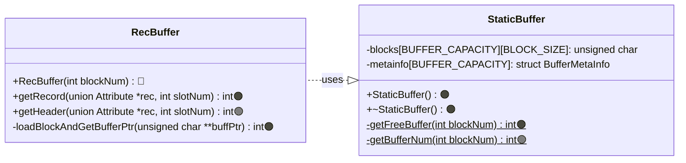
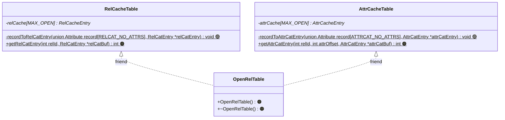

# Stage 3 : The Disk Buffer and Catalog Caches(10 hours)

:::note Learning Objectives

- Learn about the runtime data structures of NITCbase
- Implement a read-only buffer for record blocks
- Implement a read-only cache for the relation and attribute catalog

:::

:::tip PREREQUISITE READING

- [Catalog Structures](../Design/Physical%20Layer.md#catalog-structures)

:::

## Introduction

We have seen record blocks, the way they are represented on the NITCbase disk, and how to read and write from them. However, disk operations are quite slow and a bottleneck to the efficient functioning of our database. Memory operations are much more efficient, but are subject to space constraints. We should ensure that our system makes optimum use of memory wherever possible to build a fast and responsive database.

## Disk Buffer

Following the [principle of locality](https://en.wikipedia.org/wiki/Locality_of_reference), NITCbase buffers all the disk i/o operations. We will be pre-allocating memory for holding 32 disk blocks in memory at a given time. Whenever a disk block is accessed for the first time, it will be loaded into the buffer. All subsequent operations on that block will be done on that buffer until that disk block is swapped out by a more recently required disk block. All the changes done to the buffer will be commited back to the disk at that point.

However, in the present stage, we will not be implementing the write-back functionality. Here, we will modify our disk read operations to work from a buffer instead of the disk directly. This allows all subsequent read operations to be much quicker than repeatedly reading from the disk.

### Using the disk buffer

This functionality is implemented in the [StaticBuffer](../Design/Buffer%20Layer.md#class-staticbuffer) class. This class declares a static two dimensional array of size [BUFFER_CAPACITY](/constants) × [BLOCK_SIZE](/constants). The methods relevant to adding this functionality are shown in the class diagram below.

> **NOTE**: The functions are denoted with circles as follows.<br/>
> 🔵 -> methods that are already in their final state<br/>
> 🟢 -> methods that will attain their final state in this stage<br/>
> 🟠 -> methods that we will modify in this stage, but will require more work

<br/>



<br/>

Modify your `BlockBuffer.cpp` file to read from the buffer instead of the disk directly. We will be making use of the `loadBlockAndGetBufferPtr()` method instead of `Disk::readBlock()`. This function will call the appropriate `StaticBuffer` functions to load the block to a free buffer and get a pointer to it.

<details>
<summary>Buffer/BlockBuffer.cpp</summary>

```cpp
int BlockBuffer::getHeader(struct HeadInfo *head) {

  unsigned char *bufferPtr;
  int ret = loadBlockAndGetBufferPtr(&bufferPtr);
  if (ret != SUCCESS) {
    return ret;   // return any errors that might have occured in the process
  }

  // ...

  memcpy(&head->numSlots, bufferPtr + 24, 4);
  // ...
}

int RecBuffer::getRecord(union Attribute *rec, int slotNum) {
  // ...
  unsigned char *bufferPtr;
  int ret = loadBlockAndGetBufferPtr(&bufferPtr);
  if (ret != SUCCESS) {
    return ret;
  }
  // ...
}

int BlockBuffer::loadBlockAndGetBufferPtr(unsigned char **buffPtr) {
  // check whether the block is already present in the buffer using StaticBuffer.getBufferNum()
  int bufferNum = StaticBuffer::getBufferNum(this->blockNum);

  if (bufferNum == E_BLOCKNOTINBUFFER) {
    bufferNum = StaticBuffer::getFreeBuffer(this->blockNum);

    if (bufferNum == E_OUTOFBOUND) {
      return E_OUTOFBOUND;
    }

    Disk::readBlock(StaticBuffer::blocks[bufferNum], this->blockNum);
  }

  // store the pointer to this buffer (blocks[bufferNum]) in *buffPtr
  *buffPtr = StaticBuffer::blocks[bufferNum];

  return SUCCESS;
}
```

</details>

Now, we define all the `StaticBuffer` functions that we made use of. The `StaticBuffer` class has two member fields we are concerned about here. The `blocks` field is the actual buffer as we mentioned earlier. `metainfo` is an array of [struct BufferMetaInfo](../Design/Buffer%20Layer.md#buffer-structure) which is used to store the metadata of the [BUFFER_CAPACITY](/constants) blocks that are in the buffer. At this stage, we'll use this structure to keep track of whether a block is free or if it belongs to a particular block. _Both these arrays are static members of the class and hence need to be explicitly declared before they can be used._

<details>
<summary>Buffer/StaticBuffer.cpp</summary>

```cpp
unsigned char StaticBuffer::blocks[BUFFER_CAPACITY][BLOCK_SIZE];
struct BufferMetaInfo StaticBuffer::metainfo[BUFFER_CAPACITY];

StaticBuffer::StaticBuffer() {

  // initialise all blocks as free
  for (/*bufferIndex = 0 to BUFFER_CAPACITY-1*/) {
    metainfo[bufferIndex].free = true;
  }
}

// override the default destructor. we'll write this function later.
StaticBuffer::~StaticBuffer() {}

int StaticBuffer::getFreeBuffer(int blockNum) {
  if (blockNum < 0 || blockNum > DISK_BLOCKS) {
    return E_OUTOFBOUND;
  }
  int allocatedBuffer;

  // find the first free buffer and assign it's index to allocatedBuffer (check metainfo)

  metainfo[allocatedBuffer].free = false;
  metainfo[allocatedBuffer].blockNum = blockNum;

  return allocatedBuffer;
}

int StaticBuffer::getBufferNum(int blockNum) {
  // Check if blockNum is valid (non zero and less than number of disk blocks)
  // and return E_OUTOFBOUND if not valid.

  // find and return the bufferIndex which corresponds to blockNum (check metainfo)

  // if block is not in the buffer
  return E_BLOCKNOTINBUFFER;
}
```

</details>

You've now implemented a rudimentary version of a buffer. The only pending operation is to declare an instance of the class `StaticBuffer` in `main()` so that our constructor is called. _Ensure that this declaration happens after the instance of the `Disk` class is declared_.

<details>
<summary>main.cpp</summary>

```cpp
int main(int argc, char *argv[]) {

  Disk disk_run;
  StaticBuffer buffer;

  // ...
  // ...
}
```

</details>

Compile the program and execute it. You should get output identical to what you were getting in the previous stage.

---

## Caches

Almost all operations on a relation require access to its corresponding relation catalog and attribute catalog entries. Since this is such a common operation, NITCbase uses a more specialised data structure for operations on these structures. The **relation cache** and the **attribute cache** are specialised data structures used for accessing the catalogs. These caches are both arrays of size 12 ([MAX_OPEN](/constants)). Each entry in these arrays can store the catalog entries for a single relation. The entries in both the caches for a given index `i` < [MAX_OPEN](/constants) will correspond to the same relation.

An entry of the relation cache stores the relation catalog entry, the rec-id (block & slot number) of the entry on the disk, and some other runtime data. An entry of the attribute cache is a linked list where each node contains one of the attribute catalog entries for the relation, the corresponding rec-ids and some runtime metadata.

**Take a quick look at the documentation for [relation cache table structures](../Design/Cache%20Layer.md#relation-cache-table-structures) and [attribute cache table structures](../Design/Cache%20Layer.md#attribute-cache-table-structures) before proceeding further.** You don't need to understand any of the fields not mentioned here explicitly.

The index corresponding to a relation in the relation/attribute cache is called it's **relation id** or rel-id. NITCbase fixes that the catalog entries for the relation catalog will always be stored at **rel-id 0** (recall that the first relation in both the catalogs is the relation catalog). The catalog entries for the attribute catalog will always be stored at **rel-id 1**. At this stage, we will only be implementing the cache operations for these two relations.

### Setting up the cache

The next feature that we will add to NITCbase is a rudimentary version of the relation and attribute cache. This functionality is implemented in the [RelCacheTable](../Design/Cache%20Layer.md#class-relcachetable), [AttrCacheTable](../Design/Cache%20Layer.md#class-attrcachetable) and [OpenRelTable](../Design/Cache%20Layer.md#class-openreltable) classes. The details of [OpenRelTable](../Design/Cache%20Layer.md#class-openreltable) are not relevant at this stage and will be covered in later stages. In this stage, we will only be using the constructor of this class to initialise our caches. The class diagram below shows the functions we will be implementing.



<br/>

We'll start by implementing [RelCacheTable](../Design/Cache%20Layer.md#class-relcachetable). Here, we have two functions; `getRelCatEntry()` which is used to the get the [RelCatEntry](../Design/Cache%20Layer.md#relcatentry) from the relation cache and `recordToRelCatEntry()` which converts a record (array of [union Attribute](../Design/Buffer%20Layer.md#attribute)) to a [RelCatEntry](../Design/Cache%20Layer.md#relcatentry) struct. We also need to declare the static member field `relCache`.

<details>
<summary>Cache/RelCacheTable.cpp</summary>

```cpp
RelCacheEntry* RelCacheTable::relCache[MAX_OPEN];

int RelCacheTable::getRelCatEntry(int relId, RelCatEntry* relCatBuf) {
  if (relId < 0 || relId >= MAX_OPEN) {
    return E_OUTOFBOUND;
  }

  // copy the value to the relCatBuf argument
  *relCatBuf = relCache[relId]->relCatEntry;

  return SUCCESS;
}

// convert a relation catalog record to RelCatEntry struct
void RelCacheTable::recordToRelCatEntry(union Attribute record[RELCAT_NO_ATTRS], RelCatEntry* relCatEntry) {
  strcpy(relCatEntry->relName, record[RELCAT_REL_NAME_INDEX].sVal);
  relCatEntry->numAttrs = (int)record[RELCAT_NO_ATTRIBUTES_INDEX].nVal;

  // fill the rest of the relCatEntry struct with the values at RELCAT_NO_RECORDS_INDEX,
  // RELCAT_FIRST_BLOCK_INDEX, RELCAT_LAST_BLOCK_INDEX, RELCAT_NO_SLOTS_PER_BLOCK_INDEX
}
```

</details>

Similarly, in [AttrCacheTable](../Design/Cache%20Layer.md#class-attrcachetable), we have a static member field `attrCache` and two functions; `getAttrCatEntry()` which is used to the get the [AttrCatEntry](../Design/Cache%20Layer.md#attrcatentry) from the attribute cache and `recordToAttrCatEntry()` which converts a record (array of [union Attribute](../Design/Buffer%20Layer.md#attribute)) to an [AttrCatEntry](../Design/Cache%20Layer.md#attrcatentry) struct. _Note that an attribute cache entry is a linked list_. The attribute cache is an array of linked lists.

<details>
<summary>Cache/AttrCacheTable.cpp</summary>

```cpp
AttrCacheEntry* AttrCacheTable::attrCache[MAX_OPEN];

int AttrCacheTable::getAttrCatEntry(int relId, int attrOffset, AttrCatEntry* attrCatBuf) {
  // check if 0 <= relId < MAX_OPEN and return E_OUTOFBOUND otherwise

  // traverse the linked list of attribute cache entries
  for (AttrCacheEntry* entry = attrCache[relId]; entry != nullptr; entry = entry->next) {
    if (entry->attrCatEntry.offset == attrOffset) {

      // copy entry->attrCatEntry to *attrCatBuf and return SUCCESS;
    }
  }

  // there is no attribute at this offset
  return E_ATTRNOTEXIST;
}

void AttrCacheTable::recordToAttrCatEntry(union Attribute record[ATTRCAT_NO_ATTRS], AttrCatEntry* attrCatEntry) {
  strcpy(attrCatEntry->relName, record[ATTRCAT_REL_NAME_INDEX].sVal);

  // copy the rest of the fields in the record to the attrCacheEntry struct
}
```

</details>

Making use of the above defined functions, we can now modify our `main.cpp` file to fetch the catalog entries from the cache instead of the records. Additionally, we also declare an object of type `OpenRelTable` to invoke it's constructor. We'll implement this later. _Ensure that the `OpenRelTable` object is declared after the `Disk` and `StaticBuffer` objects_.

<details>
<summary>main.cpp</summary>

```cpp
int main(int argc, char *argv[]) {
  Disk disk_run;
  StaticBuffer buffer;
  OpenRelTable cache;

  /*
  for i = 0 and i = 1 (i.e RELCAT_RELID and ATTRCAT_RELID)

      get the relation catalog entry using RelCacheTable::getRelCatEntry()
      printf("Relation: %s\n", relname);

      for j = 0 to numAttrs of the relation - 1
          get the attribute catalog entry for (rel-id i, attribute offset j)
           in attrCatEntry using AttrCacheTable::getAttrCatEntry()

          printf("  %s: %s\n", attrName, attrType);
  */

  return 0;
}
```

</details>

You must now have an idea of the general flow of data between various functions. The only thing left to implement now is the constructor (and destructor) of class `OpenRelTable`. We'll use this constructor to read our `RELCAT` and `ATTRCAT` records from the disk into the cache. Recall that the index of a relation in the caches is called it's rel-id. The relation catalog has rel-id 0 ([RELCAT_RELID](/constants)) and the attribute catalog has rel-id 1([ATTRCAT_RELID](/constants)).

<details>
<summary>Cache/OpenRelTable.cpp</summary>

```cpp
OpenRelTable::OpenRelTable() {
  /************ Setting up Relation Cache entries ************/

  /**** setting up Relation Catalog relation in the Relation Cache Table****/
  RecBuffer relCatBlock(RELCAT_BLOCK);

  Attribute relCatRecord[RELCAT_NO_ATTRS];
  relCatBlock.getRecord(relCatRecord, RELCAT_SLOTNUM_FOR_RELCAT);

  struct RelCacheEntry relCacheEntry;
  RelCacheTable::recordToRelCatEntry(relCatRecord, &relCacheEntry.relCatEntry);
  relCacheEntry.recId.block = RELCAT_BLOCK;
  relCacheEntry.recId.slot = RELCAT_SLOTNUM_FOR_RELCAT;

  // allocate this on the heap because we want it to persist outside this function
  RelCacheTable::relCache[RELCAT_RELID] = (struct RelCacheEntry*)malloc(sizeof(RelCacheEntry));
  *(RelCacheTable::relCache[RELCAT_RELID]) = relCacheEntry;

  /**** setting up Attribute Catalog relation in the Relation Cache Table ****/

  // set up the relation cache entry for the attribute catalog similarly
  // from the record at RELCAT_SLOTNUM_FOR_ATTRCAT

  // set the value at RelCacheTable::relCache[ATTRCAT_RELID]


  /************ Setting up Attribute cache entries ************/

  /**** setting up Relation Catalog relation in the Attribute Cache Table ****/
  RecBuffer attrCatBlock(ATTRCAT_BLOCK);

  Attribute attrCatRecord[ATTRCAT_NO_ATTRS];

  // iterate through all the attributes of the relation catalog and create a linked
  // list of AttrCacheEntry (slots 0 to 5)
  // for each of the entries, set
  //    attrCacheEntry.recId.block = ATTRCAT_BLOCK;
  //    attrCacheEntry.recId.slot = i   (0 to 5)
  //    and attrCacheEntry.next appropriately

  // set the next field in the last entry to nullptr

  AttrCacheTable::attrCache[RELCAT_RELID] = /* head of the linked list */;

  /**** setting up Attribute Catalog relation in the Attribute Cache Table ****/

  // set up the attributes of the attribute cache similarly.
  // read slots 6-11 from attrCatBlock and initialise recId appropriately

  // set the value at AttrCacheTable::attrCache[ATTRCAT_RELID]
}

OpenRelTable::~OpenRelTable() {
  // free all the memory that you allocated in the constructor
}
```

</details>

And that's it; your NITCbase now uses buffers and caches! On compiling and executing this program, you should see the following output.

```plain
Relation: RELATIONCAT
  RelName: STR
  #Attributes: NUM
  #Records: NUM
  FirstBlock: NUM
  LastBlock: NUM
  #Slots: NUM

Relation: ATTRIBUTECAT
  RelName: STR
  AttributeName: STR
  AttributeType: NUM
  PrimaryFlag: NUM
  RootBlock: NUM
  Offset: NUM
```

## Exercises

**Q1**. Modify the program to cache and print the catalog entries for the relation `Students` we created in the last stage.

---

We will be working with the [Frontend Interface](../Design/Architecture.md) in all subsequent stages. All the functionality we implemented in the main function will be reimplemented in the appropriate handler function later. **Undo your changes and revert the `main.c` file to it's [original state](https://github.com/Nitcbase/nitcbase/blob/master/main.cpp) calling the `handleFrontend()` function.**
