# The Disk Buffer and Catalog Caches(6 hours)

:::note Learning Objectives

- Learn

:::

## Introduction

We have seen record blocks, the way they are represented on the NITCbase disk, and how to read and write from them. However, disk operations are quite slow and a bottleneck to the efficient functioning of our database. Memory operations are much more efficient, but are subject to space constraints. We should ensure that our system makes optimum use of memory wherever possible to build a fast and responsive database.

### Disk Buffer

Following the [principle of locality](https://en.wikipedia.org/wiki/Locality_of_reference), NITCbase buffers all the disk i/o operations. We will be pre-allocating memory for holding 32 disk blocks in memory at a given time. Whenever a disk block is accessed for the first time, it will be loaded into the buffer. All subsequent operations on that block will be done on that buffer until that disk block is swapped out by a more recently required disk block. All the changes done to the buffer will be commited back to the disk at that point.

However, in the present stage, we will not be implementing the write-back functionality. Here, we will modify our disk read operations to work from a buffer instead of the disk directly. This allows all subsequent read operations to be much quicker than repeatedly reading from the disk.

This functionality is implemented in the [StaticBuffer](../Design/Buffer%20Layer.md#class-staticbuffer) class. This class declares a static two dimensional array of size [BUFFER_CAPACITY](/constants) × [BLOCK_SIZE](/constants).

### Caches

Almost all operations on a relation require access to its corresponding relation catalog and attribute catalog entries. Since this is such a common operation, NITCbase uses a more specialised data structure for operations on these structures. The **relation cache** and the **attribute cache** are specialised data structures used for accessing the catalogs. These caches are both arrays of size 12 ([MAX_OPEN](/constants)). Each entry in these arrays can store the catalog entries for a single relation. The entries in both the caches for a given index i < [MAX_OPEN](/constants) will correspond to the same relation.

An entry of the relation cache stores the relation catalog entry, the rec-id (block & slot number) of the entry on the disk, and some other runtime data. An entry of the attribute cache is a linked list of all the attribute catalog entries for a relation, the corresponding rec-ids and some runtime metadata.

**Take a quick look at the documentation for [relation cache table structures](../Design/Cache%20Layer.md#relation-cache-table-structures) and [attribute cache table structures](../Design/Cache%20Layer.md#attribute-cache-table-structures) before proceeding further.** You don't need to understand any of the fields not mentioned here explicitly.

The index corresponding to a relation in the relation/attribute cache is called it's **relation id** or rel-id. NITCbase fixes that the catalog entries for the relation catalog will always be stored at **rel-id 0** (recall that the first relation in both the catalogs is the relation catalog). The catalog entries for the attribute catalog will always be stored at **rel-id 1**. At this stage, we will only be implementing the cache operations for these two relations.

This functionality is implemented in the [RelCacheTable](../Design/Cache%20Layer.md#class-relcachetable), [AttrCacheTable](../Design/Cache%20Layer.md#class-attrcachetable) and [OpenRelTable](../Design/Cache%20Layer.md#class-openreltable). The details of the [OpenRelTable](../Design/Cache%20Layer.md#class-openreltable) are not relevant at this stage and will be covered in later stages. In this stage, we will only be using the constructor of this class to initialise our caches.

## Adding memory operations to our database

Now let us develop our database to utilise memory as we described earlier.

### Using the disk buffer

The methods relevant to adding this functionality are shown in the class diagram below.

> **NOTE**: The functions are denoted with circles as follows.<br/>
> 🔵 -> methods that are already in their final state<br/>
> 🟢 -> methods that will attain their final state in this stage<br/>
> 🟠 -> methods that we will modify in this stage, but will require more work<br/>
> 🟤 -> methods that require more work, but we will leave as is in this stage

```mermaid
classDiagram
  direction RL
  class RecBuffer{
    +RecBuffer(int blockNum) 🔵
    +getRecord(union Attribute *rec, int slotNum) int🟠
    +getHeader(union Attribute *rec, int slotNum) int🟢
    -loadBlockAndGetBufferPtr(unsigned char **buffPtr) int🟠
  }
  class StaticBuffer{
    -blocks[BUFFER_CAPACITY][BLOCK_SIZE]: unsigned char
    -metainfo[BUFFER_CAPACITY]: struct BufferMetaInfo
    +StaticBuffer() 🟠
    +~StaticBuffer() 🟠
    -getFreeBuffer(int blockNum)$ int🟠
    -getBufferNum(int blockNum)$ int🟢
  }
  StaticBuffer<|..RecBuffer : uses
```

<br/>



<br/>

Modify your `BlockBuffer.cpp` file to read from the buffer instead of the disk directly. We will be making use of the `loadBlockAndGetBufferPtr()` method instead of `Disk::readBlock()`. This function will call the appropriate `StaticBuffer` functions to load the block to a free buffer and get a pointer to it.

```cpp title="Buffer/BlockBuffer.cpp"
int BlockBuffer::getHeader(struct HeadInfo *head) {

  unsigned char *bufferPtr;
  int ret = loadBlockAndGetBufferPtr(&bufferPtr);
  if (ret != SUCCESS) {
    return ret;   // return any errors that might have occured in the process
  }

  // ...

  memcpy(&head->numSlots, bufferPtr + 24, 4);
  // ...
}

int RecBuffer::getRecord(union Attribute *rec, int slotNum) {
  // ...
  unsigned char *bufferPtr;
  int ret = loadBlockAndGetBufferPtr(&bufferPtr);
  if (ret != SUCCESS) {
    return ret;
  }
  // ...
}

int BlockBuffer::loadBlockAndGetBufferPtr(unsigned char **buffPtr) {
  // check whether the block is already present in the buffer using StaticBuffer.getBufferNum()
  int bufferNum = StaticBuffer::getBufferNum(this->blockNum);

  if (bufferNum == E_BLOCKNOTINBUFFER) {
    bufferNum = StaticBuffer::getFreeBuffer(this->blockNum);

    if (bufferNum == E_OUTOFBOUND) {
      return E_OUTOFBOUND;
    }

    Disk::readBlock(StaticBuffer::blocks[bufferNum], this->blockNum);
  }

  // store the pointer to this buffer (blocks[bufferNum]) in *buffPtr
  *buffPtr = StaticBuffer::blocks[bufferNum];

  return SUCCESS;
}
```

<br/>

Now, we define all the `StaticBuffer` functions that we made use of. The `StaticBuffer` class has two member fields we are concerned about here. The `blocks` field is the actual buffer as we mentioned earlier. `metainfo` is an array of [struct BufferMetaInfo](../Design/Buffer%20Layer.md#buffer-structure) which is used to store the metadata of the [BUFFER_CAPACITY](/constants) blocks that are in the buffer. At this stage, we'll use this structure to keep track of whether a block is free or if it belongs to a particular block. _Both these arrays are static members of the class and hence need to be explicitly declared before they can be used._

```cpp title="Buffer/StaticBuffer.cpp"
unsigned char StaticBuffer::blocks[BUFFER_CAPACITY][BLOCK_SIZE];
struct BufferMetaInfo StaticBuffer::metainfo[BUFFER_CAPACITY];

StaticBuffer::StaticBuffer() {

  // initialise all blocks as free
  for (/*bufferIndex = 0 to BUFFER_CAPACITY-1*/) {
    metainfo[bufferIndex].free = true;
  }
}

// override the default destructor. we'll write this function later.
StaticBuffer::~StaticBuffer() {}

int StaticBuffer::getFreeBuffer(int blockNum) {
  if (blockNum < 0 || blockNum > DISK_BLOCKS) {
    return E_OUTOFBOUND;
  }
  int allocatedBuffer;

  // find the first free buffer and assign it's index to allocatedBuffer (check metainfo)

  metainfo[allocatedBuffer].free = false;
  metainfo[allocatedBuffer].blockNum = blockNum;

  return allocatedBuffer;
}

int StaticBuffer::getBufferNum(int blockNum) {
  // Check if blockNum is valid (non zero and less than number of disk blocks)
  // and return E_OUTOFBOUND if not valid.

  // find and return the bufferIndex which corresponds to blockNum (check metainfo)

  // if block is not in the buffer
  return E_BLOCKNOTINBUFFER;
}
```

You've now implemented a rudimentary version of a buffer. The only pending operation is to declare an instance of the class `StaticBuffer` in `main()` so that our constructor is called. _Ensure that this declaration happens after the instance of the `Disk` class is declared_.

```cpp title="main.cpp"
int main(int argc, char *argv[]) {

  Disk disk_run;
  StaticBuffer buffer;

  // ...
  // ...
}
```

Compile the program and execute it. You should get output identical to what you were getting in the previous stage.

---

### Initialising the cache

Let's modify our `main.cpp` file to read this data from the cache.

```cpp title=main.cpp
int main(int argc, char *argv[]) {
  Disk disk_run;

  for (/* for i = 0 and i = 1*/) {
    struct RelCatEntry relCatEntry;

    // get the relation catalog entry for rel-id i in relCatEntry
    // using RelCacheTable::getRelCatEntry()

    printf("Relation: %s\n", relCatEntry.relName);

    for (/* j = 0 to numAttrs of the relation - 1 */) {
      struct AttrCatEntry attrCatEntry;

      // get the attribute catalog entry for (rel-id i, attribute offset j)
      // in attrCatEntry using AttrCacheTable::getAttrCatEntry()

      const char *attrType = (/* check the type of the attribute */) ? "NUM" : "STR";
      printf("  %s: %s\n", attrCatEntry.attrName, attrType);
    }
    printf("\n");
  }

  return 0;
}
```

Now, let us modify our program to read the catalog details into the respective caches.

load the relation cache, open relation table, and attr cache table

update the read operations to use static buffer

On running this program, we should see identical output as you saw in the last for the relations RELCAT and ATTRCAT.

## Exercises

insert questions here

We will be working with the [Frontend Interface](../Design/Architecture.md) in all subsequent stages. We will move the operations we implemented to the appropriate function. **Undo your changes and revert the `main.c` file to it's [original state](https://github.com/Nitcbase/nitcbase/blob/master/main.cpp) before proceeding further.**
