# Stage 4 : Linear Search on Relations (12 hours)

:::note Learning Objectives

- Familiarise with the mechanism of receiving commands from the Frontend User Interface and calling the appropriate function in the lower layers through the Frontend Programming Interface
- Implement linear search on a relation whose metadata is available in the relation and attribute caches to display the records

:::

:::tip PREREQUISITE READING

- [External Filesystem (XFS) Commands](../User%20Interface%20Commands/efs.md)

:::

## Introduction

We discussed the relation and attribute cache in the previous stage. Your implementation must now be able to read the rows and columns of the relations `RELCAT` and `ATTRIBUTECAT` from the caches and display the attributes for these relations. In this stage, we'll implement a search functionality so that we can search through all the records of these relations too.

## The Search Operation

A search operation involves fetching all records that satisfy some condition. This is also known as a selection operation in [relational algebra](https://en.wikipedia.org/wiki/Relational_algebra). NITCbase supports selection with the following operators: `=`, `!=`, `>`, `>=`, `<` `>=`. We'll implement a function that will do the appropriate search and return to us a record that satisfies our condition each time it's called. Higher levels can call this function repeatedly until there are no more records to be found.

You might've realized that the above function would require some global state to work as intended. We'll need to keep track of the previously found record so that we can fetch the next record that satisfies the condition. And that is exactly what the `searchIndex` field in the relation cache does. `searchIndex` in a relation cache entry stores the `rec-id = {block, slot}` of the last hit during linear search on that relation. A value of `rec-id = {-1, -1}` indicates that the search should start over from the beginning again.

The search functionality is implemented in the [Block Access Layer](../Design/Block%20Access%20Layer.md) of NITCbase and made available to the user through the [SELECT](../User%20Interface%20Commands/dml.md#select--from-table-where) command. This command will be parsed and handled by the [Frontend Interface](../Design/Frontend.md#frontend-programming-interface) which will call the [Algebra Layer](../Design/Algebra%20Layer.md). The `searchIndex` field and it's operations will be implemented in the [Cache Layer](../Design/Cache%20Layer/intro.md).

## Implementation

A sequence diagrams documenting the flow of data between the layers is shown below.

> **NOTE**: The functions are denoted with circles as follows.<br/>
> 🔵 -> methods that are already in their final state<br/>
> 🟢 -> methods that will attain their final state in this stage<br/>
> 🟠 -> methods that we will modify in this stage, and in subsequent stages <br/>
> 🟤 -> methods that we built earlier and require more work later, but will leave as is in this stage

```mermaid
 %%{init: { 'sequence': {'mirrorActors':false} } }%%
sequenceDiagram
    actor User
    participant Frontend User Interface
    participant Frontend Programming Interface
    participant Algebra Layer
    participant Block Access Layer
    participant Cache Layer
    participant Buffer Layer
    User->>Frontend User Interface: SELECT
    activate Frontend User Interface
    Frontend User Interface->>Frontend Programming Interface:select_from_table_where()🟢
    activate Frontend Programming Interface
    Frontend Programming Interface->>Algebra Layer:select()🟠
    activate Algebra Layer
    loop until all records found
      Algebra Layer->>Block Access Layer:linearSearch()🟢
      activate Block Access Layer
      Block Access Layer->>Cache Layer:cache functions
      activate Cache Layer
      Cache Layer-->>Block Access Layer:relCatEntry, attrCatEntry
      deactivate Cache Layer
      Block Access Layer->>Buffer Layer:getHeader()🔵, getRecord()🔵, getSlotmap()🟢
      activate Buffer Layer
      Buffer Layer-->>Block Access Layer: record block info
      deactivate Buffer Layer
      Block Access Layer-->>Algebra Layer:recId
      deactivate Block Access Layer
    end
    Algebra Layer-->>User:operation status
    deactivate Algebra Layer
    deactivate Frontend Programming Interface
    deactivate Frontend User Interface

```

<br/>



<br/>

A class diagram showing the methods relevant to this functionality in the [Cache Layer](../Design/Cache%20Layer/intro.md), [Buffer Layer](../Design/Buffer%20Layer/intro.md), [Block Access Layer](../Design/Block%20Access%20Layer.md) and [Algebra Layer](../Design/Algebra%20Layer.md) is shown below.

```mermaid
classDiagram
  class Algebra{
    +select(char srcRel[ATTR_SIZE], char targetRel[ATTR_SIZE], char attr[ATTR_SIZE], int op, char strVal[ATTR_SIZE])$ int🟠
  }
  class BlockAccess{
    +linearSearch(int relId, char attrName[ATTR_SIZE], Attribute attrVal, int op)$ RecId🟢
  }
```



---

**Cache Layer**

```mermaid
classDiagram
  direction RL
  RelCacheTable <|.. OpenRelTable : friend
  AttrCacheTable <|.. OpenRelTable : friend

  class RelCacheTable{
    -relCache[MAX_OPEN] : RelCacheEntry*
    -recordToRelCatEntry(union Attribute record[RELCAT_NO_ATTRS], RelCatEntry *relCatEntry)$ void🔵
    +getRelCatEntry(int relId, RelCatEntry *relCatBuf)$ int🔵
    +getSearchIndex(int relId, RecId *searchIndex)$ int🟢
    +setSearchIndex(int relId, RecId *searchIndex)$ int🟢
    +resetSearchIndex(int relId)$ int🟢
  }
  class AttrCacheTable{
      -attrCache[MAX_OPEN] : AttrCacheEntry*
      -recordToAttrCatEntry(union Attribute record[ATTRCAT_NO_ATTRS], AttrCatEntry *attrCatEntry)$ void🔵
      +getAttrCatEntry(int relId, int attrOffset, AttrCatEntry *attrCatBuf)$ int🔵
      +getAttrCatEntry(int relId, char attrName[ATTR_SIZE], AttrCatEntry *attrCatBuf)$ int🟢
  }
  class OpenRelTable{
      +OpenRelTable(): 🟤
      +~OpenRelTable(): 🟤
      +getRelId(char relName[ATTR_SIZE])$ int🟠
  }

```



---

**Buffer Layer**

```mermaid
classDiagram
  direction LR
  BlockBuffer <|-- RecBuffer
  class RecBuffer{
    +RecBuffer(int blockNum) 🔵
    +getRecord(union Attribute *rec, int slotNum) int🔵
    +getSlotMap(unsigned char *slotMap) int🟢
  }
  class BlockBuffer{
    #int blockNum
    +BlockBuffer(int blockNum) 🔵
    +getHeader(struct HeadInfo *head) int🔵
    #loadBlockAndGetBufferPtr(unsigned char **buffPtr) int🟤
  }
```



<br/>

We will be working with the [Frontend Interface](../Design/Architecture.md) from this stage onwards. For all subsequent stages, your `main.cpp` only needs to have declarations of `Disk`, `StaticBuffer` and `OpenRelTable` classes and a call to the `handleFrontend()` function as shown below.

:::info NOTE

The `handleFrontend()` function runs in an infinite loop receiving commands from the user. Similar to the XFS Interface, **graceful exit from the Frontend Interface is done using the `exit` command**.

In earlier stages, you had implemented the constructors for the `StaticBuffer` and `OpenRelTable` classes. In later stages, we will be implementing the destructors for these classes as well. The `Disk` class too has a destructor defined. It is essential that these destructors be run to ensure that all the changes we make during runtime are written back to the disk.

The destructors will only be run if the program exits gracefully. If the program was to be killed with the `Ctrl`+`C` combination, the destructors will not be run and any changes made will be lost. Recall that all runtime changes in NITCbase are written to a temporary disk copy, and the changes are copied to the actual disk only at the time of program exit.
:::

<details>
<summary>main.cpp</summary>

```cpp
int main(int argc, char *argv[]) {
  Disk disk_run;
  StaticBuffer buffer;
  OpenRelTable cache;

  return FrontendInterface::handleFrontend(argc, argv);
}
```

</details>

As shown in the sequence diagram above, the Frontend User Interface will parse the `SELECT` command and call the `Frontend::select_from_table()` function in the Frontend Programming Interface. The actual _select_ functionality is implemented in the [Algebra Layer](../Design/Algebra%20Layer.md). Hence, the implementation of the `Frontend::select_from_table()` function only involves a call to the `Algebra::select()` function.

:::caution NOTE
In the current stage, we will only be implementing the handler for a command of the form

```sql
SELECT * FROM RelName INTO TargetName WHERE Attribute `op` value;
```

There are other versions of the `SELECT` command which map to different handlers as shown below:

| Frontend User Interface Command                                                       | Frontend Programming Interface Handler         |
| ------------------------------------------------------------------------------------- | ---------------------------------------------- |
| SELECT Attribute1,Attribute2 FROM RelName INTO TargetName WHERE Attribute `op` value; | `Frontend::select_attrlist_from_where()`       |
| SELECT \* FROM RelName INTO TargetName;                                               | `Frontend::select_from_table()`                |
| SELECT Attribute1,Attribute2 FROM RelName INTO TargetName;                            | `Frontend::select_attrlist_from_table_where()` |

Since we have only implemented the `Frontend::select_from_table()` function, the other commands do not currently do anything.

:::

<details>
<summary>Frontend/Frontend.cpp</summary>

```cpp
int Frontend::select_from_table_where(char relname_source[ATTR_SIZE], char relname_target[ATTR_SIZE],
                                      char attribute[ATTR_SIZE], int op, char value[ATTR_SIZE]) {
  return Algebra::select(relname_source, relname_target, attribute, op, value);
}
```

</details>

Before we can get into implementing search, we need to understand `searchIndex` and implement the associated functions in the [Cache Layer](../Design/Cache%20Layer/intro.md).

Each entry in the relation cache has a `searchIndex` field (see [struct RelCatEntry](../Design/Cache%20Layer/intro.md#relcacheentry)). To start a search operation from the first record, we initialise this field with `{-1, -1}` with the `RelCacheTable::resetSearchIndex()` function. Once a linear search operation is executed and a record is found, we update `searchIndex` with the rec-id(`{block, slot}`) of that record using `RelCacheTable::setSearchIndex()`. The next time `linearSearch()` is called, search will resume from this block until a successful block is found.

The [RelCacheTable](../Design/Cache%20Layer/RelCacheTable.md) defines methods to provide this functionality.

<details>
<summary>Cache/RelCacheTable.cpp</summary>

```cpp

/* will return the searchIndex for the relation corresponding to `relId
NOTE: this function expects the caller to allocate memory for `*searchIndex`
*/
int RelCacheTable::getSearchIndex(int relId, RecId* searchIndex) {
  // check if 0 <= relId < MAX_OPEN and return E_OUTOFBOUND otherwise

  // check if relCache[relId] == nullptr and return E_RELNOTOPEN if true

  // copy the searchIndex field of the Relation Cache entry corresponding
  //   to input relId to the searchIndex variable.
  *searchIndex = relCache[relId]->searchIndex;
  return SUCCESS;
}

// sets the searchIndex for the relation corresponding to relId
int RelCacheTable::setSearchIndex(int relId, RecId* searchIndex) {

  // check if 0 <= relId < MAX_OPEN and return E_OUTOFBOUND otherwise

  // check if relCache[relId] == nullptr and return E_RELNOTOPEN if true

  // update the searchIndex value in the relCache for the relId to the searchIndex argument

  return SUCCESS;
}

int RelCacheTable::resetSearchIndex(int relId) {
  // use setSearchIndex to set the search index to {-1, -1}
}

```

</details>

The [SELECT](../User%20Interface%20Commands/dml.md#select--from-table-where) command specifies a condition expecting to fetch all the records that satisfy the condition. While checking for this condition, we will need to have the details of the attribute which is part of the condition. In the previous stage, we had implemented the `AttrCacheTable::getAttrCatEntry()` function in the [Cache Layer](../Design/Cache%20Layer/intro.md) which returned to us the attribute at a particular offset. Here, we overload that function to find an attribute of a relation with a particular name.

<details>
<summary>Cache/AttrCacheTable.cpp</summary>

```cpp
/* returns the attribute with name `attrName` for the relation corresponding to relId
NOTE: this function expects the caller to allocate memory for `*attrCatBuf`
*/
int AttrCacheTable::getAttrCatEntry(int relId, char attrName[ATTR_SIZE], AttrCatEntry* attrCatBuf) {

  // check that relId is valid and corresponds to an open relation

  // iterate over the entries in the attribute cache and set attrCatBuf to the entry that
  //    matches attrName

  // no attribute with name attrName for the relation
  return E_ATTRNOTEXIST;
}


```

</details>

One last thing we will need before implementing search is the ability to read the slotmap so that we can iterate through all the valid records of the relation. Let's add that function to our [RecBuffer](../Design/Buffer%20Layer/RecBuffer.md) implementation in the [Buffer Layer](../Design/Buffer%20Layer/intro.md).

<details>
<summary>Buffer/BlockBuffer.cpp</summary>

```cpp
/* used to get the slotmap from a record block
NOTE: this function expects the caller to allocate memory for `*slotMap`
*/
int RecBuffer::getSlotMap(unsigned char *slotMap) {
  unsigned char *bufferPtr;

  // get the starting address of the buffer containing the block using loadBlockAndGetBufferPtr().
  int ret = loadBlockAndGetBufferPtr(&bufferPtr);
  if (ret != SUCCESS) {
    return ret;
  }

  struct HeadInfo head;
  // get the header of the block using getHeader() function

  int slotCount = /* number of slots in block from header */;

  // get a pointer to the beginning of the slotmap in memory by offsetting HEADER_SIZE
  unsigned char *slotMapInBuffer = bufferPtr + HEADER_SIZE;

  // copy the values from `slotMapInBuffer` to `slotMap` (size is `slotCount`)

  return SUCCESS;
}

```

</details>

Now, we finally implement linear search on our database. As mentioned earlier, NITCbase supports 6 operators in our search operation (`=`, `!=`, `>`, `>=`, `<` `>=`).

An attribute in NITCbase can be either a string or a number. In case the attribute is a number, the operators work as you'd expect. If it is a string, the operation is performed with respect to lexicographic order (i.e `>` would be checked on the first differing letter between two strings). It would be convenient in our operation to abstract this implementation detail to a separate function. That is exactly what the [compareAttrs function](../Design/Buffer%20Layer/intro.md#compareattrs) in `Buffer/BlockBuffer.cpp` does.

> **TASK**: Implement the [compareAttrs function](../Design/Buffer%20Layer/intro.md#compareattrs) in `Buffer/BlockBuffer.cpp` before proceeding further.

Now, we implement the `BlockAccess::linearSearch()` function in the [Block Access Layer](../Design/Block%20Access%20Layer.md).

<details>
<summary>BlockAccess/BlockAccess.cpp</summary>

Implement the `BlockAccess::linearSearch()` function by looking at the algorithm given in the [design docs](../Design/Block%20Access%20Layer.md#blockaccess--linearsearch).

</details>

The last thing we need to do is to make use of the records that we get from `BlockAccess::linearSearch()` and print it to the console so that we can see it. This functionality is implemented in the `Algebra::select()` function in the [Algebra Layer](../Design/Algebra%20Layer.md).

In actuality, NITCbase only allows you to _select_ records into another relation. But, at this stage we will ignore the target relation and just print the selected records onto the console. This will be modified later according to the actual specification.

<details>
<summary>Algebra/Algebra.cpp</summary>

```cpp

/* used to select all the records that satisfy a condition.
the arguments of the function are
- srcRel - the source relation we want to select from
- targetRel - the relation we want to select into. (ignore for now)
- attr - the attribute that the condition is checking
- op - the operator of the condition
- strVal - the value that we want to compare against (represented as a string)
*/
int Algebra::select(char srcRel[ATTR_SIZE], char targetRel[ATTR_SIZE], char attr[ATTR_SIZE], int op, char strVal[ATTR_SIZE]) {
  int srcRelId = OpenRelTable::getRelId(srcRel);      // we'll implement this later
  if (srcRelId == E_RELNOTOPEN) {
    return E_RELNOTOPEN;
  }

  AttrCatEntry attrCatEntry;
  // get the attribute catalog entry for attr, using AttrCacheTable::getAttrcatEntry()
  //    return E_ATTRNOTEXIST if it returns the error


  /*** Convert strVal (string) to an attribute of data type NUMBER or STRING ***/
  int type = attrCatEntry.attrType;
  Attribute attrVal;
  if (type == NUMBER) {
    if (isNumber(strVal)) {       // the isNumber() function is implemented below
      attrVal.nVal = atof(strVal);
    } else {
      return E_ATTRTYPEMISMATCH;
    }
  } else if (type == STRING) {
    strcpy(attrVal.sVal, strVal);
  }

  /*** Selecting records from the source relation ***/

  // Before calling the search function, reset the search to start from the first hit
  // using RelCacheTable::resetSearchIndex()

  RelCatEntry relCatEntry;
  // get relCatEntry using RelCacheTable::getRelCatEntry()

  /************************
  The following code prints the contents of a relation directly to the output
  console. Direct console output is not permitted by the actual the NITCbase
  specification and the output can only be inserted into a new relation. We will
  be modifying it in the later stages to match the specification.
  ************************/

  printf("|");
  for (int i = 0; i < relCatEntry.numAttrs; ++i) {
    AttrCatEntry attrCatEntry;
    // get attrCatEntry at offset i using AttrCacheTable::getAttrCatEntry()

    printf(" %s |", attrCatEntry.attrName);
  }
  printf("\n");

  while (true) {
    RecId searchRes = BlockAccess::linearSearch(srcRelId, attr, attrVal, op);

    if (searchRes.block != -1 && searchRes.slot != -1) {

      // get the record at searchRes using BlockBuffer.getRecord

      // print the attribute values in the same format as above

    } else {

      // (all records over)
      break;
    }
  }

  return SUCCESS;
}


// will return if a string can be parsed as a floating point number
bool isNumber(char *str) {
  int len;
  float ignore;
  /*
    sscanf returns the number of elements read, so if there is no float matching
    the first %f, ret will be 0, else it'll be 1

    %n gets the number of characters read. this scanf sequence will read the
    first float ignoring all the whitespace before and after. and the number of
    characters read that far will be stored in len. if len == strlen(str), then
    the string only contains a float with/without whitespace. else, there's other
    characters.
  */
  int ret = sscanf(str, "%f %n", &ignore, &len);
  return ret == 1 && len == strlen(str);
}

```

</details>

In the above function, we made use of the function `OpenRelTable::getRelId()` to get the rel-id of the source relation. Since we're currently only working with the relation and attribute catalog, we define the function as follows.

<details>
<summary>Cache/OpenRelTable.cpp</summary>

```cpp
/* This function will open a relation having name `relName`.
Since we are currently only working with the relation and attribute catalog, we
will just hardcode it. In subsequent stages, we will loop through all the relations
and open the appropriate one.
*/
int OpenRelTable::getRelId(char relName[ATTR_SIZE]) {

  // if relname is RELCAT_RELNAME, return RELCAT_RELID
  // if relname is ATTRCAT_RELNAME, return ATTRCAT_RELID

  return E_RELNOTOPEN;
}
```

</details>

And that's it! Your NITCbase should now support searching through records. Let's try it out. Execute `make` and run the program. Run the following commands.

```
# SELECT * FROM ATTRIBUTECAT INTO null WHERE RelName=RELATIONCAT;
| RelName | AttributeName | AttributeType | PrimaryFlag | RootBlock | Offset |
| RELATIONCAT | RelName |  1 | -1 | -1 |  0 |
| RELATIONCAT | #Attributes |  0 |  1 | -1 |  1 |
| RELATIONCAT | #Records |  0 |  1 | -1 |  2 |
| RELATIONCAT | FirstBlock |  0 | -1 | -1 |  3 |
| RELATIONCAT | LastBlock |  0 |  1 | -1 |  4 |
| RELATIONCAT | #Slots |  0 |  1 | -1 |  5 |
Selected successfully into null

# SELECT * FROM RELATIONCAT INTO null WHERE #Records>10;
| RelName | #Attributes | #Records | FirstBlock | LastBlock | #Slots |
| ATTRIBUTECAT |  6 | 22 |  5 |  6 | 20 |
Selected successfully into null
```

## Exercises

:::info tip

To do a select query on a relation, NITCbase expects that the relation be open. Since the relation catalog and attribute catalog are always open, we can always do select queries on it. To select a record from another relation, we will have to open it as well (that is, load the catalog entries into the caches).

A way to do it is to modify the constructor of the `OpenRelTable` class to load the corresponding cache entries. This works because the constructor is run during system start. Recall that the `OpenRelTable` constructor is also responsible for opening the relation catalog and attribute catalog.

Along with that, we also have to modify the `OpenRelTable::getRelId()` function to return the rel-id of the slot where we loaded the cache entries of the required relation to.
:::

**Q1**. In the exercises of the previous stages, you created a relation `Students(RollNumber STR, Name STR, Marks NUM, Batch STR)`. Insert the following values into the relation using the [INSERT](../User%20Interface%20Commands/dml.md#insert-into-table-values) command in the **XFS Interface**.

```plain
B220502CS, Keerthana, 99, J
B220983CS, Gokul,     84, B
B221002CS, Jessiya,   84, B
B220763CS, Cliford,   90, J
B220110CS, James,     74, B
B220439CS, Anna,      89, J
B220287CS, Arun,      93, B
```

Populate the entries of the `Students` relation in the caches (by updating the `OpenRelTable` constructor) and update the `OpenRelTable::getRelId()` function to return the rel-id of the same. Then, run the following search queries **in your NITCbase** and confirm whether it is working.

:::caution note

When the NITCbase program is running, all disk operations are done on a temporary **run copy** of the disk and not on the **actual disk**. Updates to the run copy are commited back to the actual disk **only on successful termination** of the NITCbase program. Hence, if you use the XFS Interface to modify the actual disk while NITCbase is running, there will be inconsistencies between the run copy and the actual disk. Therefore, whenever your NITCbase program is making changes to the (run copy of the) disk, you must never use the XFS Interface and make changes to the actual disk before NITCbase exit.

Similarly, before you make any changes to the actual disk using the XFS Interface, you must exit NITCbase and synchronize the run copy with the actual disk, and only then run XFS Interface commands. After making updates to the actual disk using the XFS Inteface, if you run NITCbase again, the run copy will be synchronized with the contents of the actual disk.

:::

```sql
SELECT * FROM Students INTO null WHERE Batch=J;
SELECT * FROM Students INTO null WHERE Batch!=J;
SELECT * FROM Students INTO null WHERE Marks>=90;
```

**Q2**. The following commands will test the error conditions of the select functionality. Run the following **in your NITCbase** and ensure that you get the corresponding output as shown below.

```plain
SELECT * FROM RELATIONCAT INTO null WHERE #Records > five;  # Error: Mismatch in attribute type
SELECT * FROM RELATIONCAT INTO null WHERE Name = Students;  # Error: Attribute does not exist
SELECT * FROM Students INTO null WHERE Batch=J;             # Error: Relation is not open
```
