# Stage 4 : Looking at the Records (10 hours)

:::note Learning Objectives

- Learn

:::

## Introduction

We discussed about the relation and attribute cache in the previous stage. Your implementation must now be able to read the rows and columns of the relations `RELCAT` and `ATTRIBUTECAT` from the caches and display the attributes for these relations. In this stage, we'll implement a search functionality so that we can search through all the records of these relations too.

## The Search Operation

A search operation involves fetching all records that satisfy some condition. This is also known as a selection operation in [relational algebra](https://en.wikipedia.org/wiki/Relational_algebra). NITCbase supports selection with the following operators: `=`, `!=`, `>`, `>=`, `<` `>=`. We'll implement a function that will do the appropriate search and return to us a record that satisfies our condition each time it's called. Higher levels can call this function repeatedly until there are no more records to be found.

You might've realized that the above function would require some global state to work as intended. We'll need to keep track of the previously found record so that we can fetch the next record that satisfies the condition. And that is exactly what the `searchIndex` field in the caches do. `searchIndex` in the relation cache entry is used to store the last hit during linear search on that relation. A value of `{-1, -1}` indicates that the search should start over from the beginning again.

The search functionality is implemented in the [Block Access Layer](../Design/Block%20Access%20Layer.md) of NITCbase and made available to the user through the [SELECT](../User%20Interface%20Commands/dml.md#select--from-table-where) command in the [Algebra Layer](../Design/Algebra%20Layer.md).

## Implementation

A sequence diagrams documenting the flow of data between the layers is shown below.

> **NOTE**: The functions are denoted with circles as follows.<br/>
> 🔵 -> methods that are already in their final state<br/>
> 🟢 -> methods that will attain their final state in this stage<br/>
> 🟠 -> methods that we will modify in this stage, but will require more work <br/>
> 🟤 -> methods that require more work, but we will leave as is in this stage

```mermaid
 %%{init: { 'sequence': {'mirrorActors':false} } }%%
sequenceDiagram
    actor User
    participant Frontend Interface
    participant Frontend
    participant Algebra Layer
    participant Block Access Layer
    participant Cache Layer
    participant Buffer Layer
    User->>Frontend Interface: SELECT
    activate Frontend Interface
    Frontend Interface->>Frontend:select_from_table_where()🟢
    activate Frontend
    Frontend->>Algebra Layer:select()🟠
    activate Algebra Layer
    loop until all records found
      Algebra Layer->>Block Access Layer:linearSearch()🟢
      activate Block Access Layer
      Block Access Layer->>Cache Layer:cache functions
      activate Cache Layer
      Cache Layer-->>Block Access Layer:relCatEntry, attrCatEntry
      deactivate Cache Layer
      Block Access Layer->>Buffer Layer:getHeader()🔵, getRecord()🔵, getSlotmap()🟢
      activate Buffer Layer
      Buffer Layer-->>Block Access Layer: record block info
      deactivate Buffer Layer
      Block Access Layer-->>Algebra Layer:recId
      deactivate Block Access Layer
    end
    Algebra Layer-->>User:operation status
    deactivate Algebra Layer
    deactivate Frontend
    deactivate Frontend Interface

```

<br/>



<br/>

A class diagram showing the methods relevant to this functionality in the Cache Layer is shown below.

```mermaid
classDiagram
  direction RL
  RelCacheTable <|.. OpenRelTable : friend
  AttrCacheTable <|.. OpenRelTable : friend

  class RelCacheTable{
    -relCache[MAX_OPEN] : RelCacheEntry*
    -recordToRelCatEntry(union Attribute record[RELCAT_NO_ATTRS], RelCatEntry *relCatEntry)$ void🔵
    +getRelCatEntry(int relId, RelCatEntry *relCatBuf)$ int🔵
    +getSearchIndex(int relId, RecId *searchIndex)$ int🟢
    +setSearchIndex(int relId, RecId *searchIndex)$ int🟢
    +resetSearchIndex(int relId)$ int🟢
  }
  class AttrCacheTable{
      -attrCache[MAX_OPEN] : AttrCacheEntry*
      -recordToAttrCatEntry(union Attribute record[ATTRCAT_NO_ATTRS], AttrCatEntry *attrCatEntry)$ void🔵
      +getAttrCatEntry(int relId, char attrName[ATTR_SIZE], AttrCatEntry *attrCatBuf)$ int🟢
      +getAttrCatEntry(int relId, int attrOffset, AttrCatEntry *attrCatBuf)$ int🔵
  }
  class OpenRelTable{
      +OpenRelTable(): 🟤
      +~OpenRelTable(): 🟤
      +getRelId(char relName[ATTR_SIZE])$ int🟠
  }

```



<br/>

We will be working with the [Frontend Interface](../Design/Architecture.md) from this stage onwards. If you have not done so already, clear your `main.cpp` file to it's [original state](https://github.com/Nitcbase/nitcbase/blob/master/main.cpp). It should only have declarations of `Disk`, `StaticBuffer` and `OpenRelTable` classes and a call to the `handleFrontend()` function.

As shown in the sequence diagram above, the Frontend Interface will parse the `SELECT` command and call the `Frontend::select_from_table()` function. This function will in turn call the `Algebra::select()` function.

<details>
<summary>Frontend/Frontend.cpp</summary>

```cpp
int Frontend::select_from_table_where(char relname_source[ATTR_SIZE], char relname_target[ATTR_SIZE],
                                      char attribute[ATTR_SIZE], int op, char value[ATTR_SIZE]) {
  return Algebra::select(relname_source, relname_target, attribute, op, value);
}
```

</details>

Before we can get into implementing search, we need to learn about searchIndex and implement the associated functions. Each entry in the relation cache has a `searchIndex` field (see [struct RelCatEntry](../Design/Cache%20Layer.md#relcacheentry)). By default, this field stores a value of `{-1, -1}`. Once a linear search operation is executed and a record is found, we update `searchIndex` with the rec-id(`{block, slot}`) of that record. The next time `linearSearch()` is called, search will resume from this block until a successful block is found. To start the search from the first record, `searchIndex` will have to be reset. The [RelCacheTable](../Design/Cache%20Layer.md#class-relcachetable) defines methods to provide this functionality.

<details>
<summary>Cache/RelCacheTable.cpp</summary>

```cpp

int RelCacheTable::getSearchIndex(int relId, RecId* searchIndex) {
  // check if 0 <= relId < MAX_OPEN and return E_OUTOFBOUND otherwise

  // check if relCache[relId] == nullptr and return E_RELNOTOPEN if true

  // copy the searchIndex field of the Relation Cache entry corresponding
  //   to input relId to the searchIndex variable.
  *searchIndex = relCache[relId]->searchIndex;
  return SUCCESS;
}

int RelCacheTable::setSearchIndex(int relId, RecId* searchIndex) {

  // check if 0 <= relId < MAX_OPEN and return E_OUTOFBOUND otherwise

  // check if relCache[relId] == nullptr and return E_RELNOTOPEN if true


  // update the searchIndex value in the relCache for the relId to the searchIndex argument

  return SUCCESS;
}

int RelCacheTable::resetSearchIndex(int relId) {
  // use setSearchIndex to set the search index to {-1, -1}
}

```

</details>

The [SELECT](../User%20Interface%20Commands/dml.md#select--from-table-where) command specifies a condition to check for in all the records. While checking for this condition, we will need to have the details of the attribute which is part of the condition. In the previous stage, we had implemented the `getAttrCatEntry()` function which returned to us the attribute at a particular offset. Here, we overload that function to find an attribute of a relation with a particular name.

<details>
<summary>Cache/AttrCacheTable.cpp</summary>

```cpp

int AttrCacheTable::getAttrCatEntry(int relId, char attrName[ATTR_SIZE], AttrCatEntry* attrCatBuf) {

  // check that relId is valid and corresponds to an open relation

  // iterate over the entries in the attribute cache and set attrCatBuf to the entry that
  //    matches attrName

  // no attribute with name attrName for the relation
  return E_ATTRNOTEXIST;
}


```

</details>

One last thing we will need before implementing search is the ability to read the slotmap so that we can iterate through all the valid records of the relation. Let's add that function to our [RecBuffer](../Design/Buffer%20Layer.md#class-recbuffer) implementation.

<details>
<summary>Buffer/BlockBuffer.cpp</summary>

```cpp
int RecBuffer::getSlotMap(unsigned char *slotMap) {
  unsigned char *bufferPtr;

  // get the starting address of the buffer containing the block using loadBlockAndGetBufferPtr().
  int ret = loadBlockAndGetBufferPtr(&bufferPtr);
  if (ret != SUCCESS) {
    return ret;
  }

  struct HeadInfo head;
  // get the header of the block using getHeader() function

  int slotCount = /* number of slots in block from header */;

  // get a pointer to the beginning of the slotmap in memory by offsetting HEADER_SIZE
  unsigned char *slotMapInBuffer = bufferPtr + HEADER_SIZE;

  // copy the values from `slotMapInBuffer` to `slotMap` (size is `slotCount`)

  return SUCCESS;
}

```

</details>

Now, we finally implement linear search on our database. As mentioned earlier, NITCbase supports 6 operators in our search operation (`=`, `!=`, `>`, `>=`, `<` `>=`).

An attribute in NITCbase can be either a string or a number. In case the attribute is a number, the operators work as you'd expect. If it is a string, the operation is performed with respect to lexicographic order (i.e `>` would be checked on the first differing letter between two strings). It would be convenient in our operation to abstract this implementation detail to a separate function. That is exactly what the [compareAttrs function](../Design/Buffer%20Layer.md#compareattrs) in `Buffer/BlockBuffer.cpp` does. **Implement this function before proceeding further.**

<details>
<summary>BlockAccess/BlockAccess.cpp</summary>

Implement this function by looking at the [design docs](../Design/Block%20Access%20Layer.md#blockaccess--linearsearch).

</details>

The last piece of this puzzle is to make use of the records that we get from linearSearch and print it to the console so that we can see it. In actuality, NITCbase only allows you to _select_ records into another relation. But, at this stage we will ignore the target relation and just print the selected records onto the console.

<details>
<summary>Algebra/Algebra.cpp</summary>

```cpp

// will return if a string can be parsed as a floating point number
bool isNumber(char *str) {
  int len;
  float ignore;
  /*
    sscanf returns the number of elements read, so if there is no float matching
    the first %f, ret will be 0, else it'll be 1

    %n gets the number of characters read. this scanf sequence will read the
    first float ignoring all the whitespace before and after. and the number of
    characters read that far will be stored in len. if len == strlen(str), then
    the string only contains a float with/without whitespace. else, there's other
    characters.
  */
  int ret = sscanf(str, "%f %n", &ignore, &len);
  return ret == 1 && len == strlen(str);
}

int Algebra::select(char srcRel[ATTR_SIZE], char targetRel[ATTR_SIZE], char attr[ATTR_SIZE], int op, char strVal[ATTR_SIZE]) {
  int srcRelId = OpenRelTable::getRelId(srcRel);
  if (srcRelId == E_RELNOTOPEN) {
    return E_RELNOTOPEN;
  }

  AttrCatEntry attrCatEntry;
  // get the attribute catalog entry for attr, using AttrCacheTable::getAttrcatEntry()
  //    return E_ATTRNOTEXIST if it returns the error


  /*** Convert strVal (string) to an attribute of data type NUMBER or STRING ***/
  int type = attrCatEntry.attrType;
  Attribute attrVal;
  if (type == NUMBER) {
    if (isNumber(strVal)) {
      attrVal.nVal = atof(strVal);
    } else {
      return E_ATTRTYPEMISMATCH;
    }
  } else if (type == STRING) {
    strcpy(attrVal.sVal, strVal);
  }

  /*** Selecting records from the source relation ***/

  // Before calling the search function, reset the search to start from the first hit

  RelCatEntry relCatEntry;
  // get relCatEntry using RelCacheTable::getRelCatEntry()

  printf("|");
  for (int i = 0; i < relCatEntry.numAttrs; ++i) {
    AttrCatEntry attrCatEntry;
    // get attrCatEntry at offset i using AttrCacheTable::getAttrCatEntry()

    printf(" %s |", attrCatEntry.attrName);
  }
  printf("\n");

  while (true) {
    RecId searchRes = BlockAccess::linearSearch(srcRelId, attr, attrVal, op);

    if (searchRes.block != -1 && searchRes.slot != -1) {

      // get the record at searchRes using BlockBuffer.getRecord

      // print the attribute values in the same format as above

    } else {

      // (all records over)
      break;
    }
  }

  return SUCCESS;
}

```

</details>

In the above function, we made use of the function `OpenRelTable::getRelId()` to get the rel-id of the source relation. Since we're currently only working with the relation and attribute catalog, we define the function as follows.

<details>
<summary>Cache/OpenRelTable.cpp</summary>

```cpp
int OpenRelTable::getRelId(char relName[ATTR_SIZE]) {

  // if relname is RELCAT_RELNAME, return RELCAT_RELID
  // if relname is ATTRCAT_RELNAME, return ATTRCAT_RELID

  return E_RELNOTOPEN;
}
```

</details>

And that's it! Your NITCbase should now support searching through records. Let's try it out. Execute `make` and run the `nitcbase` executable. You should see the following.

```
# SELECT * FROM ATTRIBUTECAT INTO null WHERE RelName=RELATIONCAT;
| RelName | AttributeName | AttributeType | PrimaryFlag | RootBlock | Offset |
| RELATIONCAT | RelName |  1 | -1 | -1 |  0 |
| RELATIONCAT | #Attributes |  0 |  1 | -1 |  1 |
| RELATIONCAT | #Records |  0 |  1 | -1 |  2 |
| RELATIONCAT | FirstBlock |  0 | -1 | -1 |  3 |
| RELATIONCAT | LastBlock |  0 |  1 | -1 |  4 |
| RELATIONCAT | #Slots |  0 |  1 | -1 |  5 |
Selected successfully into null

# SELECT * FROM RELATIONCAT INTO null WHERE #Records>10;
| RelName | #Attributes | #Records | FirstBlock | LastBlock | #Slots |
| ATTRIBUTECAT |  6 | 22 |  5 |  6 | 20 |
Selected successfully into null
```

## Exercises

**Q1**. In the exercises of the previous stages, you created a relation Students(). Insert records into it and do a search operation. (pending)
