# Stage 4

:::note Learning Objectives

- Learn

:::

## Introduction

We discussed about the relation and attribute cache in the previous stage. Your implementation must now be able to read the rows and columns of the relations `RELCAT` and `ATTRCAT` from the caches and display the attributes for these relations. In this stage, we'll extend this functionality to any relation in the DBMS. Additionally, we'll also implement a search functionality so that we can search through all the records of a relation.

### Open and Closed Relations

A relation that has it's rleation and attribute catalog entries stored in the respective caches is called an **open relation**. NITCbase supports opening 12 relations at once (10 in practice. Why?). If we want to open any more relations, we will have to **close** some relation. **NITCbase requires that a relation be opened before any operations can be performed on it**.

We discussed about the [RelCacheTable](../Design/Cache%20Layer.md#class-relcachetable) and [AttrCacheTable](../Design/Cache%20Layer.md#class-attrcachetable) classes in the preceeding stage. Here, we introduce the class [OpenRelTable](../Design/Cache%20Layer.md#class-openreltable) class. This class manages the open and closing of relations and handles the caching operations. It has a member `tableMetaInfo` which is a [MAX_OPEN](/constants) sized array of type [struct OpenRelTableMetaInfo](../Design/Cache%20Layer.md#openreltablemetainfo). `tableMetaInfo` is used to store which entries of the caches are free and the relation to which an occupied entry belongs.

For any index `i` that is occupied in the caches, the entries at index `i` in `relCache`, `attrCache` and `tableMetaInfo` will correspond to the same relation. Recall that this index `i` is called the relation's rel-id. These three tables comprise the core functionality of the [Cache Layer](../Design/Cache%20Layer.md) of NITCbase.

### Searching

A search operation involves fetching all records that satisfy some condition. This is also known as a selection operation in [relational algebra](https://en.wikipedia.org/wiki/Relational_algebra). NITCbase supports selection with the following operators: `=`, `!=`, `>`, `>=`, `<` `>=`. We'll implement a function that will do the appropriate search and return to us a record that satisfies our condition each time it's called. Higher levels can call this function repeatedly until there are no more records to be found.

You might've realized that the above function would require some global state to work as intended. We'll need to keep track of the previously found record so that we can fetch the next record that satisfies the condition. And that is exactly what the `searchIndex` field in the caches do. `searchIndex` in the relation cache is used to store the last hit during linear search on that relation. A value of `{-1, -1}` indicates that the search should start over from the beginning again.

The search functionality is implemented in the [Block Access Layer](../Design/Block%20Access%20Layer.md) of NITCbase and made available to the user through the [SELECT](../User%20Interface%20Commands/dml.md#select--from-table-where) command in the [Algebra Layer](../Design/Algebra%20Layer.md).

## Implementation

The difficulty in implementation here comes from the fact that these two operations are intertwined. Opening a relation requires us to search for the corresponding records in the catalogs. To search through the records of a relation, we require that the relation be open. You must see now why the relation catalog and attribute catalog are always kept open.

A sequence diagram documenting the flow of data between the layers is shown below.

> **NOTE**: The functions are denoted with circles as follows. 
> 🔵 -> methods that are already in their final state 
> 🟢 -> methods that will attain their final state in this stage 
> 🟠 -> methods that we will modify in this stage, but will require more work

```mermaid
 %%{init: { 'sequence': {'mirrorActors':false} } }%%
sequenceDiagram
    actor User
    participant Frontend Interface
    participant Frontend
    participant Algebra Layer
    participant Block Access Layer
    participant Cache Layer
    User->>Frontend Interface: SELECT
    activate Frontend Interface
    Frontend Interface->>Frontend:select_from_table_where()🟢
    activate Frontend
    Frontend->>Algebra Layer:select()🟠
    activate Algebra Layer
    loop until all records found
      Algebra Layer->>Block Access Layer:search()🟢
      activate Block Access Layer
      Block Access Layer->>Cache Layer:cache functions
      activate Cache Layer
      Cache Layer-->>Block Access Layer:relCatEntry, attrCatEntry
      deactivate Cache Layer
      Block Access Layer-->>Algebra Layer:recId
      deactivate Block Access Layer
    end
    Algebra Layer-->>User:operation status
    deactivate Algebra Layer
    deactivate Frontend
    deactivate Frontend Interface

```

 

 

A class diagram showing the methods relevant to this functionality in the Cache Layer is shown below.

```mermaid
classDiagram
  direction RL
  RelCacheTable <|.. OpenRelTable : friend
  AttrCacheTable <|.. OpenRelTable : friend

  class RelCacheTable{
    -relCache[MAX_OPEN] : RelCacheEntry*
    -recordToRelCatEntry(union Attribute record[RELCAT_NO_ATTRS], RelCatEntry *relCatEntry)$ void🔵
    +getRelCatEntry(int relId, RelCatEntry *relCatBuf)$ int🟢
  }
  class AttrCacheTable{
      -attrCache[MAX_OPEN] : AttrCacheEntry*
      -recordToAttrCatEntry(union Attribute record[ATTRCAT_NO_ATTRS], AttrCatEntry *attrCatEntry)$ void🔵
      +getAttrCatEntry(int relId, char attrName[ATTR_SIZE], AttrCatEntry *attrCatBuf)$ int🟢
      +getAttrCatEntry(int relId, int attrOffset, AttrCatEntry *attrCatBuf)$ int🟢
  }
  class OpenRelTable{
      -tableMetaInfo[MAX_OPEN] : OpenRelTableMetaInfo
      +OpenRelTable(): 🟢
      +~OpenRelTable(): 🟠
      -getFreeOpenRelTableEntry()$ int🟢
      +getRelId(char relName[ATTR_SIZE])$ int🟢
      +openRel(char relName[ATTR_SIZE])$ int🟢
      +closeRel(int relId)$ int🟠
  }

```

 

## Exercises

- insert records and search
