# Stage 5 : Working With More Relations (10 hours)

:::note Learning Objectives

- Learn

:::

## Introduction

Your implementation must now be able to read the rows and columns of the relations `RELCAT` and `ATTRIBUTECAT` and filter the records based on a certain condition. In this stage, we'll extend all the functionality we have so far to work with any relation on the DBMS.

### Open and Closed Relations

A relation that has it's relation and attribute catalog entries stored in the respective caches is called an **open relation**. NITCbase supports opening 12 relations at once (10 in practice. Why?). If we want to open any more relations, we will have to **close** some relation. **NITCbase requires that a relation be opened before any operations can be performed on it**.

We discussed the [RelCacheTable](../Design/Cache%20Layer.md#class-relcachetable) and [AttrCacheTable](../Design/Cache%20Layer.md#class-attrcachetable) classes in the preceeding stage. Here, we introduce the class [OpenRelTable](../Design/Cache%20Layer.md#class-openreltable) class. This class manages the open and closing of relations and handles the caching operations. It has a member `tableMetaInfo` which is a [MAX_OPEN](/constants) sized array of type [struct OpenRelTableMetaInfo](../Design/Cache%20Layer.md#openreltablemetainfo). `tableMetaInfo` is used to store which entries of the caches are free and the relation to which an occupied entry belongs.

For any index `i` that is occupied in the caches, the entries at index `i` in `relCache`, `attrCache` and `tableMetaInfo` will correspond to the same relation. Recall that this index `i` is called the relation's rel-id. These three tables comprise the core functionality of the [Cache Layer](../Design/Cache%20Layer.md) of NITCbase. A table can be opened and closed by the user with the [OPEN TABLE](../User%20Interface%20Commands/ddl.md#open-table) and [CLOSE TABLE](../User%20Interface%20Commands/ddl.md#close-table) commands respectively both handled by the [Schema Layer](../Design/Schema%20Layer.md).

## Implementation

Opening a relation requires us to search for the corresponding records in the catalogs. To search through the records of a relation, we require that the relation be open. You must see now why the relation catalog and attribute catalog are always kept open.

A sequence diagrams documenting the flow of data between the layers is shown below.

<br/>


<br/>

A class diagram showing the methods relevant to this functionality in the Cache Layer is shown below.

```mermaid
classDiagram
direction RL
  RelCacheTable <|.. OpenRelTable : friend
  AttrCacheTable <|.. OpenRelTable : friend
  class RelCacheTable{
    -relCache[MAX_OPEN] : RelCacheEntry*
  }
  class AttrCacheTable{
    -attrCache[MAX_OPEN] : AttrCacheEntry*
  }
  class OpenRelTable{
    -tableMetaInfo[MAX_OPEN] : OpenRelTableMetaInfo
    +OpenRelTable(): 🟢
    +~OpenRelTable(): 🟠
    -getFreeOpenRelTableEntry()$ int🟢
    +getRelId(char relName[ATTR_SIZE])$ int🟢
    +openRel(char relName[ATTR_SIZE])$ int🟢
    +closeRel(int relId)$ int🟠
  }

```

> **NOTE**: The functions are denoted with circles as follows.<br/>
> 🔵 -> methods that are already in their final state<br/>
> 🟢 -> methods that will attain their final state in this stage<br/>
> 🟠 -> methods that we will modify in this stage, and in subsequent stages <br/>



<br/>

As shown in the sequence diagram above, the Frontend User Interface will parse the `OPEN TABLE` command and call the `Frontend::open_table()` function in the Frontend Programming Interface. This call is then transferred along to the [Schema Layer](../Design/Schema%20Layer.md). Hence, the implementation of the `Frontend::open_table()` function only involves a call to the `Schema::openRel()` function. Similarly, the `CLOSE TABLE` command leads to the `Frontend::close_table()` function which in turn transfers control to `Schema::closeRel()`.

<details>
<summary>Frontend/Frontend.cpp</summary>

```cpp
int Frontend::open_table(char relname[ATTR_SIZE]) {
  return Schema::openRel(relname);
}

int Frontend::close_table(char relname[ATTR_SIZE]) {
  return Schema::closeRel(relname);
}
```

</details>

The `Schema::openRel()` function transfers control along to the [Cache Layer](../Design/Cache%20Layer.md) and calls `OpenRelTable::openRel()`. `Schema::closeRel()` ensures that the relation and attribute catalog aren't being closed and closes a relation if it is open by calling `OpenRelTable::closeRel()`.

<details>
<summary>Schema/Schema.cpp</summary>

```cpp
int Schema::openRel(char relName[ATTR_SIZE]) {
  return OpenRelTable::openRel(relName);
}

int Schema::closeRel(char relName[ATTR_SIZE]) {
  if (/* relation is relation catalog or attribute catalog */) {
    return E_NOTPERMITTED;
  }

  // this function returns the rel-id of a relation if it is open or
  // E_RELNOTOPEN if it is not. we will implement this later.
  int relId = OpenRelTable::getRelId(relName);

  if (/* relation is not open */) {
    return E_RELNOTOPEN;
  }

  return OpenRelTable::closeRel(relId);
}

```

</details>

## Exercises
