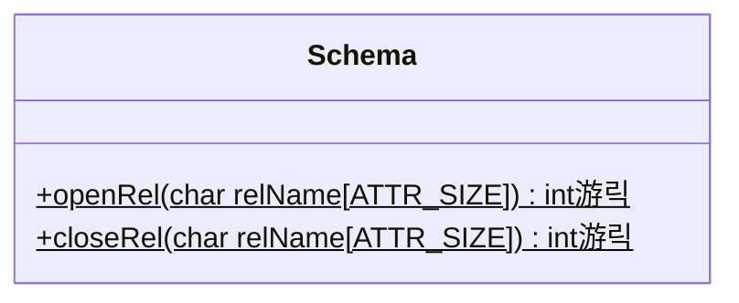
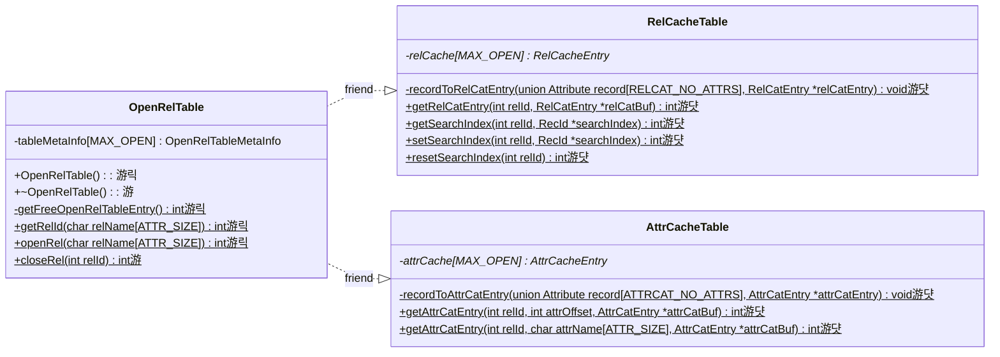

# Stage 5 : Opening Relations (10 hours)

:::note Learning Objectives

- Familiarise with the design of the [Cache Layer](../Design/Cache%20Layer/intro.md) and understand the maintenance of the catalog caches
- Implement the functions for opening a relation and setting up it's cache entries to facilitate searching of records.

:::

:::tip PREREQUISITE READING

- [Data Manipulation Language (DML) Commands](../User%20Interface%20Commands/dml.md)

:::

## Introduction

Your current NITCbase implementation must be able to read the rows and columns of the relations `RELCAT` and `ATTRIBUTECAT` and filter the records based on a certain condition. In this stage, we'll extend all the functionality we have implemented so far to work with any arbitrary relation on the DBMS.

### Open and Closed Relations

A relation that has it's relation and attribute catalog entries stored in the respective caches is called an **open relation**. NITCbase supports opening [MAX_OPEN](/docs/constants)(= 12) relations at once. Since the relation catalog and attribute catalog are always open, we can only open 10 other relations. If we want to open any more relations, we will have to **close** some relation. Note that the NITCbase specification does not allow closing of the relation and attribute catalog unless at the time of database exit. **NITCbase requires that a relation be opened before any [DML](../User%20Interface%20Commands/dml.md) commands can be performed on it**.

We discussed the [RelCacheTable](../Design/Cache%20Layer/RelCacheTable.md) and [AttrCacheTable](../Design/Cache%20Layer/AttrCacheTable.md) classes in the preceding stage. Here, we introduce the class [OpenRelTable](../Design/Cache%20Layer/OpenRelTable.md). This class manages the opening and closing of relations and handles the caching operations. It has a member `tableMetaInfo` which is a [MAX_OPEN](/docs/constants) sized array of type [struct OpenRelTableMetaInfo](../Design/Cache%20Layer/intro.md#openreltablemetainfo). `tableMetaInfo` is used to store which entries of the caches are free and the relation to which an occupied entry belongs.

For any index `k` that is occupied in the caches, the entries at index `k` in `relCache`, `attrCache` and `tableMetaInfo` will correspond to the same relation. Recall that this index `k` is called the relation's rel-id. These three tables comprise the core functionality of the [Cache Layer](../Design/Cache%20Layer/intro.md) of NITCbase. A table can be opened and closed by the user with the [OPEN TABLE](../User%20Interface%20Commands/ddl.md#open-table) and [CLOSE TABLE](../User%20Interface%20Commands/ddl.md#close-table) commands respectively, both handled by the [Schema Layer](../Design/Schema%20Layer.md).

## Implementation

To open a relation, we need to search through the relation and attribute catalog and fetch the records corresponding to the relation we want to open. To search through the records of a relation, we require that it's catalog entries be present in the caches i.e the relation is open. Hence, NITCbase ensures that the relation catalog and attribute catalog are always kept open.

A sequence diagrams documenting the flow of data between the layers is shown below.

> **NOTE**: The functions are denoted with circles as follows.<br/>
> 🔵 -> methods that are already in their final state<br/>
> 🟢 -> methods that will attain their final state in this stage<br/>
> 🟠 -> methods that we will modify in this stage, and in subsequent stages <br/>

<br/>


<br/>

A class diagram showing the methods relevant to this functionality in the [Cache Layer](../Design/Cache%20Layer/intro.md) and [Schema Layer](../Design/Schema%20Layer.md) is shown below.

> Note that we will be using functions from the [Buffer Layer](../Design/Buffer%20Layer/intro.md) and the `linearSearch` function from the [Block Access Layer](../Design/Block%20Access%20Layer.md) that was already implemented by you in the earlier stages. However, these functions do not require any modification at this stage. Hence, their class diagrams are not included below.

**Schema Layer**



---

**Cache Layer**



<br/>

As shown in the sequence diagram above, the Frontend User Interface will parse the `OPEN TABLE` command and call the `Frontend::open_table()` function in the Frontend Programming Interface. This call is then transferred along to the [Schema Layer](../Design/Schema%20Layer.md). Hence, the implementation of the `Frontend::open_table()` function only involves a call to the `Schema::openRel()` function. Similarly, the `CLOSE TABLE` command leads to the `Frontend::close_table()` function which in turn transfers control to `Schema::closeRel()`.

<details>
<summary>Frontend/Frontend.cpp</summary>

```cpp
int Frontend::open_table(char relname[ATTR_SIZE]) {
  return Schema::openRel(relname);
}

int Frontend::close_table(char relname[ATTR_SIZE]) {
  return Schema::closeRel(relname);
}
```

</details>

Now, let us implement the functions in the [Schema Layer](../Design/Schema%20Layer.md).

The `Schema::openRel()` function invokes the [Cache Layer](../Design/Cache%20Layer/intro.md) function `OpenRelTable::openRel()`. `Schema::closeRel()` closes a relation if it is open by calling `OpenRelTable::closeRel()` which frees that slot in the caches. Note that this function should not allow the closing of the relation catalog and the attribute catalog.

Closing a relation involves writing back to the disk any changes that have been made to the relation while the relation was open. At this stage, we have not implemented any such update operations and hence, your current implementation of `Schema::closeRel()` does not need to handle the same. We will add this functionality in later stages.

<details>
<summary>Schema/Schema.cpp</summary>

```cpp
int Schema::openRel(char relName[ATTR_SIZE]) {
  int ret = OpenRelTable::openRel(relName);

  // the OpenRelTable::openRel() function returns the rel-id if successful
  // a valid rel-id will be within the range 0 <= relId < MAX_OPEN and any
  // error codes will be negative
  if(ret >= 0){
    return SUCCESS;
  }

  //otherwise it returns an error message
  return ret;
}

int Schema::closeRel(char relName[ATTR_SIZE]) {
  if (/* relation is relation catalog or attribute catalog */) {
    return E_NOTPERMITTED;
  }

  // this function returns the rel-id of a relation if it is open or
  // E_RELNOTOPEN if it is not. we will implement this later.
  int relId = OpenRelTable::getRelId(relName);

  if (/* relation is not open */) {
    return E_RELNOTOPEN;
  }

  return OpenRelTable::closeRel(relId);
}

```

</details>

Next, we implement the functions of the [Cache Layer](../Design/Cache%20Layer/intro.md).

The `OpenRelTable` class will need to be modified to initialise and update the values in the `tableMetaInfo` array. We will also implement the functions for opening and closing relations.

_Note that `tableMetaInfo` is an array of type [struct OpenRelTableMetaInfo](../Design/Cache%20Layer/intro.md#openreltablemetainfo). It is static member of the class and will hence need to be explicitly declared before it can be used._

<details>
<summary>Cache/OpenRelTable.cpp</summary>

```cpp

OpenRelTableMetaInfo OpenRelTable::tableMetaInfo[MAX_OPEN];

OpenRelTable::OpenRelTable() {

  // initialise all values in relCache and attrCache to be nullptr and all entries
  // in tableMetaInfo to be free

  // load the relation and attribute catalog into the relation cache (we did this already)

  // load the relation and attribute catalog into the attribute cache (we did this already)

  /************ Setting up tableMetaInfo entries ************/

  // in the tableMetaInfo array
  //   set free = false for RELCAT_RELID and ATTRCAT_RELID
  //   set relname for RELCAT_RELID and ATTRCAT_RELID
}


OpenRelTable::~OpenRelTable() {

  // close all open relations (from rel-id = 2 onwards. Why?)
  for (int i = 2; i < MAX_OPEN; ++i) {
    if (!tableMetaInfo[i].free) {
      OpenRelTable::closeRel(i); // we will implement this function later
    }
  }

  // free the memory allocated for rel-id 0 and 1 in the caches
}
```

> **TASK**: Implement the following functions looking at their respective design docs
>
> - [`OpenRelTable::getFreeOpenRelTableEntry()`](../Design/Cache%20Layer/OpenRelTable.md#openreltable--getfreeopenreltableentry)
> - [`OpenRelTable::getRelId()`](../Design/Cache%20Layer/OpenRelTable.md#openreltable--getrelid)
>
> <sub>
>
> **WARNING**: The `OpenRelTable::openRel()` function involves dynamic memory allocation using `malloc` for creating entries in the relation cache and attribute cache (as a linked list). Please take care to avoid segmentation faults due to mishandling of the associated pointers and such.
> </sub>
>
> - [`OpenRelTable::openRel()`](../Design/Cache%20Layer/OpenRelTable.md#openreltable--openrel)

```cpp

int OpenRelTable::closeRel(int relId) {
  if (/* rel-id corresponds to relation catalog or attribute catalog*/) {
    return E_NOTPERMITTED;
  }

  if (/* 0 <= relId < MAX_OPEN */) {
    return E_OUTOFBOUND;
  }

  if (/* rel-id corresponds to a free slot*/) {
    return E_RELNOTOPEN;
  }

  // free the memory allocated in the relation and attribute caches which was
  // allocated in the OpenRelTable::openRel() function

  // update `tableMetaInfo` to set `relId` as a free slot
  // update `relCache` and `attrCache` to set the entry at `relId` to nullptr

  return SUCCESS;
}

```

You should now be able to open any relation present in your database and perform the _select_ operation on it.

</details>

## Exercises

**Q1.** Recall that in the previous stages, we had created a relation `Students(RollNumber STR, Name STR, Marks NUM, Batch STR)` and inserted the following records into the relation.

```plain
B220502CS, Keerthana, 99, J
B220983CS, Gokul,     84, B
B221002CS, Jessiya,   84, B
B220763CS, Cliford,   90, J
B220110CS, James,     74, B
B220439CS, Anna,      89, J
B220287CS, Arun,      93, B
```

Open the relation `Students` and do a select query on the relation with the following commands.

```sql
OPEN TABLE Students;
SELECT * FROM Students INTO null WHERE Batch=J;
CLOSE TABLE Students;
```

**Q2.** Open the relations `Events(id NUM, title STR, location STR)`, `Locations(name STR, capacity NUM)` and `Participants(regNo NUM, event STR)` that you created earlier and do a _select_ query for all three relations. Ensure that you get the following output.

```plain
# SELECT * FROM Events INTO null WHERE id>0;
| id | title | location |
Selected successfully into null

# SELECT * FROM Locations INTO null WHERE name!=none;
| name | capacity |
Selected successfully into null

# SELECT * FROM Participants INTO null WHERE regNo>0;
| regNo | event |
Selected successfully into null
```

**Q3.** In this exercise, we will test the error conditions of the _open_ functionality. Run the following **in your XFS interface** to create some test relations. (You could make use of the [run](../User%20Interface%20Commands/utility.md#run-batch-execution-command) command to run multiple commands easily.)

```sql
create table a(id NUM);
create table b(id NUM);
create table c(id NUM);
create table d(id NUM);
create table e(id NUM);
create table f(id NUM);
create table g(id NUM);
create table h(id NUM);
create table i(id NUM);
create table j(id NUM);
create table k(id NUM);
```

Run the following commands **in your NITCbase** and ensure that you get the corresponding output.

> Since we have the constant [MAX_OPEN](/docs/constants) = 12 in our design, we will not be able to open more than 10 relations (+ the catalog relations). So, the 11-th relation opened should return a cache full error.

```sql
open table x;    # Error: Relation does not exist
open table a;    # Relation a opened successfully
open table b;    # Relation b opened successfully
open table c;    # Relation c opened successfully
open table d;    # Relation d opened successfully
open table e;    # Relation e opened successfully
open table f;    # Relation f opened successfully
open table g;    # Relation g opened successfully
open table h;    # Relation h opened successfully
open table i;    # Relation i opened successfully
open table j;    # Relation j opened successfully
open table k;    # Error: Cache is full
close table k;   # Error: Relation is not open
close table j;   # Relation j closed successfully
open table k;    # Relation k opened successfully
```

These test tables can be deleted using the [DROP TABLE](../User%20Interface%20Commands/ddl.md#drop-table) command.
