# Stage 4

:::note Learning Objectives

- Learn

:::

## Introduction

Your implementation must now be able to read the rows and columns of the relations `RELCAT` and `ATTRIBUTECAT` and filter the records based on a certain condition. In this stage, we'll extend all the functionality we have so far to work with any relation on the DBMS.

### Open and Closed Relations

A relation that has it's relation and attribute catalog entries stored in the respective caches is called an **open relation**. NITCbase supports opening 12 relations at once (10 in practice. Why?). If we want to open any more relations, we will have to **close** some relation. **NITCbase requires that a relation be opened before any operations can be performed on it**.

We discussed about the [RelCacheTable](../Design/Cache%20Layer.md#class-relcachetable) and [AttrCacheTable](../Design/Cache%20Layer.md#class-attrcachetable) classes in the preceeding stage. Here, we introduce the class [OpenRelTable](../Design/Cache%20Layer.md#class-openreltable) class. This class manages the open and closing of relations and handles the caching operations. It has a member `tableMetaInfo` which is a [MAX_OPEN](/constants) sized array of type [struct OpenRelTableMetaInfo](../Design/Cache%20Layer.md#openreltablemetainfo). `tableMetaInfo` is used to store which entries of the caches are free and the relation to which an occupied entry belongs.

For any index `i` that is occupied in the caches, the entries at index `i` in `relCache`, `attrCache` and `tableMetaInfo` will correspond to the same relation. Recall that this index `i` is called the relation's rel-id. These three tables comprise the core functionality of the [Cache Layer](../Design/Cache%20Layer.md) of NITCbase. A table can be opened by the user with the [OPEN TABLE](../User%20Interface%20Commands/ddl.md#open-table) command.

## Implementation

Opening a relation requires us to search for the corresponding records in the catalogs. To search through the records of a relation, we require that the relation be open. You must see now why the relation catalog and attribute catalog are always kept open.

A sequence diagrams documenting the flow of data between the layers is shown below.

```mermaid
 %%{init: { 'sequence': {'mirrorActors':false} } }%%
sequenceDiagram
    actor User
    participant Frontend Interface
    participant Frontend
    participant Schema Layer
    participant Cache Layer
    participant Block Access Layer
    participant Buffer Layer
    User->>Frontend Interface: OPEN TABLE
    activate Frontend Interface
    Frontend Interface->>Frontend:open_table()🟢
    activate Frontend
    Frontend->>Schema Layer:openRel()🟠
    activate Schema Layer
    Schema Layer->>Cache Layer:openRel()🟢
    activate Cache Layer
    loop until all catalog entries are read
      Cache Layer->>Block Access Layer:linearSearch()🔵
      activate Block Access Layer
      Block Access Layer-->>Cache Layer: recId
      deactivate Block Access Layer
      Cache Layer->>Buffer Layer:getHeader()🔵, getRecord()🔵, getSlotmap()🔵
      activate Buffer Layer
      Buffer Layer-->>Cache Layer: record block info
      deactivate Buffer Layer
    end
    Cache Layer-->>User:operation status
    deactivate Cache Layer
    deactivate Schema Layer
    deactivate Frontend
    deactivate Frontend Interface

```

 

 

A class diagram showing the methods relevant to this functionality in the Cache Layer is shown below.

```mermaid
classDiagram
  class OpenRelTable{
    -tableMetaInfo[MAX_OPEN] : OpenRelTableMetaInfo
    +OpenRelTable(): 🟢
    +~OpenRelTable(): 🟠
    -getFreeOpenRelTableEntry()$ int🟢
    +getRelId(char relName[ATTR_SIZE])$ int🟢
    +openRel(char relName[ATTR_SIZE])$ int🟢
    +closeRel(int relId)$ int🟠
  }

```

 

## Exercises
