# Stage 6 : Writing Back to the Disk (10 hours)

:::note Learning Objectives

- Implement the commands to rename relations and attributes
- Implement the transfer of record blocks between the disk and the buffer
- Implement the LRU algorithm to free up space in the buffer when it becomes fully occupied

:::

:::tip PREREQUISITE READING

- [Data Definition Language (DDL) Commands](../User%20Interface%20Commands/ddl.md)

:::

## Introduction

This far, we've covered a lot of the functionality of NITCbase involving reading from the disk. You've implemented a read-only buffer and a cache for the catalog entries. In this stage, we will discuss operations involving writing back to the disk. You will implement the [ALTER TABLE RENAME](../User%20Interface%20Commands/ddl.md#alter-table-rename) and [ALTER TABLE RENAME COLUMN](../User%20Interface%20Commands/ddl.md#alter-table-rename-column) commands which are used to rename a relation and it's attributes respectively.

### Block Replacement

In our implementation so far, every time we want to access a block, we load it into a buffer and then do all our read operations from that. Recall that in the [Buffer Layer](../Design/Buffer%20Layer.md), [StaticBuffer](../Design/Buffer%20Layer.md#class-staticbuffer) allows us to buffer `BUFFER_CAPACITY`(=32) blocks at any given time. What if we want to read from a new block? We will obviously have to reuse an existing slot to load in our new block.

NITCbase uses the [LRU(least recently used) algorithm](<https://en.wikipedia.org/wiki/Cache_replacement_policies#Least_recently_used_(LRU)>) to decide on the block that will be replaced. Each entry in the buffer has a corresponding [`timestamp` field](../Design/Buffer%20Layer.md#buffer-structure) which keeps track of how long it has been since the disk block buffered in that particular location has been used. When a position needs to be freed up, the disk block with the highest timestamp is chosen and changes, if any, are written back to the disk.

Each entry in the buffer also has a corresponding [`dirty` field](../Design/Buffer%20Layer.md#buffer-structure) which is a boolean value storing if the values in that buffer entry have been updated since they were loaded from the disk block. If the dirty bit is set for an entry, we will write it back to the disk when the entry is replaced in the buffer or at system exit.

## Implementation

The [ALTER TABLE RENAME](../User%20Interface%20Commands/ddl.md#alter-table-rename) and [ALTER TABLE RENAME COLUMN](../User%20Interface%20Commands/ddl.md#alter-table-rename-column) commands modify the schema of a relation and are hence handled by the [Schema Layer](../Design/Schema%20Layer.md). NITCbase requires that a relation be closed before its schema can be edited. To update a relation name or attribute name, we will need to update the corresponding entries in the relation and/or attribute catalog blocks. These changes will subsequently be written back to the disk from the disk buffer.

A sequence diagram showing the call sequence involved in the implementation of this functionality is shown below.

> **NOTE**: The functions are denoted with circles as follows.<br/>
> 🔵 -> methods that are already in their final state<br/>
> 🟢 -> methods that will attain their final state in this stage<br/>
> 🟠 -> methods that we will modify in this stage, and in subsequent stages

```mermaid
 %%{init: { 'sequence': {'mirrorActors':false} } }%%
sequenceDiagram
  actor User
  participant Frontend User Interface
  participant Frontend Programming Interface
  participant Schema Layer
  participant Block Access Layer
  participant Buffer Layer
  User->>Frontend User Interface: ALTER TABLE RENAME
  activate Frontend User Interface
  Frontend User Interface->>Frontend Programming Interface :alter_table_rename🟢
  activate Frontend Programming Interface
  Frontend Programming Interface->>Schema Layer:renameRel()🟢
  activate Schema Layer
  Schema Layer->>Block Access Layer:renameRelation()🟢
  activate Block Access Layer
  Note over Block Access Layer, Block Access Layer: find relation catalog entry
  Block Access Layer ->> Buffer Layer: setRecord()🟢
  activate Buffer Layer
  Buffer Layer-->>Block Access Layer:operation status
  deactivate Buffer Layer
  loop for all attribute catalog entries of the relation
    Note over Block Access Layer, Block Access Layer: find attribute catalog entry
    Block Access Layer ->> Buffer Layer: setRecord()🟢
    activate Buffer Layer
    Buffer Layer-->>Block Access Layer:operation status
    deactivate Buffer Layer
  end
  Block Access Layer-->>User:operation status
  deactivate Block Access Layer
  deactivate Schema Layer
  deactivate Frontend Programming Interface
  deactivate Frontend User Interface

```



<br/>

A class diagram showing the methods relevant to this functionality in the [Schema Layer](../Design/Schema%20Layer.md), [Block Access Layer](../Design/Block%20Access%20Layer.md) and [Buffer Layer](../Design/Buffer%20Layer.md) is shown below.

```mermaid
classDiagram
  class Schema{
    +openRel(char relName[ATTR_SIZE])$ int🔵
    +closeRel(char relName[ATTR_SIZE])$ int🔵
    +renameRel(char oldRelName[ATTR_SIZE], char newRelName[ATTR_SIZE])$ int🟢
    +renameAttr(char relName[ATTR_SIZE], char oldAttrName[ATTR_SIZE], char newAttrName[ATTR_SIZE])$ int🟢
  }
```

```mermaid
classDiagram
  class BlockAccess{
    +linearSearch(int relId, char attrName[ATTR_SIZE], Attribute attrVal, int op)$ RecId🔵
    +renameRelation(char oldName[ATTR_SIZE], char newName[ATTR_SIZE])$ int🟢
    +renameAttribute(char relName[ATTR_SIZE], char oldName[ATTR_SIZE], char newName[ATTR_SIZE])$ int🟢
  }
```





---

**Buffer Layer**

```mermaid
classDiagram
  direction LR
  BlockBuffer <|-- RecBuffer
  StaticBuffer<|..RecBuffer : uses
  StaticBuffer<|..BlockBuffer : uses
  class RecBuffer{
    +RecBuffer(int blockNum) 🔵
    +getRecord(union Attribute *rec, int slotNum) int🔵
    +getSlotMap(unsigned char *slotMap) int🔵
    +setRecord(union Attribute *rec, int slotNum) int🟢
  }
  class BlockBuffer{
    #blockNum: int
    +BlockBuffer(int blockNum) 🔵
    +getHeader(struct HeadInfo *head) int🔵
    #loadBlockAndGetBufferPtr(unsigned char **buffPtr) int🟢
  }
  class StaticBuffer{
    -blocks[BUFFER_CAPACITY][BLOCK_SIZE]: unsigned char
    -metainfo[BUFFER_CAPACITY]: struct BufferMetaInfo
    +StaticBuffer() 🟠
    +~StaticBuffer() 🟠
    -getFreeBuffer(int blockNum)$ int🟢
    -getBufferNum(int blockNum)$ int🔵
    +setDirtyBit(int blockNum)$ int🟢
  }
```



<br/>

As shown in the sequence diagram above, the Frontend User Interface will parse the `ALTER TABLE RENAME` command and call the `Frontend::alter_table_rename()` function in the Frontend Programming Interface. This call is then transferred along to the [Schema Layer](../Design/Schema%20Layer.md). Hence, the implementation of the `Frontend::alter_table_rename()` function only involves a call to the `Schema::renameRel()` function. Similarly, the `ALTER TABLE RENAME COLUMN` command leads to the `Frontend::alter_table_rename_column()` function which in turn transfers control to `Schema::renameAttr()`.

<details>
<summary>Frontend/Frontend.cpp</summary>

```cpp
int Frontend::alter_table_rename(char relname_from[ATTR_SIZE], char relname_to[ATTR_SIZE]) {
  return Schema::renameRel(relname_from, relname_to);
}

int Frontend::alter_table_rename_column(char relname[ATTR_SIZE], char attrname_from[ATTR_SIZE],
                                        char attrname_to[ATTR_SIZE]) {
  return Schema::renameAttr(relname, attrname_from, attrname_to);
}
```

</details>

Now, let us implement the functions in the [Schema Layer](../Design/Schema%20Layer.md)

The `Schema::renameRel()` and `Schema::renameAttr()` functions ensure that the relation is closed and the input is for a valid operation. Subsequently, they call the respective [Block Access Layer](../Design/Block%20Access%20Layer.md) functions `BlockAccess::renameRelation()` and `BlockAccess::renameAttribute()`.

<details>
<summary>Schema/Schema.cpp</summary>

Implement the following functions looking at their respective design docs

- [`Schema::renameRel()`](../Design/Schema%20Layer.md#schema--renamerel)
- [`Schema::renameAttr()`](../Design/Schema%20Layer.md#schema--renameattr)

</details>

The [Block Access Layer](../Design/Block%20Access%20Layer.md) functions will then call `linearSearch()` to iterate through the relation and attribute catalog blocks and find the entries corresponding to the required relation. It then uses `RecBuffer::getRecord()` and `RecBuffer::setRecord()` to fetch the existing record value, update the name and then write the updated record back into the disk block. (The implementation of the `RecBuffer::setRecord()` function will be described later in this stage.)

<details>
<summary>BlockAccess/BlockAccess.cpp</summary>

Implement the following functions looking at their respective design docs

- [`BlockAccess::renameRelation()`](../Design/Block%20Access%20Layer.md#blockaccess--renamerelation)
- [`BlockAccess::renameAttribute()`](../Design/Block%20Access%20Layer.md#blockaccess--renameattribute)

</details>

Now, the only functionality we have left to implement is in the [Buffer Layer](../Design/Buffer%20Layer.md). In the [StaticBuffer class](../Design/Buffer%20Layer.md#class-staticbuffer), we update the `StaticBuffer::getFreeBuffer()` function to implement our block replacement algorithm if there are no free slots in the buffer. We also modify the constructor and destructor to work with the changes we discussed and implement `StaticBuffer::setDirtyBit()`.

<details>
<summary>Buffer/StaticBuffer.cpp</summary>

```cpp
StaticBuffer::StaticBuffer() {

  for (/*bufferIndex = 0 to BUFFER_CAPACITY-1*/) {
    // set metainfo[bufferindex] with the following values
    //   free = true
    //   dirty = false
    //   timestamp = -1
    //   blockNum = -1
  }
}

// write back all modified blocks on system exit
StaticBuffer::~StaticBuffer() {
  /*iterate through all the buffer blocks,
    write back blocks with metainfo as free=false,dirty=true
    using Disk::writeBlock()
    */
}
```

> **TASK**: Implement the following functions looking at their respective design docs
>
> - [`StaticBuffer::getFreeBuffer()`](../Design/Buffer%20Layer.md#staticbuffer--getfreebuffer)
> - [`StaticBuffer::setDirtyBit()`](../Design/Buffer%20Layer.md#staticbuffer--setdirtybit)

</details>

In the [RecBuffer class](../Design/Buffer%20Layer.md#class-recbuffer), we modify the `BlockBuffer::loadBlockAndGetBufferPtr()` function to increment the `timestamp` field for the buffer blocks and call the `StaticBuffer::getFreeBuffer()` function to allocate a free buffer if required. We also implement the `RecBuffer::setRecord()` function which is used to update the value of a record at a particular slot in the disk block.

<details>
<summary>Buffer/BlockBuffer.cpp</summary>

Implement the following functions looking at their respective design docs

- [`BlockBuffer::loadBlockAndGetBufferPtr()`](../Design/Buffer%20Layer.md#blockbuffer--loadblockandgetbufferptr)
- [`RecBuffer::setRecord()`](../Design/Buffer%20Layer.md#recbuffer--setrecord)

</details>

And that's it! You should now be able to rename any relation (except `RELCAT` and `ATTRCAT` of course) and any attribute of a relation. We have also implemented the basis of writing blocks back to the disk which we will expand upon in later stages.

## Exercises

**Q1.** In the **XFS interface**, [create a relation](../User%20Interface%20Commands/ddl.md#create-table) `Books(name STR, author STR, price NUM, bookOwner STR)`. Then, in your NITCbase, run the following commands.

```sql
ALTER TABLE RENAME Books TO LibraryBooks;
ALTER TABLE RENAME LibraryBooks COLUMN bookOwner TO lender;
OPEN TABLE LibraryBooks;
SELECT * FROM LibraryBooks INTO null WHERE price>0;
exit
```

Ensure that you get the following output.

```plain
| name | author | price | bookOwner |
Selected successfully into null
```

Now, let's confirm whether the changes have been written back to the disk. Open the **XFS Interface** and verify the output of the [schema command](../User%20Interface%20Commands/efs.md#show-schema).

```
# schema LibraryBooks
Relation: LibraryBooks
Attribute        Type Index
---------------- ---- -----
name             STR  no
author           STR  no
price            NUM  no
lender           STR  no
```
