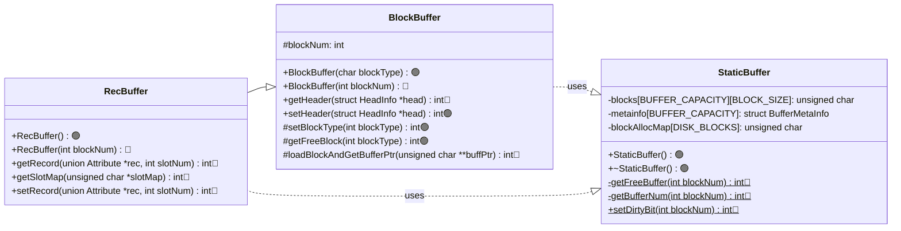

# Stage 7 : Inserting Records Into Relations (10 hours)

:::note Learning Objectives

- Implement

:::

## Introduction

Inserting records is quite possibly one of the most essential features of a DBMS. In this stage, we will implement all the methods required to finally start populating the relations that we have in NITCbase. Inserting a record into a relation primarily involves two main steps

- iterate through the last block of the relation and find a free slot or allocate a new block if the previous block is full.
- set the value of the record in the block and update all the caches to reflect this change

The allocation of a new block is handled by the [Buffer Layer](../Design/Buffer%20Layer.md) and the insertion operation is handled by the [Algebra Layer](../Design/Algebra%20Layer.md).

## Implementation

### Allocating New Blocks

We have already implemented a constructor for the [RecBuffer class](../Design/Buffer%20Layer.md#class-recbuffer) which takes a block number as an argument and creates an instance of `RecBuffer` that handles operations on that block using the buffer (referred to as [**constructor 2**](../Design/Buffer%20Layer.md#recbuffer--recbuffer-constructor-2) in the docs). The [RecBuffer class](../Design/Buffer%20Layer.md#class-recbuffer) also supports a default constructor (referred to as [**constructor 1**](../Design/Buffer%20Layer.md#recbuffer--recbuffer-constructor-1) in the docs) which can be used to allocate a new block on the disk and create an instance of `RecBuffer` to handle operations on that block using the buffer.

To find a free block, we iterate through the [block allocation map](../Design/Physical%20Layer.md#disk-model) to find an unoccupied block. Similar to other disk data structures, the block allocation map too is loaded into memory during the runtime of the database.

The methods relevant to adding this functionality are shown in the class diagram below.

> **NOTE**: The functions are denoted with circles as follows.<br/>
> 🔵 -> methods that are already in their final state<br/>
> 🟢 -> methods that will attain their final state in this stage<br/>
> 🟠 -> methods that we will modify in this stage, and in subsequent stages

<br/>



<br/>

An instance declared using [constructor 1](../Design/Buffer%20Layer.md#blockbuffer--blockbuffer-constructor1) will call the `BlockBuffer::getFreeBlock()` method to get a free block. This method makes use of the `setHeader()` method to and `setBlockType()` set up the header in the newly acquired disk block and the `setBlockType()` method to update the type of the block in the block allocation map.

In the `StaticBuffer` file, we declare the `blockAllocMap` member field and update our constructor and destructor to handle this array as well.

<details>
<summary>Buffer/StaticBuffer.cpp</summary>

```cpp
// declare the blockAllocMap array
unsigned char StaticBuffer::blockAllocMap[DISK_BLOCKS];

StaticBuffer::StaticBuffer() {
  // copy blockAllocMap blocks from disk to buffer (using readblock() of disk)
  // blocks 0 to 3

  /* initialise metainfo of all the buffer blocks with
     dirty:false, free:true, timestamp:-1 and blockNum:-1
     (you did this already)
  */
}

StaticBuffer::~StaticBuffer() {
  // copy blockAllocMap blocks from buffer to disk(using writeblock() of disk)

  /*iterate through all the buffer blocks,
    write back blocks with meta info as free:false,dirty:true (using writeblock() of disk)
    (you did this already)
  */
}
```

</details>

<details>
<summary>Buffer/BlockBuffer.cpp</summary>

Implement the following functions looking at their respective design docs

- [`BlockBuffer::BlockBuffer(char blockType)`](../Design/Buffer%20Layer.md#blockbuffer--blockbuffer-constructor1)
- [`RecBuffer::RecBuffer()`](../Design/Buffer%20Layer.md#recbuffer--recbuffer-constructor-1)
- [`BlockBuffer::setHeader()`](../Design/Buffer%20Layer.md#blockbuffer--setheader)
- [`BlockBuffer::setBlockType()`](../Design/Buffer%20Layer.md#blockbuffer--setblocktype)
- [`BlockBuffer::getFreeBlock()`](../Design/Buffer%20Layer.md#blockbuffer--getfreeblock)

</details>

### Inserting a Record

- set value
- update slotmap
