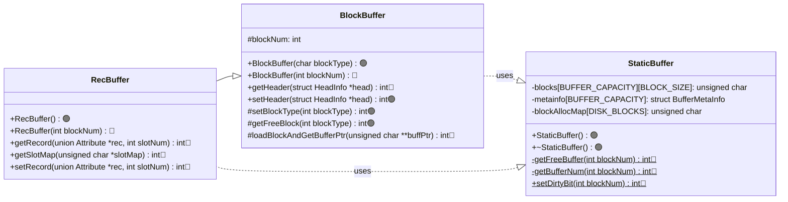
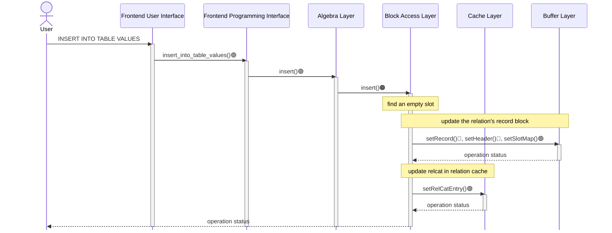
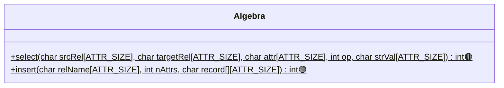
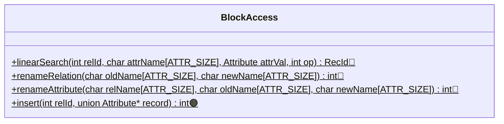
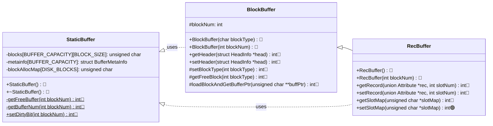

# Stage 7 : Inserting Records Into Relations (20 hours)

:::note Learning Objectives

- Implement the record insertion functionality in NITCbase
- Implement the functions responsible for allocating and making use of previously unoccupied disk blocks
- Implement functions to handle runtime updates to the relation and attribute cache

:::

## Introduction

Inserting records is one of the most essential features of a DBMS. In this stage, we will implement all the methods required to start inserting tuples into an existing relation in NITCbase. Inserting a record into a relation primarily involves three main steps

- Iterate through the blocks of the relation and find a free slot or allocate a new block if all the blocks are full.
- Store the contents of the record in the appropriate slot in the block and update the slotmap.
- Update the relation catalog/cache to reflect the change in number of records. This entails a write-back of the updated cache values to the corresponding buffer of the catalog blocks.

A new record can be inserted using the [INSERT INTO TABLE VALUES](../User%20Interface%20Commands/dml.md#insert-into-table-values) command which is handled by the [Algebra Layer](../Design/Algebra%20Layer.md). The allocation of a new block is handled by the [Buffer Layer](../Design/Buffer%20Layer/intro.md).

## Implementation

### Allocating New Blocks

Recall that the [BlockBuffer class](../Design/Buffer%20Layer/BlockBuffer.md) is the parent of the [RecBuffer class](../Design/Buffer%20Layer/RecBuffer.md). Both `BlockBuffer` and `RecBuffer` classes have two constructors each (referred to as _Constructor1_ and _Constructor2_). Thus, put together, these two classes have four constructors.

When a disk block is allocated to a relation for the first time, _Constructor1_ of the `RecBuffer` class must be invoked. This function has no arguments, and in turn invokes the _Constructor1_ of `BlockBuffer` with argument `'R'` (indicating that the allocated block is to be used as a record block and not an index block. Allocation of index blocks will be discussed in later stages of the roadmap.). _Constructor1_ of `BlockBuffer` will iterate through the block allocation map for an unallocated block and return a free block, if available.

The number of the allocated block will be stored in the private data field `blockNum` of the object allocated. (IMPORTANT&nbsp;NOTE: If block allocation failed, appropriate error code will be written on to the `blockNum` field. Care should be taken to check whether the allocation was successful before going ahead with accessing the block!)

Recall that we have already completed the implementation of `RecBuffer::Constructor2` and `BlockBuffer::Constructor2` in the previous stages. If a record block was already allocated to a relation using `RecBuffer::Constructor1` in the past, then `RecBuffer::Constructor2` is used for the subseqent access of the block. This constructor, as already seen, involves loading the block from the disk to the buffer (if not already present) and updating the data structures in the [class StaticBuffer](../Design/Buffer%20Layer/StaticBuffer.md). Since the block number is already known in this case, it must be passed as an argument to the constructor. `RecBuffer::Constructor2` in turn invokes the parent class constructor `BlockBuffer::Constructor2`, passing the block number as an argument, for performing the required functionality.

NITCBase requires that the `RecBuffer::Constructor1` be invoked only when **both the conditions** below hold true:

1. a record is added into a relation (or when a new relation is created, resulting in an insertion into the catalogs) <br/>
2. none of its already allocated blocks (if any) have a free slot to store the inserted record, implying that insertion cannot be performed without allocating a new block.

In all the previous stages, such insertion was performed only through the XFS Interface, and we never had to do a fresh block allocation for any relation. In this stage, we will be implementing `RecBuffer::Constructor1` and `BlockBuffer::Constructor1` to support record insertions into existing relations.

The methods relevant to adding this functionality are shown in the class diagram below.

> **NOTE**: The functions are denoted with circles as follows.<br/>
> 🔵 -> methods that are already in their final state<br/>
> 🟢 -> methods that will attain their final state in this stage<br/>
> 🟠 -> methods that we will modify in this stage, and in subsequent stages <br/>
> 🟤 -> methods that we built earlier and require more work later, but will leave as is in this stage

<br/>



<br/>

An instance declared using [constructor 1](../Design/Buffer%20Layer/BlockBuffer.md#blockbuffer--blockbuffer-constructor1) will call the `BlockBuffer::getFreeBlock()` method to get a free block. This method makes use of the `setHeader()` method to set up the header in the newly acquired disk block and the `setBlockType()` method to update the type of the block in the block allocation map.

Similar to other disk data structures, the block allocation map too is loaded into memory during the runtime of the database. In the `StaticBuffer` file, we declare the `blockAllocMap` member field and update our constructor and destructor to initialise and write-back the block alloc map between the disk and memory.

<details>
<summary>Buffer/StaticBuffer.cpp</summary>

```cpp
// declare the blockAllocMap array
unsigned char StaticBuffer::blockAllocMap[DISK_BLOCKS];

StaticBuffer::StaticBuffer() {
  // copy blockAllocMap blocks from disk to buffer (using readblock() of disk)
  // blocks 0 to 3

  /* initialise metainfo of all the buffer blocks with
     dirty:false, free:true, timestamp:-1 and blockNum:-1
     (you did this already)
  */
}

StaticBuffer::~StaticBuffer() {
  // copy blockAllocMap blocks from buffer to disk(using writeblock() of disk)

  /*iterate through all the buffer blocks,
    write back blocks with metainfo as free:false,dirty:true
    (you did this already)
  */
}
```

</details>

<details>
<summary>Buffer/BlockBuffer.cpp</summary>

Implement the following functions looking at their respective design docs

- [`BlockBuffer::setHeader()`](../Design/Buffer%20Layer/BlockBuffer.md#blockbuffer--setheader)
- [`BlockBuffer::setBlockType()`](../Design/Buffer%20Layer/BlockBuffer.md#blockbuffer--setblocktype)
- [`BlockBuffer::getFreeBlock()`](../Design/Buffer%20Layer/BlockBuffer.md#blockbuffer--getfreeblock)
- [`BlockBuffer::BlockBuffer(char blockType)`](../Design/Buffer%20Layer/BlockBuffer.md#blockbuffer--blockbuffer-constructor1)
- [`RecBuffer::RecBuffer()`](../Design/Buffer%20Layer/RecBuffer.md#recbuffer--recbuffer-constructor-1)

</details>

### Handling Cache Updates

Recall that every relation catalog entry (and consequently every relation cache entry) contains a field `numRecords` which stores the number of records that are part of the relation. After we insert a record, this value will have to be incremented. This far, we have only been reading from the caches. In this stage, we will implement write-back for the relation cache.

Similar to the buffer, each entry in the caches contain a `dirty` field which stores whether that entry has been modified. If a cache entry is dirty, it will need to be written back (to the copy of the disk block in the buffer) either when the relation is closed (with the [CLOSE TABLE](../User%20Interface%20Commands/ddl.md#close-table) command) or at system exit when all open relations are closed. The cache entry can be written back to the disk buffer using an instance of the `RecBuffer` class. Our earlier implementation did not need to do this since we did not have any operations which modified the caches.

A class diagram indicating the relevant methods in the [Cache Layer](../Design/Cache%20Layer/intro.md) is shown below.


<br/>

In earlier stages, we had implemented the `RelCacheTable::getRelCatEntry()` function to get an entry from the relation cache. In this stage, we will implement it's counterpart `RelCacheTable::setRelCatEntry()` which is how we update the values stored in the relation cache during runtime. We will also implement the `RelCacheTable::relCatEntryToRecord()` function which converts from the [struct RelCatEntry](../Design/Cache%20Layer/intro.md#relcacheentry) to a relation catalog entry record. This is useful when the relation is closed and the cache entries are written back to the buffer.

<details>
<summary>Cache/RelCacheTable.cpp</summary>

Implement the following functions looking at their respective design docs

- [`RelCacheTable::setRelCatEntry()`](../Design/Cache%20Layer/RelCacheTable.md#relcachetable--setrelcatentry)
- [`RelCacheTable::relCatEntryToRecord()`](../Design/Cache%20Layer/RelCacheTable.md#relcachetable--relcatentrytorecord)

</details>

Now, we modify our `OpenRelTable::closeRel()` function to handle write-back for the relation cache.

<details>
<summary>Cache/OpenRelTable.cpp</summary>

```cpp
int OpenRelTable::closeRel(int relId) {
  // confirm that rel-id fits the following conditions
  //     2 <=relId < MAX_OPEN
  //     does not correspond to a free slot
  //  (you have done this already)

  /****** Releasing the Relation Cache entry of the relation ******/

  if (/* RelCatEntry of the relId-th Relation Cache entry has been modified */)
  {

    /* Get the Relation Catalog entry from RelCacheTable::relCache
    Then convert it to a record using RelCacheTable::relCatEntryToRecord(). */


    // declaring an object of RecBuffer class to write back to the buffer
    RecBuffer relCatBlock(recId.block);

    // Write back to the buffer using relCatBlock.setRecord() with recId.slot
  }

  /****** Releasing the Attribute Cache entry of the relation ******/

  // free the memory allocated in the attribute caches which was
  // allocated in the OpenRelTable::openRel() function

  // (because we are not modifying the attribute cache at this stage,
  // write-back is not required. We will do it in subsequent
  // stages when it becomes needed)


  /****** Set the Open Relation Table entry of the relation as free ******/

  // update `metainfo` to set `relId` as a free slot

  return SUCCESS;
}
```

</details>

### Inserting a Record

Now that we have our block allocation and cache write-back in place, we can implement the [Algebra Layer](../Design/Algebra%20Layer.md) and [Block Access Layer](../Design/Block%20Access%20Layer.md) functionalities required to insert a record in a block. We also need to implement the [Buffer Layer](../Design/Buffer%20Layer/intro.md) methods to update the slotmap.

A sequence diagram documenting the call sequence for a record insertion is shown below along with a class diagram with the relevant classes.



---





<br/>

**Buffer Layer**



<br/>

As shown in the sequence diagram above, the [Frontend User Interface](../Design/Frontend.md#frontend-user-interface) will parse the `INSERT INTO TABLE VALUES` command and call the `Frontend::insert_into_table_values()` function in the [Frontend Programming Interface](../Design/Frontend.md#frontend-programming-interface). This call is then transferred along to the [Algebra Layer](../Design/Algebra%20Layer.md). Hence, the implementation of the `Frontend::insert_into_table_values()` function only involves a call to the `Algebra::insert()` function.

<details>
<summary>Frontend/Frontend.cpp</summary>

```cpp
int Frontend::insert_into_table_values(char relname[ATTR_SIZE], int attr_count, char attr_values[][ATTR_SIZE]) {
  return Algebra::insert(relname, attr_count, attr_values);
}
```

</details>

The `Algebra::insert()` function does some validation on the input and converts the user inputs, which are in the form of a string, and assigns it to an [union Attribute](../Design/Buffer%20Layer/intro.md#attribute) type. It then calls the `BlockAccess::insert()` function to handle the insertion of the record.

<details>
<summary>Algebra/Algebra.cpp</summary>

Implement the `Algebra::insert()` function by looking at the [design docs](../Design/Algebra%20Layer.md#insert).

</details>

Before we implement the record insertion, we implement the [Buffer Layer](../Design/Buffer%20Layer/intro.md) method to update the slotmap and a getter function for the [BlockBuffer class](../Design/Buffer%20Layer/BlockBuffer.md) to access the private `blockNum` member of the class.

<details>
<summary>Buffer/BlockBuffer.cpp</summary>

Implement the following functions looking at their respective design docs

- [`RecBuffer::setSlotMap()`](../Design/Buffer%20Layer/RecBuffer.md#recbuffer--setslotmap)
- [`BlockBuffer::getBlockNum()`](../Design/Buffer%20Layer/BlockBuffer.md#blockbuffer--getblocknum)

</details>

Now, we implement the insert functionality in the [Block Access Layer](../Design/Block%20Access%20Layer.md). Inserting a record involves finding a free slot (or allocating a new block if none), and then setting the record in that slot followed by updating the slotmap and the catalog caches.

<details>
<summary>BlockAccess/BlockAccess.cpp</summary>

```cpp
int BlockAccess::insert(int relId, Attribute *record) {
    // get the relation catalog entry from relation cache
    // ( use RelCacheTable::getRelCatEntry() of Cache Layer)

    int blockNum = /* first record block of the relation (from the rel-cat entry)*/;

    // rec_id will be used to store where the new record will be inserted
    RecId rec_id = {-1, -1};

    int numOfSlots = /* number of slots per record block */;
    int numOfAttributes = /* number of attributes of the relation */;

    int prevBlockNum = /* block number of the last element in the linked list = -1 */;

    /*
        Traversing the linked list of existing record blocks of the relation
        until a free slot is found OR
        until the end of the list is reached
    */
    while (blockNum != -1) {
        // create a RecBuffer object for blockNum (using appropriate constructor!)

        // get header of block(blockNum) using RecBuffer::getHeader() function

        // get slot map of block(blockNum) using RecBuffer::getSlotMap() function

        // search for free slot in the block 'blockNum' and store it's rec-id in rec_id
        // (Free slot can be found by iterating over the slot map of the block)
        /* slot map stores SLOT_UNOCCUPIED if slot is free and
           SLOT_OCCUPIED if slot is occupied) */

        /* if a free slot is found, set rec_id and discontinue the traversal
           of the linked list of record blocks (break from the loop) */

        /* otherwise, continue to check the next block by updating the
           block numbers as follows:
              update prevBlockNum = blockNum
              update blockNum = header.rblock (next element in the linked
                                               list of record blocks)
        */
    }

    //  if no free slot is found in existing record blocks (rec_id = {-1, -1})
    {
        // if relation is RELCAT, do not allocate any more blocks
        //     return E_MAXRELATIONS;

        // Otherwise,
        // get a new record block (using the appropriate RecBuffer constructor!)
        // get the block number of the newly allocated block
        // (use BlockBuffer::getBlockNum() function)
        // let ret be the return value of getBlockNum() function call
        if (ret == E_DISKFULL) {
            return E_DISKFULL;
        }

        // Assign rec_id.block = new block number(i.e. ret) and rec_id.slot = 0

        /*
            set the header of the new record block such that it links with
            existing record blocks of the relation
            set the block's header as follows:
            blockType: REC, pblock: -1
            lblock
                  = -1 (if linked list of existing record blocks was empty
                         i.e this is the first insertion into the relation)
                  = prevBlockNum (otherwise),
            rblock: -1, numEntries: 0,
            numSlots: numOfSlots, numAttrs: numOfAttributes
            (use BlockBuffer::setHeader() function)
        */

        /*
            set block's slot map with all slots marked as free
            (i.e. store SLOT_UNOCCUPIED for all the entries)
            (use RecBuffer::setSlotMap() function)
        */

        // if prevBlockNum != -1
        {
            // create a RecBuffer object for prevBlockNum
            // get the header of the block prevBlockNum and
            // update the rblock field of the header to the new block
            // number i.e. rec_id.block
            // (use BlockBuffer::setHeader() function)
        }
        // else
        {
            // update first block field in the relation catalog entry to the
            // new block (using RelCacheTable::setRelCatEntry() function)
        }

        // update last block field in the relation catalog entry to the
        // new block (using RelCacheTable::setRelCatEntry() function)
    }

    // create a RecBuffer object for rec_id.block
    // insert the record into rec_id'th slot using RecBuffer.setRecord())

    /* update the slot map of the block by marking entry of the slot to
       which record was inserted as occupied) */
    // (ie store SLOT_OCCUPIED in free_slot'th entry of slot map)
    // (use RecBuffer::getSlotMap() and RecBuffer::setSlotMap() functions)

    // increment the numEntries field in the header of the block to
    // which record was inserted
    // (use BlockBuffer::getHeader() and BlockBuffer::setHeader() functions)

    // Increment the number of records field in the relation cache entry for
    // the relation. (use RelCacheTable::setRelCatEntry function)

    return SUCCESS;
}
```

</details>

Your NITCbase should now support insertion of records into an existing relation using the [INSERT INTO TABLE VALUES](../User%20Interface%20Commands/dml.md#insert-into-table-values) command. In addition, you can also make use of the [INSERT INTO TABLE FROM FILE](../User%20Interface%20Commands/dml.md#insert-into-table-from-file) command. This command is used to populate a relation using values from a CSV file. The Frontend Programming Interface handles the file input and repeatedly calls the `Frontend::insert_into_table_values()` function that you implemented.

:::caution

While inserting the records, the number of records is updated in the relation cache. However, if we were to immediately run the [SELECT](../User%20Interface%20Commands/dml.md#select--from-table-where) command to read the values stored in the relation catalog, we will find that the `#Records` field is not up to date.

This is because while the relation is open, all the updates made to the catalog relations are only present in the respective caches. It is only when the relation is closed that the changes are written to the buffer (and subsequently the disk). If we were to close the relation and then read the records of the relation catalog, we would see that the updated `#Records` value is indeed reflected in the record.

Though this is an inconsistency in the values, all runtime operations only make use of the values in the caches and do not read from the disk. So, any unexpected behaviour is avoided.

:::

## Exercises

**Q1.** In an exercise of a previous stage, you created a relation `Locations(name STR, capacity NUM)`. Insert the following values into the relation using the [INSERT](../User%20Interface%20Commands/dml.md#insert-into-table-values) command **in your NITCbase**.

```plain
elhc, 300
nlhc, 300
eclc, 500
pits, 150
oat,  950
audi, 1000
```

Then, verify the insertion using the [SELECT](../User%20Interface%20Commands/dml.md#select--from-table-where) command that you implemented earlier. Additionally, run the [SELECT](../User%20Interface%20Commands/dml.md#select--from-table-where) command to read the records of the relation catalog and verify that the `#Records` field matches the number of records you inserted as shown below.

```sql
SELECT * FROM Locations INTO null WHERE capacity>0;
CLOSE TABLE Locations;      # required to update the relation catalog
SELECT * FROM RELATIONCAT INTO null WHERE RelName=Locations;
```

<br/>

**Q2.** Using the [INSERT INTO TABLE FROM FILE](../User%20Interface%20Commands/dml.md#insert-into-table-from-file) command, insert the values present [here](/roadmap_files/s7insert.txt) into the relation `Events(id NUM, title STR, location STR)`. Then, use the [SELECT](../User%20Interface%20Commands/dml.md#select--from-table-where) command to verify that all 50 events were created.
