# Stage 7 : Inserting Records Into Relations (20 hours)

:::note Learning Objectives

- Implement the record insertion functionality in NITCbase
- Implement the functions responsible for allocating and making use of previously unoccupied disk blocks
- Implement functions to handle runtime updates to the relation and attribute cache

:::

## Introduction

Inserting records is one of the most essential features of a DBMS. In this stage, we will implement all the methods required to start inserting tuples into an existing relation in NITCbase. Inserting a record into a relation primarily involves three main steps

- iterate through the last block of the relation and find a free slot or allocate a new block if the current last block is full.
- store the contents of the record in the appropriate slot in the block and update the slotmap
- update the relation catalog/cache to reflect the change in number of records (thus entailing an update to the corresponding block in the buffer)

A new record can be inserted using the [INSERT INTO TABLE VALUES](../User%20Interface%20Commands/dml.md#insert-into-table-values) command which is handled by the [Algebra Layer](../Design/Algebra%20Layer.md). The allocation of a new block is handled by the [Buffer Layer](../Design/Buffer%20Layer.md).

## Implementation

### Allocating New Blocks

We have already implemented a constructor (referred to as [**constructor 2**](../Design/Buffer%20Layer.md#recbuffer--recbuffer-constructor-2) in the docs) for the [RecBuffer class](../Design/Buffer%20Layer.md#class-recbuffer) which takes a block number as an argument and constructs an instance of the class. The instance of `RecBuffer` thus created can be used to handle operations on that block using the buffer.

The [RecBuffer class](../Design/Buffer%20Layer.md#class-recbuffer) also defines a default constructor (referred to as [**constructor 1**](../Design/Buffer%20Layer.md#recbuffer--recbuffer-constructor-1) in the docs). This constructor will find a free block on the disk and create an instance of `RecBuffer` to handle operations on that block using the buffer.

To find a free block, we iterate through the [block allocation map](../Design/Physical%20Layer.md#disk-model) to find an unoccupied block. Similar to other disk data structures, the block allocation map too is loaded into memory during the runtime of the database.

The methods relevant to adding this functionality are shown in the class diagram below.

> **NOTE**: The functions are denoted with circles as follows.<br/>
> 🔵 -> methods that are already in their final state<br/>
> 🟢 -> methods that will attain their final state in this stage<br/>
> 🟠 -> methods that we will modify in this stage, and in subsequent stages <br/>
> 🟤 -> methods that we built earlier and require more work later, but will leave as is in this stage

<br/>


<br/>

An instance declared using [constructor 1](../Design/Buffer%20Layer.md#blockbuffer--blockbuffer-constructor1) will call the `BlockBuffer::getFreeBlock()` method to get a free block. This method makes use of the `setHeader()` method to set up the header in the newly acquired disk block and the `setBlockType()` method to update the type of the block in the block allocation map.

In the `StaticBuffer` file, we declare the `blockAllocMap` member field and update our constructor and destructor to initialise and write-back the block alloc map between the disk and memory.

<details>
<summary>Buffer/StaticBuffer.cpp</summary>

```cpp
// declare the blockAllocMap array
unsigned char StaticBuffer::blockAllocMap[DISK_BLOCKS];

StaticBuffer::StaticBuffer() {
  // copy blockAllocMap blocks from disk to buffer (using readblock() of disk)
  // blocks 0 to 3

  /* initialise metainfo of all the buffer blocks with
     dirty:false, free:true, timestamp:-1 and blockNum:-1
     (you did this already)
  */
}

StaticBuffer::~StaticBuffer() {
  // copy blockAllocMap blocks from buffer to disk(using writeblock() of disk)

  /*iterate through all the buffer blocks,
    write back blocks with meta info as free:false,dirty:true (using writeblock() of disk)
    (you did this already)
  */
}
```

</details>

<details>
<summary>Buffer/BlockBuffer.cpp</summary>

Implement the following functions looking at their respective design docs

- [`BlockBuffer::BlockBuffer(char blockType)`](../Design/Buffer%20Layer.md#blockbuffer--blockbuffer-constructor1)
- [`RecBuffer::RecBuffer()`](../Design/Buffer%20Layer.md#recbuffer--recbuffer-constructor-1)
- [`BlockBuffer::setHeader()`](../Design/Buffer%20Layer.md#blockbuffer--setheader)
- [`BlockBuffer::setBlockType()`](../Design/Buffer%20Layer.md#blockbuffer--setblocktype)
- [`BlockBuffer::getFreeBlock()`](../Design/Buffer%20Layer.md#blockbuffer--getfreeblock)

</details>

### Handling Cache Updates

Recall that the relation catalog and consequently the relation cache contain a field `numRecords` which stores the number of records that are part of the relation. After we insert a record, this value will have to be incremented. Thus far, we have only been reading from the caches. In this stage, we will implement write-back for the relation cache.

Similar to the buffer, each entry in the caches contain a `dirty` field which stores whether that entry has been modified. If a cache entry is dirty, it will need to be written back either when the relation is closed (with the [CLOSE TABLE](../User%20Interface%20Commands/ddl.md#close-table) command) or at system exit when all open relations are closed. The cache entry can be written back to the disk using an instance of the `RecBuffer` class.

A class diagram indicating the relevant methods in the [Cache Layer](../Design/Cache%20Layer.md) is shown below.

```mermaid
classDiagram
direction RL
  RelCacheTable <|.. OpenRelTable : friend
  AttrCacheTable <|.. OpenRelTable : friend
  class RelCacheTable{
    -relCache[MAX_OPEN] : RelCacheEntry*
    -recordToRelCatEntry(union Attribute record[RELCAT_NO_ATTRS], RelCatEntry *relCatEntry)$ void🔵
    -relCatEntryToRecord(RelCatEntry *relCatEntry, union Attribute record[RELCAT_NO_ATTRS])$ void🟢
    +getRelCatEntry(int relId, RelCatEntry *relCatBuf)$ int🔵
    +setRelCatEntry(int relId, RelCatEntry *relCatBuf)$ int🟢
    +getSearchIndex(int relId, RecId *searchIndex)$ int🔵
    +setSearchIndex(int relId, RecId *searchIndex)$ int🔵
    +resetSearchIndex(int relId)$ int🔵
  }
  class AttrCacheTable{
    -attrCache[MAX_OPEN] : AttrCacheEntry*
    -recordToAttrCatEntry(union Attribute record[ATTRCAT_NO_ATTRS], AttrCatEntry *attrCatEntry)$ void🔵
    +getAttrCatEntry(int relId, int attrOffset, AttrCatEntry *attrCatBuf)$ int🔵
    +getAttrCatEntry(int relId, char attrName[ATTR_SIZE], AttrCatEntry *attrCatBuf)$ int🔵
  }
  class OpenRelTable{
    -tableMetaInfo[MAX_OPEN] : OpenRelTableMetaInfo
    +OpenRelTable(): 🔵
    +~OpenRelTable(): 🟠
    -getFreeOpenRelTableEntry()$ int🔵
    +getRelId(char relName[ATTR_SIZE])$ int🔵
    +openRel(char relName[ATTR_SIZE])$ int🔵
    +closeRel(int relId)$ int🟠
  }

```



<br/>

In earlier stages, we had implemented the `RelCacheTable::getRelCatEntry()` function to get an entry from the relation cache. In this stage, we will implement it's counterpart `RelCacheTable::setRelCatEntry()` which is how we update the values stored in the relation cache during runtime. We will also implement the `RelCacheTable::relCatEntryToRecord()` which we'll be using while closing the relation.

<details>
<summary>Cache/RelCacheTable.cpp</summary>

Implement the following functions looking at their respective design docs

- [`RelCacheTable::setRelCatEntry()`](../Design/Cache%20Layer.md#relcachetable--setrelcatentry)
- [`RelCacheTable::relCatEntryToRecord()`](../Design/Cache%20Layer.md#relcachetable--relcatentrytorecord)

</details>

Now, we modify our `OpenRelTable::closeRel()` function and the `OpenRelTable` destructor to handle write-back for the relation cache.

<details>
<summary>Cache/OpenRelTable.cpp</summary>

```cpp
OpenRelTable::~OpenRelTable() {
  // close all open relations i.e rel-id 2 to MAX_OPEN using OpenRelTable::closeRel()
  //    (you did this already)

  /************ Closing the entries in the relation cache ************/

  /****** releasing the entry corresponding to Attribute Catalog relation from Relation Cache Table ******/
  if (/* the RelCatEntry of the ATTRCAT_RELIDth Relation Cache entry has been modified */) {

    /* Get the Relation Catalog entry from Cache using RelCacheTable::relCatEntryToRecord().
    Write back that entry by instantiating RecBuffer class. Use recId member
    field and recBuffer.setRecord() */
  }
  // free the memory dynamically allocated to this RelCacheEntry


  /****** releasing the entry corresponding to Relation Catalog relation from Relation Cache Table ******/
  if(/* Relation Catalog entry of the RELCAT_RELIDth RelCacheEntry has been modified */) {

    /* Get the Relation Catalog entry from Cache using RelCacheTable::relCatEntryToRecord().
    Write back that entry by instantiating RecBuffer class. Use recId member
    field and recBuffer.setRecord() */
  }
  // free the memory dynamically allocated for this RelCacheEntry


  /************ Closing the entries in the attribute cache ************/

  // free the memory allocated for the attribute cache entries of rel-id 0 and 1
}


int OpenRelTable::closeRel(int relId) {
  // confirm that rel-id fits the following conditions
  //     - does not correspond to relation or attribute catalog
  //     - 0 <=relId < MAX_OPEN
  //     - corresponds to a free slot
  //  (you did this already)

  /****** Releasing the Relation Cache entry of the relation ******/

  if (/* RelCatEntry of the relIdth Relation Cache entry has been modified */)
  {
    /* Get the Relation Catalog entry from Cache using
    RelCacheTable::relCatEntryToRecord().
    Write back that entry by instantiating RecBuffer class. Use recId member
    field and recBuffer.setRecord() */
  }

  /****** Releasing the Attribute Cache entry of the relation ******/

  // free the memory allocated in the attribute caches which was
  // allocated in the OpenRelTable::openRel() function


  /****** Updating metadata in the Open Relation Table of the relation  ******/

  // update `tableMetaInfo` to set `relId` as a free slot

  return SUCCESS;
}
```

</details>

### Inserting a Record

Now that we have our block allocation and cache write-back in place, we can implement the [Algebra Layer](../Design/Algebra%20Layer.md) and [Block Access Layer](../Design/Block%20Access%20Layer.md) functionalities required to insert a record in a block. We also need to implement the [Buffer Layer](../Design/Buffer%20Layer.md) methods to update the slotmap.

A sequence diagram documenting the call sequence for a record insertion is shown below along with a class diagram with the relevant classes.


```mermaid
classDiagram
  class Algebra{
    +select(char srcRel[ATTR_SIZE], char targetRel[ATTR_SIZE], char attr[ATTR_SIZE], int op, char strVal[ATTR_SIZE])$ int🟤
    +insert(char relName[ATTR_SIZE], int nAttrs, char record[][ATTR_SIZE])$ int🟢
  }
```

```mermaid
classDiagram
  class BlockAccess{
    +linearSearch(int relId, char attrName[ATTR_SIZE], Attribute attrVal, int op)$ RecId🔵
    +renameRelation(char oldName[ATTR_SIZE], char newName[ATTR_SIZE])$ int🔵
    +renameAttribute(char relName[ATTR_SIZE], char oldName[ATTR_SIZE], char newName[ATTR_SIZE])$ int🔵
    +insert(int relId, union Attribute* record)$ int🟠
  }
```

---





<br/>

**Buffer Layer**


<br/>

As shown in the sequence diagram above, the Frontend User Interface will parse the `INSERT INTO TABLE VALUES` command and call the `Frontend::insert_into_table_values()` function in the Frontend Programming Interface. This call is then transferred along to the [Algebra Layer](../Design/Algebra%20Layer.md). Hence, the implementation of the `Frontend::insert_into_table_values()` function only involves a call to the `Algebra::insert()` function.

<details>
<summary>Frontend/Frontend.cpp</summary>

```cpp
int Frontend::insert_into_table_values(char relname[ATTR_SIZE], int attr_count, char attr_values[][ATTR_SIZE]) {
  return Algebra::insert(relname, attr_count, attr_values);
}
```

</details>

The `Algebra::insert()` function does some validation on the input and converts the user inputs which are in the form of a string to the [union Attribute](../Design/Buffer%20Layer.md#attribute) type. It then calls the `BlockAccess::insert()` function to handle the insertion of the record.

<details>
<summary>Algebra/Algebra.cpp</summary>

Implement the `Algebra::insert()` function by looking at the [design docs](../Design/Algebra%20Layer.md#insert).

</details>

Before we implement the record insertion, we implement the [Buffer Layer](../Design/Buffer%20Layer.md) method to update the slotmap and a getter function for the [BlockBuffer class](../Design/Buffer%20Layer.md#class-blockbuffer).

<details>
<summary>Buffer/BlockBuffer.cpp</summary>

Implement the following functions looking at their respective design docs

- [`RecBuffer::setSlotMap()`](../Design/Buffer%20Layer.md#recbuffer--setslotmap)
- [`BlockBuffer::getBlockNum()`](../Design/Buffer%20Layer.md#blockbuffer--getblocknum)

</details>

Now, we implement the insert functionality in the [Block Access Layer](../Design/Block%20Access%20Layer.md). Inserting a record involves finding a free slot (or allocating a new block if none), and then setting the record in that slot followed by updating the slotmap and the catalog caches.

<details>
<summary>BlockAccess/BlockAccess.cpp</summary>

```cpp
int BlockAccess::insert(int relId, Attribute *record) {
    // get the relation catalog entry from relation cache
    // ( use RelCacheTable::getRelCatEntry() of Cache Layer)

    int blockNum = /* first record block of the relation (from the rel-cat entry)*/;

    // let rec_id denote the rec-id of the slot where the new record will be inserted
    RecId rec_id = {-1, -1};

    int numOfSlots = /* number of slots per record block */;
    int numOfAttributes = /* number of attributes of the relation */;

    int prevBlockNum = /* block number of the last element in the linked list = -1 */;

    /*
        Traversing the linked list of existing record blocks of the relation
        until a free slot is found OR
        until the end of the list is reached
    */
    while (blockNum != -1) {
        // create a RecBuffer object for blockNum(use constructor for existing block)

        // get header of block(blockNum) using RecBuffer::getHeader() function

        // get slot map of block(blockNum) using RecBuffer::getSlotMap() function

        // search for free slot in the block 'blockNum' and store it's rec-id in rec_id
        // (Free slot can be found by iterating over the slot map of the block)
        /* slot map stores SLOT_UNOCCUPIED if slot is free and
           SLOT_OCCUPIED if slot is occupied) */

        /* if a free slot is found, discontinue the traversal of the linked
           list of record blocks */

        /* otherwise, continue to check the next block by updating the
           block numbers as follows:
              update prevBlockNum = blockNum
              update blockNum = header.rblock (next element in the linked
                                               list of record blocks)
        */
    }

    //  if no free slot is found in existing record blocks
    {
        // if relation is RELCAT, do not allocate any more blocks
        //     return E_MAXRELATIONS;

        // Otherwise,
        // get a new record block by calling RecBuffer Constructor for new block
        // get the block number of the newly allocated block
        // (use BlockBuffer::getBlockNum() function)
        // let ret be the return value of getBlockNum() function call
        if (ret == E_DISKFULL) {
            return E_DISKFULL;
        }

        // Assign rec_id.block = new block number(i.e. ret) and rec_id.slot = 0

        /*
            set the header of the new record block such that it links with
            existing record blocks of the relation
            set the block's header as follows:
            blockType: REC, pblock: -1
            lblock
                    = -1 (if linked list of existing record blocks was empty)
                    = prevBlockNum (otherwise),
            rblock: -1, numEntries: 0,
            numSlots: numOfSlots, numAttrs: numOfAttributes
            (use BlockBuffer::setHeader() function)
        */

        /*
            set block's slot map with all slots marked as free
            (i.e. store SLOT_UNOCCUPIED for all the entries)
            (use RecBuffer::setSlotMap() function)
        */

        // if prevBlockNum != -1
        {
            // create a RecBuffer object for prevBlockNum(use constructor for existing block)
            // get the header of the block prevBlockNum
            // update the rblock field of the header to the new block number(i.e. rec_id.block)
            // (use BlockBuffer::setHeader() function)
        }
        // else
        {
            // update first block field in the relation catalog entry to the new block
            // (use RelCacheTable::setRelCatEntry() function of Cache Layer)
        }

        // update last block field in the relation catalog entry to the new block
        // (use RelCacheTable::setRelCatEntry() function of Cache Layer)
    }

    // create a RecBuffer object for rec_id.block(use constructor for existing block)
    // insert the record into rec_id'th slot by calling RecBuffer::setRecord() function)

    /* update the slot map of the block by marking entry of the slot to
       which record was inserted as occupied) */
    // (ie store SLOT_OCCUPIED in free_slot'th entry of slot map)
    // (use RecBuffer::getSlotMap() and RecBuffer::setSlotMap() functions)

    // increment the num_entries field in the header of the block (to which record was inserted)
    // (use BlockBuffer::getHeader() and BlockBuffer::setHeader() functions)

    // Increment the number of records field in the relation cache entry for the relation.
    // (use RelCacheTable::setRelCatEntry function)

    return SUCCESS;
}
```

</details>

Your NITCbase should now support insertion of records into an existing relation using the [INSERT INTO TABLE VALUES](../User%20Interface%20Commands/dml.md#insert-into-table-values) command. In addition, you can also make use of the [INSERT INTO TABLE FROM FILE](../User%20Interface%20Commands/dml.md#insert-into-table-from-file) command. This command is used to populate a relation using values from a CSV file. The Frontend Programming Interface handles the file input and repeatedly calls the `Frontend::insert_into_table_values()` function that you implemented.

:::caution

While inserting the records, the number of records is updated in the relation cache. However, if we were to immediately run the [SELECT](../User%20Interface%20Commands/dml.md#select--from-table-where) command to read the values stored in the relation catalog, we will find that the `#Records` field is not up to date.

This is because while the relation is open, all the updates made to the catalog relations are only present in the respective caches. It is only when the relation is closed that the changes are written to the buffer (and subsequently the disk). If we were to close the relation and then read the records of the relation catalog, we would see that the updated `#Records` value is indeed reflected in the record.

Though this is an inconsistency in the values, all runtime operations only make use of the values in the caches and do not read from the disk. So, any unexpected behaviour is avoided.

:::

## Exercises

**Q1.** In an exercise of a previous stage, you created a relation `Locations(name STR, capacity NUM)`. Insert the following values into the relation using the [INSERT](../User%20Interface%20Commands/dml.md#insert-into-table-values) command **in your NITCbase**.

```plain
elhc, 300
nlhc, 300
eclc, 500
pits, 150
oat,  950
audi, 1000
```

Then, verify the insertion using the [SELECT](../User%20Interface%20Commands/dml.md#select--from-table-where) command that you implemented earlier. Additionally, run the [SELECT](../User%20Interface%20Commands/dml.md#select--from-table-where) command to read the records of the relation catalog and verify that the `#Records` field matches the number of records you inserted as shown below.

```sql
SELECT * FROM Locations INTO null WHERE capacity>0;
CLOSE TABLE Locations;
SELECT * FROM RELATIONCAT INTO null WHERE RelName=Locations;
```

**Q2.** Using the [INSERT INTO TABLE FROM FILE](../User%20Interface%20Commands/dml.md#insert-into-table-from-file) command, insert the values present [here](/roadmap_files/s7insert.txt) into the relation `Events(id NUM, title STR, location STR)`. Then, use the [SELECT](../User%20Interface%20Commands/dml.md#select--from-table-where) command to verify that all 50 events were created.
