# Stage 7 : Inserting Records Into Relations (10 hours)

:::note Learning Objectives

- Implement

:::

## Introduction

Inserting records is quite possibly one of the most essential features of a DBMS. In this stage, we will implement all the methods required to finally start populating the relations that we have in NITCbase. Inserting a record into a relation primarily involves three main steps

- iterate through the last block of the relation and find a free slot or allocate a new block if the previous block is full.
- set the value of the record in the block and update the slotmap
- update the relation catalog/cache to reflect the change

A new record can be inserted using the [INSERT INTO TABLE VALUES](../User%20Interface%20Commands/dml.md#insert-into-table-values) command which is handled by the [Algebra Layer](../Design/Algebra%20Layer.md). The allocation of a new block is handled by the [Buffer Layer](../Design/Buffer%20Layer.md).

## Implementation

### Allocating New Blocks

We have already implemented a constructor for the [RecBuffer class](../Design/Buffer%20Layer.md#class-recbuffer) which takes a block number as an argument and creates an instance of `RecBuffer` that handles operations on that block using the buffer (referred to as [**constructor 2**](../Design/Buffer%20Layer.md#recbuffer--recbuffer-constructor-2) in the docs). The [RecBuffer class](../Design/Buffer%20Layer.md#class-recbuffer) also supports a default constructor (referred to as [**constructor 1**](../Design/Buffer%20Layer.md#recbuffer--recbuffer-constructor-1) in the docs) which can be used to allocate a new block on the disk and create an instance of `RecBuffer` to handle operations on that block using the buffer.

To find a free block, we iterate through the [block allocation map](../Design/Physical%20Layer.md#disk-model) to find an unoccupied block. Similar to other disk data structures, the block allocation map too is loaded into memory during the runtime of the database.

The methods relevant to adding this functionality are shown in the class diagram below.

> **NOTE**: The functions are denoted with circles as follows.<br/>
> 🔵 -> methods that are already in their final state<br/>
> 🟢 -> methods that will attain their final state in this stage<br/>
> 🟠 -> methods that we will modify in this stage, and in subsequent stages <br/>
> 🟤 -> methods that we built earlier and require more work later, but will leave as is in this stage

```mermaid
classDiagram
  direction RL
  BlockBuffer <|-- RecBuffer
  StaticBuffer<|..RecBuffer : uses
  StaticBuffer<|..BlockBuffer : uses
  class RecBuffer{
    +RecBuffer() 🟢
    +RecBuffer(int blockNum) 🔵
    +getRecord(union Attribute *rec, int slotNum) int🔵
    +getSlotMap(unsigned char *slotMap) int🔵
    +setRecord(union Attribute *rec, int slotNum) int🔵
  }
  class BlockBuffer{
    #blockNum: int
    +BlockBuffer(char blockType) 🟢
    +BlockBuffer(int blockNum) 🔵
    +getHeader(struct HeadInfo *head) int🔵
    +setHeader(struct HeadInfo *head) int🟢
    #setBlockType(int blockType) int🟢
    #getFreeBlock(int blockType) int🟢
    #loadBlockAndGetBufferPtr(unsigned char **buffPtr) int🔵
  }
  class StaticBuffer{
    -blocks[BUFFER_CAPACITY][BLOCK_SIZE]: unsigned char
    -metainfo[BUFFER_CAPACITY]: struct BufferMetaInfo
    -blockAllocMap[DISK_BLOCKS]: unsigned char
    +StaticBuffer() 🟢
    +~StaticBuffer() 🟢
    -getFreeBuffer(int blockNum)$ int🔵
    -getBufferNum(int blockNum)$ int🔵
    +setDirtyBit(int blockNum)$ int🔵
  }
```

<br/>



<br/>

An instance declared using [constructor 1](../Design/Buffer%20Layer.md#blockbuffer--blockbuffer-constructor1) will call the `BlockBuffer::getFreeBlock()` method to get a free block. This method makes use of the `setHeader()` method to and `setBlockType()` set up the header in the newly acquired disk block and the `setBlockType()` method to update the type of the block in the block allocation map.

In the `StaticBuffer` file, we declare the `blockAllocMap` member field and update our constructor and destructor to handle this array as well.

<details>
<summary>Buffer/StaticBuffer.cpp</summary>

```cpp
// declare the blockAllocMap array
unsigned char StaticBuffer::blockAllocMap[DISK_BLOCKS];

StaticBuffer::StaticBuffer() {
  // copy blockAllocMap blocks from disk to buffer (using readblock() of disk)
  // blocks 0 to 3

  /* initialise metainfo of all the buffer blocks with
     dirty:false, free:true, timestamp:-1 and blockNum:-1
     (you did this already)
  */
}

StaticBuffer::~StaticBuffer() {
  // copy blockAllocMap blocks from buffer to disk(using writeblock() of disk)

  /*iterate through all the buffer blocks,
    write back blocks with meta info as free:false,dirty:true (using writeblock() of disk)
    (you did this already)
  */
}
```

</details>

<details>
<summary>Buffer/BlockBuffer.cpp</summary>

Implement the following functions looking at their respective design docs

- [`BlockBuffer::BlockBuffer(char blockType)`](../Design/Buffer%20Layer.md#blockbuffer--blockbuffer-constructor1)
- [`RecBuffer::RecBuffer()`](../Design/Buffer%20Layer.md#recbuffer--recbuffer-constructor-1)
- [`BlockBuffer::setHeader()`](../Design/Buffer%20Layer.md#blockbuffer--setheader)
- [`BlockBuffer::setBlockType()`](../Design/Buffer%20Layer.md#blockbuffer--setblocktype)
- [`BlockBuffer::getFreeBlock()`](../Design/Buffer%20Layer.md#blockbuffer--getfreeblock)

</details>

### Handling Cache Updates

Recall that the relation catalog and consequently the relation cache contain a field `numRecords` which stores the number of records that are part of the relation. After we insert a record, this value will have to be incremented. Thus far, we have only been reading from the caches. In this stage, we will implement write-back for the relation cache.

Similar to the buffer, each entry in the caches contain a `dirty` field which stores whether that entry has been modified. If a cache entry is dirty, it will need to be written back either when the relation is closed (with the [CLOSE TABLE](../User%20Interface%20Commands/ddl.md#close-table) command) or at system exit when all open relations are closed. The cache entry can be written back to the disk using an instance of the `RecBuffer` class.

A class diagram indicating the relevant methods in the [Cache Layer](../Design/Cache%20Layer.md) is shown below.

```mermaid
classDiagram
direction RL
  RelCacheTable <|.. OpenRelTable : friend
  AttrCacheTable <|.. OpenRelTable : friend
  class RelCacheTable{
    -relCache[MAX_OPEN] : RelCacheEntry*
    -recordToRelCatEntry(union Attribute record[RELCAT_NO_ATTRS], RelCatEntry *relCatEntry)$ void🔵
    -relCatEntryToRecord(RelCatEntry *relCatEntry, union Attribute record[RELCAT_NO_ATTRS])$ void🟢
    +getRelCatEntry(int relId, RelCatEntry *relCatBuf)$ int🔵
    +setRelCatEntry(int relId, RelCatEntry *relCatBuf)$ int🟢
    +getSearchIndex(int relId, RecId *searchIndex)$ int🔵
    +setSearchIndex(int relId, RecId *searchIndex)$ int🔵
    +resetSearchIndex(int relId)$ int🔵
  }
  class AttrCacheTable{
    -attrCache[MAX_OPEN] : AttrCacheEntry*
    -recordToAttrCatEntry(union Attribute record[ATTRCAT_NO_ATTRS], AttrCatEntry *attrCatEntry)$ void🔵
    +getAttrCatEntry(int relId, int attrOffset, AttrCatEntry *attrCatBuf)$ int🔵
    +getAttrCatEntry(int relId, char attrName[ATTR_SIZE], AttrCatEntry *attrCatBuf)$ int🔵
  }
  class OpenRelTable{
    -tableMetaInfo[MAX_OPEN] : OpenRelTableMetaInfo
    +OpenRelTable(): 🔵
    +~OpenRelTable(): 🟠
    -getFreeOpenRelTableEntry()$ int🔵
    +getRelId(char relName[ATTR_SIZE])$ int🔵
    +openRel(char relName[ATTR_SIZE])$ int🔵
    +closeRel(int relId)$ int🟠
  }

```



<br/>

In earlier stages, we had implemented the `RelCacheTable::getRelCatEntry()` function to get an entry from the relation cache. In this stage, we will implement it's counterpart `RelCacheTable::setRelCatEntry()` which is how we update the values stored in the relation cache during runtime. We will also implement the `RelCacheTable::relCatEntryToRecord()` which we'll be using while closing the relation.

<details>
<summary>Cache/RelCacheTable.cpp</summary>

Implement the following functions looking at their respective design docs

- [`RelCacheTable::setRelCatEntry()`](../Design/Cache%20Layer.md#relcachetable--setrelcatentry)
- [`RelCacheTable::relCatEntryToRecord()`](../Design/Cache%20Layer.md#relcachetable--relcatentrytorecord)

</details>

Now, we modify our `OpenRelTable::closeRel()` function and the `OpenRelTable` destructor to handle write-back for the relation cache.

<details>
<summary>Cache/OpenRelTable.cpp</summary>

```cpp
OpenRelTable::~OpenRelTable() {
  // close all open relations i.e rel-id 2 to MAX_OPEN using OpenRelTable::closeRel()
  //    (you did this already)

  /************ Closing the entries in the relation cache ************/

  /****** releasing the entry corresponding to Attribute Catalog relation from Relation Cache Table ******/
  if (/* the RelCatEntry of the ATTRCAT_RELIDth Relation Cache entry has been modified */) {

    /* Get the Relation Catalog entry from Cache using RelCacheTable::relCatEntryToRecord().
    Write back that entry by instantiating RecBuffer class. Use recId member
    field and recBuffer.setRecord() */
  }
  // free the memory dynamically allocated to this RelCacheEntry


  /****** releasing the entry corresponding to Relation Catalog relation from Relation Cache Table ******/
  if(/* Relation Catalog entry of the RELCAT_RELIDth RelCacheEntry has been modified */) {

    /* Get the Relation Catalog entry from Cache using RelCacheTable::relCatEntryToRecord().
    Write back that entry by instantiating RecBuffer class. Use recId member
    field and recBuffer.setRecord() */
  }
  // free the memory dynamically allocated for this RelCacheEntry


  /************ Closing the entries in the attribute cache ************/

  // free the memory allocated for the attribute cache entries of rel-id 0 and 1
}


int OpenRelTable::closeRel(int relId) {
  // confirm that rel-id fits the following conditions
  //     - does not correspond to relation or attribute catalog
  //     - 0 <=relId < MAX_OPEN
  //     - corresponds to a free slot
  //  (you did this already)

  /****** Releasing the Relation Cache entry of the relation ******/

  if (/* RelCatEntry of the relIdth Relation Cache entry has been modified */)
  {
    /* Get the Relation Catalog entry from Cache using
    RelCacheTable::relCatEntryToRecord().
    Write back that entry by instantiating RecBuffer class. Use recId member
    field and recBuffer.setRecord() */
  }

  /****** Releasing the Attribute Cache entry of the relation ******/

  // free the memory allocated in the attribute caches which was
  // allocated in the OpenRelTable::openRel() function


  /****** Updating metadata in the Open Relation Table of the relation  ******/

  // update `tableMetaInfo` to set `relId` as a free slot

  return SUCCESS;
}
```

</details>

### Inserting a Record

A sequence diagram documenting the call sequence for a record insertion is shown below.


<br/>





```mermaid
classDiagram
  class Algebra{
    +select(char srcRel[ATTR_SIZE], char targetRel[ATTR_SIZE], char attr[ATTR_SIZE], int op, char strVal[ATTR_SIZE])$ int🟤
    +insert(char relName[ATTR_SIZE], int nAttrs, char record[][ATTR_SIZE])$ int🟢
  }
```

```mermaid
classDiagram
  class BlockAccess{
    +linearSearch(int relId, char attrName[ATTR_SIZE], Attribute attrVal, int op)$ RecId🔵
    +renameRelation(char oldName[ATTR_SIZE], char newName[ATTR_SIZE])$ int🔵
    +renameAttribute(char relName[ATTR_SIZE], char oldName[ATTR_SIZE], char newName[ATTR_SIZE])$ int🔵
    +insert(int relId, union Attribute* record)$ int🟠
  }
```

---

**Buffer Layer**

```mermaid
classDiagram
  direction LR
  BlockBuffer <|-- RecBuffer
  StaticBuffer<|..RecBuffer : uses
  StaticBuffer<|..BlockBuffer : uses
  class RecBuffer{
    +RecBuffer() 🔵
    +RecBuffer(int blockNum) 🔵
    +getRecord(union Attribute *rec, int slotNum) int🔵
    +setRecord(union Attribute *rec, int slotNum) int🔵
    +getSlotMap(unsigned char *slotMap) int🔵
    +setSlotMap(unsigned char *slotMap) int🟢
  }
  class BlockBuffer{
    #blockNum: int
    +BlockBuffer(char blockType) 🔵
    +BlockBuffer(int blockNum) 🔵
    +getHeader(struct HeadInfo *head) int🔵
    +setHeader(struct HeadInfo *head) int🔵
    #setBlockType(int blockType) int🔵
    #getFreeBlock(int blockType) int🔵
    #loadBlockAndGetBufferPtr(unsigned char **buffPtr) int🔵
  }
  class StaticBuffer{
    -blocks[BUFFER_CAPACITY][BLOCK_SIZE]: unsigned char
    -metainfo[BUFFER_CAPACITY]: struct BufferMetaInfo
    -blockAllocMap[DISK_BLOCKS]: unsigned char
    +StaticBuffer() 🔵
    +~StaticBuffer() 🔵
    -getFreeBuffer(int blockNum)$ int🔵
    -getBufferNum(int blockNum)$ int🔵
    +setDirtyBit(int blockNum)$ int🔵
  }
```



<br/>

- todo verify if the caches and catalogs have right values.
  - didn't check during implementatoin
- todo exercises should test new block allocatoin
