# Stage 8 : Creating and Deleting Relations (12 hours)

:::note Learning Objectives

- Implement the creation of relations by inserting records into the catalogs
- Implement the deletion of relations and freeing of the disk storage structures associated with the relation

:::

## Introduction

In previous stages, we had implemented the insertion of records into existing relations. In this stage, we will implement the functionality to create and delete relations in NITCbase.

Creating a relation, in essence, involves inserting records into the relation catalog and the attribute catalog specifying the details of the relation and its attributes. This functionality is implemented in the [Schema Layer](../Design/Schema%20Layer.md) and the [Block Access Layer](../Design/Block%20Access%20Layer.md), and is called using the [CREATE TABLE](../User%20Interface%20Commands/ddl.md#create-table) command.

Deleting a relation is done using the [DROP TABLE](../User%20Interface%20Commands/ddl.md#drop-table) command. This process involves freeing all the blocks used to store the record of the relation and removing all the records corresponding to the relation from the catalogs. Note that NITCbase only allows you to delete a relation as a whole and does not allow the deletion of individual records from a relation.

## Implementation

A sequence diagram showing the call sequence involved in the implementation of the create and delete functionality are shown below.

> **NOTE**: The functions are denoted with circles as follows.<br/>
> 🔵 -> methods that are already in their final state<br/>
> 🟢 -> methods that will attain their final state in this stage<br/>
> 🟠 -> methods that we will modify in this stage, and in subsequent stages <br/>
> 🟤 -> methods that we built earlier and require more work later, but will leave as is in this stage


<br/>


<br/>

A class diagram showing the methods relevant to this functionality in the [Schema Layer](../Design/Schema%20Layer.md), [Block Access Layer](../Design/Block%20Access%20Layer.md) and [Buffer Layer](../Design/Buffer%20Layer/intro.md) is shown below.

```mermaid
classDiagram
  class Schema{
    +openRel(char relName[ATTR_SIZE])$ int🔵
    +closeRel(char relName[ATTR_SIZE])$ int🔵
    +renameRel(char oldRelName[ATTR_SIZE], char newRelName[ATTR_SIZE])$ int🔵
    +renameAttr(char relName[ATTR_SIZE], char oldAttrName[ATTR_SIZE], char newAttrName[ATTR_SIZE])$ int🔵
    +createRel(char relName[ATTR_SIZE], int numOfAttributes, char attrNames[][ATTR_SIZE], int attrType[])$ int🟢
    +deleteRel(char relName[ATTR_SIZE])$ 🟢
  }
```

```mermaid
classDiagram
  class BlockAccess{
    +linearSearch(int relId, char attrName[ATTR_SIZE], Attribute attrVal, int op)$ RecId🔵
    +renameRelation(char oldName[ATTR_SIZE], char newName[ATTR_SIZE])$ int🔵
    +renameAttribute(char relName[ATTR_SIZE], char oldName[ATTR_SIZE], char newName[ATTR_SIZE])$ int🔵
    +insert(int relId, union Attribute* record)$ int🟤
    +search(int relId, Attribute *record, char attrName[ATTR_SIZE], Attribute attrVal, int op)$ int🟠
    +deleteRelation(char relName[ATTR_SIZE])$ int🟠
  }
```





<br/>

**Cache Layer**

```mermaid
classDiagram
direction RL
  RelCacheTable <|.. OpenRelTable : friend
  AttrCacheTable <|.. OpenRelTable : friend
  class RelCacheTable{
    -relCache[MAX_OPEN] : RelCacheEntry*
    -recordToRelCatEntry(union Attribute record[RELCAT_NO_ATTRS], RelCatEntry *relCatEntry)$ void🔵
    -relCatEntryToRecord(RelCatEntry *relCatEntry, union Attribute record[RELCAT_NO_ATTRS])$ void🔵
    +getRelCatEntry(int relId, RelCatEntry *relCatBuf)$ int🔵
    +setRelCatEntry(int relId, RelCatEntry *relCatBuf)$ int🔵
    +getSearchIndex(int relId, RecId *searchIndex)$ int🔵
    +setSearchIndex(int relId, RecId *searchIndex)$ int🔵
    +resetSearchIndex(int relId)$ int🔵
  }
  class AttrCacheTable{
    -attrCache[MAX_OPEN] : AttrCacheEntry*
    -recordToAttrCatEntry(union Attribute record[ATTRCAT_NO_ATTRS], AttrCatEntry *attrCatEntry)$ void🔵
    +getAttrCatEntry(int relId, int attrOffset, AttrCatEntry *attrCatBuf)$ int🔵
    +getAttrCatEntry(int relId, char attrName[ATTR_SIZE], AttrCatEntry *attrCatBuf)$ int🔵
  }
  class OpenRelTable{
    -tableMetaInfo[MAX_OPEN] : OpenRelTableMetaInfo
    +OpenRelTable(): 🔵
    +~OpenRelTable(): 🟢
    -getFreeOpenRelTableEntry()$ int🔵
    +getRelId(char relName[ATTR_SIZE])$ int🔵
    +openRel(char relName[ATTR_SIZE])$ int🔵
    +closeRel(int relId)$ int🟤
  }

```



**Buffer Layer**

```mermaid
classDiagram
  direction LR
  BlockBuffer <|-- RecBuffer
  StaticBuffer<|..RecBuffer : uses
  StaticBuffer<|..BlockBuffer : uses
  class RecBuffer{
    +RecBuffer() 🔵
    +RecBuffer(int blockNum) 🔵
    +getRecord(union Attribute *rec, int slotNum) int🔵
    +setRecord(union Attribute *rec, int slotNum) int🔵
    +getSlotMap(unsigned char *slotMap) int🔵
    +setSlotMap(unsigned char *slotMap) int🔵
  }
  class BlockBuffer{
    #blockNum: int
    +BlockBuffer(char blockType) 🔵
    +BlockBuffer(int blockNum) 🔵
    +getHeader(struct HeadInfo *head) int🔵
    +setHeader(struct HeadInfo *head) int🔵
    +releaseBlock() void🟢
    #setBlockType(int blockType) int🔵
    #getFreeBlock(int blockType) int🔵
    #loadBlockAndGetBufferPtr(unsigned char **buffPtr) int🔵
  }
  class StaticBuffer{
    -blocks[BUFFER_CAPACITY][BLOCK_SIZE]: unsigned char
    -metainfo[BUFFER_CAPACITY]: struct BufferMetaInfo
    -blockAllocMap[DISK_BLOCKS]: unsigned char
    +StaticBuffer() 🔵
    +~StaticBuffer() 🔵
    -getFreeBuffer(int blockNum)$ int🔵
    -getBufferNum(int blockNum)$ int🔵
    +setDirtyBit(int blockNum)$ int🔵
  }
```



<br/>

As shown in the sequence diagram above, the Frontend User Interface will parse the `CREATE TABLE` command and call the `Frontend::create_table()` function in the Frontend Programming Interface. This call is then transferred along to the [Schema Layer](../Design/Schema%20Layer.md). Hence, the implementation of the `Frontend::create_table()` function only involves a call to the `Schema::createRel()` function. Similarly, the `DROP TABLE` command leads to the `Frontend::drop_table()` function which in turn transfers control to `Schema::deleteRel()`.

<details>
<summary>Frontend/Frontend.cpp</summary>

```cpp
int Frontend::create_table(char relname[ATTR_SIZE], int no_attrs, char attributes[][ATTR_SIZE], int type_attrs[]) {
  return Schema::createRel(relname, no_attrs, attributes, type_attrs);
}

int Frontend::drop_table(char relname[ATTR_SIZE]) {
  return Schema::deleteRel(relname);
}
```

</details>

Now, let us implement the functions in the [Schema Layer](../Design/Schema%20Layer.md).

The `Schema::createRel()` function is used to create a relation. Creating a relation involves adding the relevant records to the relation catalog and the attribute catalog (using `BlockAccess::insert()`). Before this can be done, the user input will need to be verified to ensure that there are no existing relations with the same name. Additionally, it will also need to be verified that the new relation does not contain duplicate attribute names.

The `Schema::deleteRel()` is used to delete a relation. NITCbase requires that a relation be closed before it is deleted. This is to avoid inconsistencies between the buffer and the disk. Deleting a relation is done with a call to the `BlockAccess::deleteRelation()` function (we will implement this function later in this stage).

<details>
<summary>Schema/Schema.cpp</summary>

Implement the following functions looking at their respective design docs

- [`Schema::createRel()`](../Design/Schema%20Layer.md#schema--createrel)
- [`Schema::deleteRel()`](../Design/Schema%20Layer.md#schema--deleterel)

</details>

Recall that every open relation has an entry in the relation cache. If any update to the cache entries for a relation are made, these must be committed back to the disk. Normally, such write-back is performed when the relation is closed. Hence, in the previous stages, we implemented the write-back operations in the `OpenRelTable::closeRel()` function.

However, in the present stage, when we create a new relation, the relation cache entries for the relation catalog and attribute catalog will be modified (the `numRecords` field will be incremented). Since these catalogs are never opened or closed, the relation cache write-back cannot happen inside `OpenReltable::closeRel()`. Instead, the relation cache write-back for the relation catalog and the attirbute catalog is peformed when the destructor for the `OpenRelTable` class is executed during system shutdown. (Recall that the cache entries for relation catalog and attribute catalog were set up during system initialization, when the constructor for `OpenRelTable` executed).

<details>
<summary>Cache/OpenRelTable.cpp</summary>

Implement the `OpenRelTable::~OpenRelTable()` function by looking at the [design docs](../Design/Cache%20Layer/OpenRelTable.md#openreltable--openreltable-destructor).

</details>

In the [Buffer Layer](../Design/Buffer%20Layer/intro.md), we implement the `BlockBuffer::releaseBlock()` function which takes a block number as an argument and frees that block in the buffer and the block allocation map, thus making the block available for use again.

:::info WARNING

The low level disk operations on all disk blocks are performed by the [StaticBuffer class](../Design/Buffer%20Layer/StaticBuffer.md) and the [BlockBuffer class](../Design/Buffer%20Layer/BlockBuffer.md). However, NITCBase design does not permit higher layer functions to perform any modifications on blocks directly by accessing the buffer. Instead, the following access procedure is stipulated by the design.

Whenever a higher layer class requires a block to be accessed or created, it must first create an object of the `BlockBuffer` class. This operation associates a block (either existing or new) to the new `BlockBuffer` object. All further operations on the block must be performed using calls to appropriate methods of the `BlockBuffer` object. (The only exception to this rule is the [StaticBuffer::getStaticBlockType()](../Design/Buffer%20Layer/StaticBuffer.md#staticbuffer--getstaticblocktype) function, which may be directly invoked by higher layer functions.)

Now, if a higher layer function wishes to release a block allocated to a relation, the `BlockBuffer::releaseBlock()` function may be invoked. This function updates the disk data structures to mark the block as free and disassociates the `BlockBuffer` object from the disk block by setting block number field of the `BlockBuffer` object as [INVALID_BLK](/docs/constants).

It is important to note here that such release operations creates a situation where the BlockBuffer object is no longer associated with any valid disk block, and any further access to the functions of the object will result in the return of an error code. Hence, care must be exercised in higher layer functions to avoid implementation
errors due to attempts to access BlockBuffer objects that have already been released.

:::

<details>
<summary>Buffer/BlockBuffer.cpp</summary>

Implement the `BlockBuffer::releaseBlock()` function by looking at the [design docs](../Design/Buffer%20Layer/BlockBuffer.md#blockbuffer--releaseblock).

</details>

In the [Block Access Layer](../Design/Block%20Access%20Layer.md), we implement the `search()` function and the `deleteRelation()` function.

We do not need to modify the [Block Access Layer](../Design/Block%20Access%20Layer.md) for relation creation at this stage because creation of a relation only involves insertion of records into the catalogs and this is something that we had already implemented in previous stages (in the `insert()` function). However, this function will be updated in subsequent stages to handle indexing.

The `search()` function in it's final state will be used to either do a linear search or a B+ tree search on the records of a relation depending on whether an index exists for the relation. Since we have not implemented indexes yet, our current implementation will just call the `linearSearch()` function.

The `deleteRelation()` function releases all the record blocks of the relation and deletes the relation's entries from the relation and attribute catalog. If the deletion of the entries in the attribute catalog causes one of its blocks to be completely unoccupied, we release that block as well. We then update the changes in the records of the catalogs in the catalog caches.

<details>
<summary>BlockAccess/BlockAccess.cpp</summary>

```cpp
/*
NOTE: This function will copy the result of the search to the `record` argument.
      The caller should ensure that space is allocated for `record` array
      based on the number of attributes in the relation.
*/
int BlockAccess::search(int relId, Attribute *record, char attrName[ATTR_SIZE], Attribute attrVal, int op) {
    // Declare a variable called recid to store the searched record
    RecId recId;

    /* search for the record id (recid) corresponding to the attribute with
    attribute name attrName, with value attrval and satisfying the condition op
    using linearSearch() */

    // if there's no record satisfying the given condition (recId = {-1, -1})
    //    return E_NOTFOUND;

    /* Copy the record with record id (recId) to the record buffer (record)
       For this Instantiate a RecBuffer class object using recId and
       call the appropriate method to fetch the record
    */

    return SUCCESS;
}
```

> **TASK**: Implement the `BlockAccess::deleteRelation()` method by looking at the [design docs](../Design/Block%20Access%20Layer.md#blockaccess--deleterelation). The algorithm specified in the docs calls `BPlusTree::bPlusDestroy()` to free any indexes that exist for the relation. Since we have not yet implemented indexing, this call may be omitted. Except for the variables, constants, and methods referring to indexing, the rest of the design remains the same.

</details>

Your NITCbase now supports the creation of relations. With that, we have now implemented all the core functionality for storing data in our database. We can now create relations, insert records into it and search for these records. Quite some progress!

## Exercises

**Q1.** In your NITCbase, run the file [s8test.txt](/roadmap_files/stage8/script.txt) to test your implementation. Place the files [s8products.csv](/roadmap_files/stage8/products.txt) and [s8stores.csv](/roadmap_files/stage8/stores.txt) in the `Files/Input_Files` directory. Place [s8test.txt](/roadmap_files/stage8/script.txt) in the `Files/Batch_Execution_Files` directory. Once you have placed the files, execute the [run](../User%20Interface%20Commands/utility.md#run-batch-execution-command) command in your NITCbase as below.

```
run s8test.txt
```

Read through the output and confirm that everything is working as intended.

**Q2.** Use the **XFS Interface** to print the contents of the relation catalog (using [dump relcat](../User%20Interface%20Commands/efs.md#dump-relation-catalog) command), attribute catalog (using [dump attrcat](../User%20Interface%20Commands/efs.md#dump-attribute-catalog) command) and the relation `Stores` (using [print table](../User%20Interface%20Commands/efs.md#print-relation) command) that was created in the previous question.

> NOTE: Don't forget to exit NITCbase before running commands in the XFS Interface (refer to the [WARNING](Stage01.md#runtime-disk) in the documentation of runtime disk).

```
dump relcat
dump attrcat
print table Stores
```

**Q3.** Run the following commands **in your NITCbase** and ensure that you get the corresponding output.

```sql
create table Stores(name STR);              # Error: Relation already exists
create table People(name NUM, name STR);    # Error: Duplicate attributes found
open table Products                         # Error: Relation does not exist
open table Stores                           # Relation Stores opened successfully
drop table Stores                           # Error: Relation is open
drop table RELATIONCAT                      # Error: This operation is not permitted
close table Stores                          # Relation Stores closed successfully
drop table Stores                           # Relation Stores deleted successfully
```

Additionally, you can also create enough relations to verify that more than 18 relations cannot be created in NITCbase (why?).
