# Stage 8 : Creating and Deleting Relations (10 hours)

:::note Learning Objectives

- Implement the creation of relations by inserting records into the catalogs
- Implement the deletion of relations and the subsequent freeing of blocks

:::

## Introduction

In previous stages, we had implemented the insertion of records into existing relations. In this stage, we will implement the functionality to create and delete relations in NITCbase.

Creating a relation, in essence, involves inserting records into the relation and attribute catalog specifying the details of the relation and its attributes. This functionality is implemented in the [Schema Layer](../Design/Schema%20Layer.md) and the [Block Access Layer](../Design/Block%20Access%20Layer.md) and is called using the [CREATE TABLE](../User%20Interface%20Commands/ddl.md#create-table) command.

Deleting a relation is done using the [DROP TABLE](../User%20Interface%20Commands/ddl.md#drop-table) command. This process involves freeing all the blocks used to store the record of the relation and removing all the records corresponding to the relation from the catalogs. Note that NITCbase does not allow you to delete individual records from a relation, only a relation as a whole.

## Implementation

A sequence diagram showing the call sequence involved in the implementation of the create and delete functionality are shown below.

> **NOTE**: The functions are denoted with circles as follows.<br/>
> 🔵 -> methods that are already in their final state<br/>
> 🟢 -> methods that will attain their final state in this stage<br/>
> 🟠 -> methods that we will modify in this stage, and in subsequent stages <br/>
> 🟤 -> methods that we built earlier and require more work later, but will leave as is in this stage


<br/>


<br/>

A class diagram showing the methods relevant to this functionality in the [Schema Layer](../Design/Schema%20Layer.md), [Block Access Layer](../Design/Block%20Access%20Layer.md) and [Buffer Layer](../Design/Buffer%20Layer/intro.md) is shown below.

```mermaid
classDiagram
  class Schema{
    +openRel(char relName[ATTR_SIZE])$ int🔵
    +closeRel(char relName[ATTR_SIZE])$ int🔵
    +renameRel(char oldRelName[ATTR_SIZE], char newRelName[ATTR_SIZE])$ int🔵
    +renameAttr(char relName[ATTR_SIZE], char oldAttrName[ATTR_SIZE], char newAttrName[ATTR_SIZE])$ int🔵
    +createRel(char relName[ATTR_SIZE], int numOfAttributes, char attrNames[][ATTR_SIZE], int attrType[])$ int🟢
    +deleteRel(char relName[ATTR_SIZE])$ 🟢
  }
```

```mermaid
classDiagram
  class BlockAccess{
    +linearSearch(int relId, char attrName[ATTR_SIZE], Attribute attrVal, int op)$ RecId🔵
    +renameRelation(char oldName[ATTR_SIZE], char newName[ATTR_SIZE])$ int🔵
    +renameAttribute(char relName[ATTR_SIZE], char oldName[ATTR_SIZE], char newName[ATTR_SIZE])$ int🔵
    +insert(int relId, union Attribute* record)$ int🟤
    +search(int relId, Attribute *record, char attrName[ATTR_SIZE], Attribute attrVal, int op)$ int🟠
    +deleteRelation(char relName[ATTR_SIZE])$ int🟠
  }
```





<br/>

**Cache Layer**

```mermaid
classDiagram
direction RL
  RelCacheTable <|.. OpenRelTable : friend
  AttrCacheTable <|.. OpenRelTable : friend
  class RelCacheTable{
    -relCache[MAX_OPEN] : RelCacheEntry*
    -recordToRelCatEntry(union Attribute record[RELCAT_NO_ATTRS], RelCatEntry *relCatEntry)$ void🔵
    -relCatEntryToRecord(RelCatEntry *relCatEntry, union Attribute record[RELCAT_NO_ATTRS])$ void🔵
    +getRelCatEntry(int relId, RelCatEntry *relCatBuf)$ int🔵
    +setRelCatEntry(int relId, RelCatEntry *relCatBuf)$ int🔵
    +getSearchIndex(int relId, RecId *searchIndex)$ int🔵
    +setSearchIndex(int relId, RecId *searchIndex)$ int🔵
    +resetSearchIndex(int relId)$ int🔵
  }
  class AttrCacheTable{
    -attrCache[MAX_OPEN] : AttrCacheEntry*
    -recordToAttrCatEntry(union Attribute record[ATTRCAT_NO_ATTRS], AttrCatEntry *attrCatEntry)$ void🔵
    +getAttrCatEntry(int relId, int attrOffset, AttrCatEntry *attrCatBuf)$ int🔵
    +getAttrCatEntry(int relId, char attrName[ATTR_SIZE], AttrCatEntry *attrCatBuf)$ int🔵
  }
  class OpenRelTable{
    -tableMetaInfo[MAX_OPEN] : OpenRelTableMetaInfo
    +OpenRelTable(): 🔵
    +~OpenRelTable(): 🟢
    -getFreeOpenRelTableEntry()$ int🔵
    +getRelId(char relName[ATTR_SIZE])$ int🔵
    +openRel(char relName[ATTR_SIZE])$ int🔵
    +closeRel(int relId)$ int🟤
  }

```



**Buffer Layer**


<br/>

As shown in the sequence diagram above, the Frontend User Interface will parse the `CREATE TABLE` command and call the `Frontend::create_table()` function in the Frontend Programming Interface. This call is then transferred along to the [Schema Layer](../Design/Schema%20Layer.md). Hence, the implementation of the `Frontend::create_table()` function only involves a call to the `Schema::createRel()` function. Similarly, the `DROP TABLE` command leads to the `Frontend::drop_table()` function which in turn transfers control to `Schema::deleteRel()`.

<details>
<summary>Frontend/Frontend.cpp</summary>

```cpp
int Frontend::create_table(char relname[ATTR_SIZE], int no_attrs, char attributes[][ATTR_SIZE], int type_attrs[]) {
  return Schema::createRel(relname, no_attrs, attributes, type_attrs);
}

int Frontend::drop_table(char relname[ATTR_SIZE]) {
  return Schema::deleteRel(relname);
}
```

</details>

Now, let us implement the functions in the [Schema Layer](../Design/Schema%20Layer.md)

The `Schema::createRel()` function checks for duplicate relation and attribute names and inserts the records into the catalogs using `BlockAccess:insert()`. The `Schema::deleteRel()` function confirms that the relation is closed and then calls the `BlockAccess::deleteRelation()` function to delete the relation (we will implement this function later in this stage).

<details>
<summary>Schema/Schema.cpp</summary>

Implement the following functions looking at their respective design docs

- [`Schema::createRel()`](../Design/Schema%20Layer.md#schema--createrel)
- [`Schema::deleteRel()`](../Design/Schema%20Layer.md#schema--deleterel)

</details>

The creation/deletion of a relation modifies the `numRecords` entry in the relation cache for the relation and attribute catalog. In the previous stage, we had implemented write-back for a cache entry on closing of the relation. In this stage, we update the destructor of the [class OpenRelTable](../Design/Cache%20Layer/OpenRelTable.md) to handle the write-back for the relation.

<details>
<summary>Cache/OpenRelTable.cpp</summary>

Implement the `OpenRelTable::~OpenRelTable()` function by looking at the [design docs](../Design/Cache%20Layer/OpenRelTable.md#openreltable--openreltable-destructor).

</details>

In the [Buffer Layer](../Design/Buffer%20Layer/intro.md), we implement the `BlockBuffer::releaseBlock()` function which takes a block number as an argument and frees that block in the buffer and the block allocation map, thus making the block available for use again.

<details>
<summary>Buffer/BlockBuffer.cpp</summary>

Implement the `BlockBuffer::releaseBlock()` function by looking at the [design docs](../Design/Buffer%20Layer/BlockBuffer.md#blockbuffer--releaseblock).

</details>

In the [Block Access Layer](../Design/Block%20Access%20Layer.md), we implement the `search()` function and the `deleteRelation()` function.

The `search()` function in it's final state will be used to either do a linear search or a b-plus tree search on the records of a relation depending on whether an index exists for the relation. However, since we have not implemented indexes yet, our current implementation will just call the `linearSearch()` function.

The `deleteRelation()` function releases all the record blocks of the relation and deletes the relation's entries from the relation and attribute catalog. If the deletion of the entries in the attribute catalog causes one of its blocks to be completely unoccupied, we release that block as well. We then update the changes in the records of the catalogs in the catalog caches.

<details>
<summary>BlockAccess/BlockAccess.cpp</summary>

```cpp
int BlockAccess::search(int relId, Attribute *record, char attrName[ATTR_SIZE], Attribute attrVal, int op) {
    // Declare a variable called recid to store the searched record
    RecId recId;

    /* search for the record id (recid) corresponding to the attribute with
    attribute name attrName, with value attrval and satisfying the condition op
    using linearSearch() */

    // if there's no record satisfying the given condition (recId = {-1, -1})
    //    return E_NOTFOUND;

    /* Copy the record with record id (recId) to the record buffer (record)
       For this Instantiate a RecBuffer class object by passing the recId and
       call the appropriate method to fetch the record
    */

    return SUCCESS;
}
```

> **TASK**: Implement the `BlockAccess::deleteRelation()` method by looking at the [design docs](../Design/Block%20Access%20Layer.md#blockaccess--deleterelation). The algorithm specified in the docs calls `BPlusTree::bPlusDestroy()` to free any indexes that exist for the relation. Since we have not yet implemented indexing, this call can be omitted. The rest of the design remains the same.

</details>

Your NITCbase now supports the creation of relations. With that, we have now implemented all the core functionality for storing data in our database. We can now create relations, insert records into it and search for these records. Quite some progress!

## Exercises

**Q1**. In your NITCbase, run the following command to fetch the details of the attribute catalog from the relation catalog.

```sql
SELECT * FROM RELATIONCAT INTO null WHERE RelName=ATTRIBUTECAT
```

Make note of the value of the `LastBlock` field of the attribute catalog. Then, create the following relations using the [CREATE TABLE](../User%20Interface%20Commands/ddl.md#create-table) command and insert all the records from [this csv file](/roadmap_files/s8products.txt) into the relation `Products`.

```
Products(id NUM, name STR, cost NUM, stock NUM, color STR)
Stores(id NUM, name STR, owner STR, location STR, startDate STR)
Sales(id NUM, storeId NUM, productId NUM, purchaser STR, discount NUM, billId NUM)
Bills(id NUM, totalCost NUM, tax NUM, tip NUM)
```

Now, run the following commands **in the XFS Interface** to verify the creation of the relations. (Note that you need to **exit from NITCbase before starting the XFS Interface**. refer: [runtime disk](./Stage01.md#the-disk-class))

```
dump relcat
dump attrcat
print table Products
```

Open `Files/Output_Files/relation_catalog` and verify that the new relations are present in the relation catalog. Also, ensure that the `LastBlock` of the attribute catalog is now pointing to a new block.

Open `Files/Output_Files/attribute_catalog` and verify that the new attributes have been added to the attribute catalog.

Now, **in your NITCbase**, delete the relation `Products` using the [DROP TABLE](../User%20Interface%20Commands/ddl.md#drop-table) command.

Run the following commands to print all the entries in the relation and attribute catalog and ensure that the results you get are consistent.

```
SELECT * FROM RELATIONCAT INTO null WHERE #Attributes>0
SELECT * FROM ATTRIBUTECAT INTO null WHERE Offset>=0
```

Then, delete the relations `Stores`, `Sales` and `Bills` that we created above using the [DROP TABLE](../User%20Interface%20Commands/ddl.md#drop-table) command. Run the following commands to verify that the deletion has completed successfully.

```sql
SELECT * FROM RELATIONCAT INTO null WHERE RelName=ATTRIBUTECAT
SELECT * FROM ATTRIBUTECAT INTO null WHERE Offset>=0
```

Ensure that the `LastBlock` field of the attribute catalog has returned to the value you had noted earlier (the newly allocated block should've been released). Also, verify that the contents of the attribute catalog are as expected.
