# Stage 9 : Selection and Projection on Relations (12 hours)

:::note Learning Objectives

- Complete the implementation of **SELECT** and **PROJECT** operations in NITCbase

:::

## Introduction

In previous stages, you had implemented linear search on relations and a rudimentary version of the [SELECT](../User%20Interface%20Commands/dml.md#select--from-table-where) command to select records from a relation. In this stage, we will complete the implementation of the select operation and the project operation.

As discussed earlier, a SELECT operation in relational algebra involves fetching all the records that satisfy a given condition. Our previous implementation would select records from a relation and print them to the console. The actual NITCbase specification defines the SELECT operation as selecting records from a relation that satisfy a specific condition and writing those records into a newly created relation of a specified name. Since we have now implemented relation creation, we can finish our implementation of the [SELECT \* FROM TABLE WHERE](../User%20Interface%20Commands/dml.md#select--from-table-where) command.

A PROJECT operation on a relation is used to pick a subset of columns from the relation. In NITCbase, doing a PROJECT operation on a relation would result in the creation of a new relation with a subset of the attributes of the source relation. The required attributes will be picked from each record and inserted into the new relation.

Once you implement the `select()` and `project()` operations in the [Algebra Layer](../Design/Algebra%20Layer.md), you will be able to add the following commands to your NITCbase using a combination of the two functions.

| Frontend User Interface Command                                                                                                                 | Operation                    |
| ----------------------------------------------------------------------------------------------------------------------------------------------- | ---------------------------- |
| [SELECT \* FROM RelName INTO TargetName WHERE Attribute `op` value](../User%20Interface%20Commands/dml.md#select--from-table-where)             | selection                    |
| [SELECT \* FROM RelName INTO TargetName](../User%20Interface%20Commands/dml.md#select--from-table)                                              | projection (clone relation)  |
| [SELECT Attr1,Attr2 FROM RelName INTO TargetName](../User%20Interface%20Commands/dml.md#select-attrlist-from-table)                             | projection                   |
| [SELECT Attr1,Attr2 FROM RelName INTO TargetName WHERE Attr `op` value](../User%20Interface%20Commands/dml.md#select-attrlist-from-table-where) | selection **and** projection |

## Implementation

A sequence diagram documenting the call sequence involved in a call to the [SELECT AttrList FROM TABLE WHERE](../User%20Interface%20Commands/dml.md##select-attrlist-from-table-where) command is shown below. The calls to the [Cache Layer](../Design/Cache%20Layer/intro.md) and [Buffer Layer](../Design/Buffer%20Layer/intro.md) are omitted for the sake of clarity.

> **NOTE**: The functions are denoted with circles as follows.<br/>
> 🔵 -> methods that are already in their final state<br/>
> 🟢 -> methods that will attain their final state in this stage<br/>
> 🟠 -> methods that we will modify in this stage, and in subsequent stages <br/>
> 🟤 -> methods that we built earlier and require more work later, but will leave as is in this stage

```mermaid
 %%{init: { 'sequence': {'mirrorActors':false} } }%%
sequenceDiagram
    actor User
    participant Frontend User Interface
    participant Frontend Programming Interface
    participant Algebra Layer
    participant Schema Layer
    participant Block Access Layer
    User->>Frontend User Interface: SELECT attr1,attr2 FROM table
    activate Frontend User Interface
    Frontend User Interface->>Frontend Programming Interface:select_attrlist_from_table()🟢
    activate Frontend Programming Interface
    Frontend Programming Interface->>Algebra Layer:project()🟢
    activate Algebra Layer
		Algebra Layer->>Schema Layer:createRel()🔵
		activate Schema Layer
		Schema Layer-->>Algebra Layer: operation status
		deactivate Schema Layer
		note right of Algebra Layer: open new relation for insertion of records
    loop for every record of source relation
      Algebra Layer->>Block Access Layer:project()🟢
      activate Block Access Layer
			note over Block Access Layer, Block Access Layer: fetch record from buffer<br/>and update search index
			Block Access Layer-->>Algebra Layer: a record
			deactivate Block Access Layer
			note right of Algebra Layer: create copy of record with only required attributes
			Algebra Layer->>Block Access Layer: insert()🔵
			activate Block Access Layer
			note over Block Access Layer,Block Access Layer: insert records to buffer<br/>and update cache
			Block Access Layer-->>Algebra Layer:operation status
			deactivate Block Access Layer
    end
    Algebra Layer-->>User:operation status
    deactivate Algebra Layer
    deactivate Frontend Programming Interface
    deactivate Frontend User Interface

```

<br/>



<br/>

A class diagram highlighting the methods relevant to this stage is shown below.

```mermaid
classDiagram
  class Algebra{
    +insert(char relName[ATTR_SIZE], int nAttrs, char record[][ATTR_SIZE])$ int🔵
    +select(char srcRel[ATTR_SIZE], char targetRel[ATTR_SIZE], char attr[ATTR_SIZE], int op, char strVal[ATTR_SIZE])$ int🟠
		+project(char srcRel[ATTR_SIZE], char targetRel[ATTR_SIZE])$ int🟢
		+project(char srcRel[ATTR_SIZE], char targetRel[ATTR_SIZE], int tar_nAttrs, char tar_Attrs[][ATTR_SIZE])$ int🟢
  }
```

```mermaid
classDiagram
  class BlockAccess{
    +linearSearch(int relId, char attrName[ATTR_SIZE], Attribute attrVal, int op)$ RecId🔵
    +renameRelation(char oldName[ATTR_SIZE], char newName[ATTR_SIZE])$ int🔵
    +renameAttribute(char relName[ATTR_SIZE], char oldName[ATTR_SIZE], char newName[ATTR_SIZE])$ int🔵
    +insert(int relId, union Attribute* record)$ int🟤
    +search(int relId, Attribute *record, char attrName[ATTR_SIZE], Attribute attrVal, int op)$ int🟤
    +deleteRelation(char relName[ATTR_SIZE])$ int🟤
		+project(int relId, Attribute *record)$ int🟢
  }
```





<br/>

In the [Block Access Layer](../Design/Block%20Access%20Layer.md), we implement the `project()` function. This function is used to fetch **one** record of the relation. Each subsequent call would return the next record until there are no more records to be returned. Similar to the `linearSearch()` function you implemented earlier, `project()` makes use of the `searchIndex` in the relation cache to keep track of the last

> NOTE: Even though this function is named `project()`, it does not do a PROJECT operation. It effectively serves as a way to access the next record from a relation. The actual projection of the record to a subset of its columns is implemented in the [Algebra Layer](../Design/Algebra%20Layer.md). This function is named `project()` only due to the fact that it serves as a helper function for the `Algebra::project()` function.

<details>
<summary>BlockAccess/BlockAccess.cpp</summary>

Implement the `BlockAccess::project()` function by looking at the algorithm given in the [design docs](../Design/Block%20Access%20Layer.md#blockaccess--project).

</details>

In the [Algebra Layer](../Design/Algebra%20Layer.md), you had already implemented part of the `select()` function in previous stages. In this stage, you will modify the function to create a new relation and insert the selected records into the new relation.

We also add two new overloaded functions `project(srcRel, targetRel)` and `project(srcRel, targetRel, numAttrs, attrs)` which are responsible for the [SELECT \* FROM TABLE](../User%20Interface%20Commands/dml.md#select--from-table) and [SELECT AttrList FROM TABLE](../User%20Interface%20Commands/dml.md#select-attrlist-from-table) commands respectively. The [SELECT AttrList FROM TABLE WHERE](../User%20Interface%20Commands/dml.md#select-attrlist-from-table-where) also makes use of the `project(srcRel, targetRel, numAttrs, attrs)` function. Note that the `project(srcRel, targetRel)` function is used to create a copy of the source relation into the target relation.

<details>
<summary>Algebra/Algebra.cpp</summary>

Implement the following functions looking at their respective design docs

- [`Algebra::select()`](../Design/Algebra%20Layer.md#select).<br/>
  **NOTE**: The definition of the above function involves a call to the `AttrCacheTable::resetSearchIndex()` function before the call to the `BlockAccess::search()` function. This call is only relevant when we are doing a B+ tree search. Since we have not yet implemented indexing, this call can be omitted. The rest of the design remains the same.
- [`Algebra::project(srcRel, targetRel)`](../Design/Algebra%20Layer.md#project-all-attributes-copy-relation)
- [`Algebra::project(srcRel, targetRel, numAttrs, attrs)`](../Design/Algebra%20Layer.md#project-specified-attributes)

</details>

Finally, in the [Frontend Programming Interface](../Design/Frontend.md#frontend-programming-interface), we update the handlers of the functions to call the respective [Algebra Layer](../Design/Algebra%20Layer.md) methods.

Contrary to what we are used to, the implementation of the `Frontend::select_attrlist_from_table_where()` function involves more than just a call to a lower layer method. Since this operation is a combination of both selection and projection, it requires calls to both the corresponding methods.

The function implementation involves creating an intermediate relation which holds the result of one of the operations. The second operation is done on this intermediate relation, and the result gives us the required target relation. The intermediate relation is then deleted. NITCbase reserves the name of this intermediate relation as `.temp` (available to you as the constant [TEMP](/constants)).

<details>
<summary>Frontend/Frontend.cpp</summary>

Implement the following functions looking at their respective design docs

- [`Frontend::select_from_table()`](../Design/Frontend.md#frontend--select_from_table)
- [`Frontend::select_attrlist_from_table()`](../Design/Frontend.md#frontend--select_attrlist_from_table)
- [`Frontend::select_from_table_where()`](../Design/Frontend.md#frontend--select_from_table_where) (this was already implemented)
- [`Frontend::select_attrlist_from_table_where()`](../Design/Frontend.md#frontend--select_attrlist_from_table_where)

</details>

## Exercises

**Q1**. Create a relation `Toys(id NUM, name STR, colour STR, stock NUM)` and insert the values from [this file](/roadmap_files/s9toys.txt) into it. Then, run the following commands in your NITCbase.

```sql
SELECT name,colour FROM Toys INTO ToyColours;
SELECT * FROM Toys INTO ToysForSale WHERE stock>10;
SELECT * FROM Toys INTO ToysCopy;
SELECT id,name FROM Toys INTO BlueToys WHERE colour=blue;
```

Verify the contents of the new relations in the XFS Interface using either the [PRINT TABLE](../User%20Interface%20Commands/efs.md#print-relation) command or [EXPORT](../User%20Interface%20Commands/efs.md#export-relation) command.

TODO

- add a question saying write query to do this
