# Stage 10: B+ Tree Search on Relations (16 hours)

:::note Learning Objectives

- Understand the fundamentals of the B+ tree data structure and how it can be used for the purposes of indexing.
- Understand how indexes are stored in the XFS disk
- Implement the B+ tree search operations to select records in NITCbase

:::

:::tip PREREQUISITE READING

- [B+ Trees](../Misc/B%2B%20Trees.md)

:::

## Introduction

A relation in a production database can contain millions or records and might span over a large number of disk blocks. An index would help us to traverse these disk blocks much quicker than a linear search over every record. If we find ourselves frequently doing search operations on the values of one specific attribute of the relation, then creating an index on that attribute will immensely speed up the search.

For example, consider the relation `Student` having 5 attributes (`Roll No`, `Name`, `Marks`, `Grade`, `Attendance`). As an administrator, we might have to frequently get the subset of students having `Marks` greater than some amount `M`. Instead of going through each and every record and checking if it satisfies our condition, the index allows us to easily reach the first record with `Marks` > `M`. We know that in a B+ tree, every subsequent leaf node will also satisfy this condition (Why?). You can see how this would save us a lot of time.

In NITCbase, indexes are B+ trees with **internal nodes of size 100**, and **leaf nodes of size 63**. Each of these nodes will be stored in a separate disk block. A fully filled internal node would consist of a 100 attribute values from various records and 101 pointers to their respective children. A pointer here refers to the block number of the corresponding internal or leaf index block. A fully filled leaf node would consist of 63 attribute values from various records. For each of these attribute values, the block number and slot number of the record with this value is also stored.

The [attribute catalog](../Design/Physical%20Layer.md#attribute-catalog) stores whether a particular attribute of a relation has an index. If it does, the `RootBlock` field of the attribute catalog will store the block number of the root block of the index. If not, `RootBlock` will contain the value `-1`.

To proceed further, we will need some prerequisite reading.

:::tip PREREQUISITE READING

- [Internal Index Blocks](../Design/Physical%20Layer.md#internal-index-block-structure)
- [Leaf Index Blocks](../Design/Physical%20Layer.md#leaf-index-block-structure)

:::

A production database might automatically create and dispose of indexes as required by the program without user intervention. In NITCbase, the user is expected to decide when the index is to be created and dropped (using the [CREATE INDEX](../User%20Interface%20Commands/ddl.md#create-index) and [DROP INDEX](../User%20Interface%20Commands/ddl.md#drop-index) commands of the [Schema Layer](../Design/Schema%20Layer.md)). Note that we will not be implementing these commands in the present stage and will instead be using them through the XFS Interface.

<details>
<summary>

Q. Assume that we have an empty database with no relations. We start it and create a table `LibraryBooks(name STR, id NUM, shelf NUM, borrower STR)`. We then insert 1000 records into the relation `LibraryBooks` in descending order of their `id`. It is given that the records have `id` from 1000 to 1.

1. If we were to do a search for a book with `id` > 500, which book would we get? What's the corresponding _record-id=(block, slot)_?
2. We then create an index on `id` for `LibraryBooks`. How many index blocks would be created?
3. How many entries does the root block have? What is the rightmost value in the root node of the B+ tree?
4. If we were to again do a search for a book with `id` > 500, which book would we get? What is the index of the entry corresponding to the found record in the leaf node of the B+ tree?

(click to view answer)

</summary>

**Answer**

1. We will get the record with `id`=1000 because that's the first record that will satisfy the condition when a linear search is done. Since this record will be the first record in the first block of the relation, we get that the rec-id is `{6, 1}`. The 7th block is the first block that is available to be used by a relation as the first 6 blocks are reserved.
2. There will be 31 leaf index blocks and 1 internal index block.
3. The root block will have 30 entries. The rightmost value in the node will be 968/969 depending on the implementation.
4. We would get the book with `id` 501 because the records will be sorted in ascending order in the leaf node. B+ search will return the first node in the leaf that satisfies the condition.

</details>

## Implementation

In this stage, you will implement the B+ search operations on a relation in the `BPlusTree::bPlusSearch()` function. We will also modify the functions we designed earlier to do an indexed search if an index is available.

Similar to the linear search operation that you implemented in the [Block Access Layer](../Design/Block%20Access%20Layer.md), the `BPlusTree::bPlusSearch()` function, when called for the first time, will return the first record that satisfies the given condition. Every subsequent call to the function will return a proceeding record that satisfies the condition until there are no more records to be returned.

Recall that in `BlockAccess::linearSearch()`, the position of the previously returned record was stored in the [RelCacheTable](../Design/Cache%20Layer/RelCacheTable.md) in the `searchIndex` field of the entry corresponding to the relation. This field was used to keep track of the position while searching through the records. To restart a search from the beginning, we would have to **reset the search index** using the `RelCacheTable::resetSearchIndex()` function.

The `BPlusTree::bPlusSearch()` function too makes use of a `searchIndex` field to keep track of it's previous search position in the leaf of the B+ tree. For a B+ search on the B+ tree of an attribute, the search index is stored in the linked list entry corresponding to the attribute in the [AttrCacheTable](../Design/Cache%20Layer/AttrCacheTable.md) entry of the relation. The search index can be reset using the `AttrCacheTable::resetSearchIndex()` function.

Unlike the search index in the relation cache, this search index does not store the rec-id of the record (from the linear search). Here, the search index stores the last entry in the leaf of the B+ tree that matched our search (that is, the block number and the entry within the leaf index block).

To proceed further, you will need to read the documentation explaining how indexing is implemented in NITCbase. While the earlier documentation explained the algorithms of the B+ tree data structure, the following document explains the specific implementation details of this data structure in NITCbase.

:::tip PREREQUISITE READING

- [Indexing in NITCbase](../Misc/Indexing.md)

:::

To add the B+ tree search functionality, we will need to implement the following:

- The [Buffer Layer](../Design/Buffer%20Layer/intro.md) methods to read from index blocks.
  - Here, we introduce three new classes [IndBuffer](../Design/Buffer%20Layer/IndBuffer.md#class-indbuffer), [IndInternal](../Design/Buffer%20Layer/IndBuffer.md#class-indinternal) and [IndLeaf](../Design/Buffer%20Layer/IndBuffer.md#class-indleaf).
  - `IndBuffer` is an [abstract class](https://en.wikipedia.org/wiki/Abstract_type) which defines [virtual methods](https://en.wikipedia.org/wiki/Virtual_function) to access and update entries in index blocks. Note that `IndBuffer` cannot be instantiated owing to it being abstract.
  - `IndInternal` and `IndLeaf` are children of `IndBuffer` used for buffered access to leaf blocks and internal index blocks respectively of the B+ tree.
- The [Cache Layer](../Design/Cache%20Layer/intro.md) methods to read and update the **search index in the [attribute cache](../Design/Cache%20Layer/AttrCacheTable.md)**
- The [B+ Tree Layer](../Design/B%2B%20Tree%20Layer.md) method to search through a B+ tree present in the disk
- Modifications to the [Block Access Layer](../Design/Block%20Access%20Layer.md) to call the B+ search if an index is present
- Modifications to the [Algebra Layer](../Design/Algebra%20Layer.md) to reset the search index in the attribute cache before beginning B+ search

A sequence diagram documenting the call sequence for a call to the `BlockAccess::search()` function is shown below.

> **NOTE**: The functions are denoted with circles as follows.<br/>
> 🔵 -> methods that are already in their final state<br/>
> 🟢 -> methods that will attain their final state in this stage<br/>
> 🟤 -> methods that we built earlier and require more work later, but will leave as is in this stage

```mermaid
%%{init: { 'sequence': {'mirrorActors':false} } }%%
sequenceDiagram
  participant Algebra Layer
  participant Block Access Layer
  participant B-Plus Tree Layer
  participant Cache Layer
  participant Buffer Layer
  Algebra Layer->>Block Access Layer: search()🟢
  activate Block Access Layer
  alt if there is an index on the attribute
  Block Access Layer->>B-Plus Tree Layer: bPlusSearch()🟢
  activate B-Plus Tree Layer
  B-Plus Tree Layer->>Cache Layer: AttrCacheTable::getSearchIndex()🟢
  activate Cache Layer
  Cache Layer-->>B-Plus Tree Layer: the search index
  deactivate Cache Layer
  B-Plus Tree Layer->>Buffer Layer: IndBuffer::getEntry()🟢
  activate Buffer Layer
  Buffer Layer-->>B-Plus Tree Layer: index entry
  deactivate Buffer Layer
  B-Plus Tree Layer->>Cache Layer: AttrCacheTable::setSearchIndex()🟢
  activate Cache Layer
  Cache Layer-->>B-Plus Tree Layer: operation status
  deactivate Cache Layer
  B-Plus Tree Layer-->>Block Access Layer: recId
  deactivate B-Plus Tree Layer
  else
  Block Access Layer->>Block Access Layer: linearSearch()🔵
  end
  Block Access Layer->>Buffer Layer: RecBuffer::getRecord()🔵
  activate Buffer Layer
  Buffer Layer-->>Block Access Layer: operation status
  deactivate Buffer Layer
  Block Access Layer-->>Algebra Layer:operation status
  deactivate Block Access Layer
```



<br/>

A class diagram showing all the relevant methods is given below. Note that the [Buffer Layer](../Design/Buffer%20Layer/intro.md) classes corresponding to record blocks have been omitted for the sake of brevity.

```mermaid
classDiagram
  class Algebra{
    +insert(char relName[ATTR_SIZE], int nAttrs, char record[][ATTR_SIZE])$ int🔵
		+project(char srcRel[ATTR_SIZE], char targetRel[ATTR_SIZE])$ int🔵
		+project(char srcRel[ATTR_SIZE], char targetRel[ATTR_SIZE], int tar_nAttrs, char tar_Attrs[][ATTR_SIZE])$ int🔵
    +select(char srcRel[ATTR_SIZE], char targetRel[ATTR_SIZE], char attr[ATTR_SIZE], int op, char strVal[ATTR_SIZE])$ int🟢
  }
```

```mermaid
classDiagram
  class BlockAccess{
    +linearSearch(int relId, char attrName[ATTR_SIZE], Attribute attrVal, int op)$ RecId🔵
    +renameRelation(char oldName[ATTR_SIZE], char newName[ATTR_SIZE])$ int🔵
    +renameAttribute(char relName[ATTR_SIZE], char oldName[ATTR_SIZE], char newName[ATTR_SIZE])$ int🔵
    +insert(int relId, union Attribute* record)$ int🟤
    +deleteRelation(char relName[ATTR_SIZE])$ int🟤
		+project(int relId, Attribute *record)$ int🔵
    +search(int relId, Attribute *record, char attrName[ATTR_SIZE], Attribute attrVal, int op)$ int🟢
  }
```






**Cache Layer**


**Buffer Layer**

```mermaid
classDiagram
    direction TB
    StaticBuffer <|.. BlockBuffer : friend
    BlockBuffer <|-- IndBuffer
    IndBuffer <|-- IndInternal
    IndBuffer <|-- IndLeaf
    class StaticBuffer{
        -blocks[BUFFER_CAPACITY][BLOCK_SIZE]: unsigned char
        -metainfo[BUFFER_CAPACITY]: struct BufferMetaInfo
        -blockAllocMap[DISK_BLOCKS]: unsigned char
        +StaticBuffer() 🔵
        +~StaticBuffer() 🔵
        -getFreeBuffer(int blockNum)$ int🔵
        -getBufferNum(int blockNum)$ int🔵
        +setDirtyBit(int blockNum)$ int🔵
        +getStaticBlockType(int blockNum)$ int🟢
    }
    class BlockBuffer{
        #blockNum: int
        +BlockBuffer(char blockType) 🔵
        +BlockBuffer(int blockNum) 🔵
        +getHeader(struct HeadInfo *head) int🔵
        +setHeader(struct HeadInfo *head) int🔵
        +releaseBlock() void🔵
        #setBlockType(int blockType) int🔵
        #getFreeBlock(int blockType) int🔵
        #loadBlockAndGetBufferPtr(unsigned char **buffPtr) int🔵
    }
    class IndBuffer{
        +IndBuffer(char blockType): 🟢
        +IndBuffer(int blockType): 🟢
        +getEntry(void *ptr, int indexNum)* int
        +setEntry(void *ptr, int indexNum)* int
    }
    class IndInternal{
        +IndInternal(): 🟢
        +IndInternal(int blockNum): 🟢
        +getEntry(void *ptr, int indexNum) int🟢
    }
    class IndLeaf{
        +IndLeaf(): 🟢
        +IndLeaf(int blockNum): 🟢
        +getEntry(void *ptr, int indexNum) int🟢
    }

```



<br/>

When an index is created on an attribute of a relation, the attribute catalog entry of the attribute is updated to store the block number of the root block of the B+ tree. This may be a leaf index block or an internal index block. (It will be a leaf if the total number of records is less than 63. Otherwise, there will be multiple leaf blocks and consequently an internal index block.)

Recall that the `search()` function in the [Block Access Layer](../Design/Block%20Access%20Layer.md) is used to either do a B+ search or a linear search depending on the presence of an index. Our earlier implementation did not account for indexes and directly called the `BlockAccess:linearSearch()` function. We now modify that function to check the attribute catalog entry and call the [`BPlusTree::bPlusSearch()`](../Design/B%2B%20Tree%20Layer.md#bplustreebplussearch) function if there is an index (we will implement this function later in this stage).

<details>
<summary>BlockAccess/BlockAccess.cpp</summary>

Implement the `BlockAccess::search()` function by looking at the [design docs](../Design/Block%20Access%20Layer.md#blockaccess--search).

</details>

In the [Cache Layer](../Design/Cache%20Layer/intro.md), we add the methods to work with the search index in the attribute cache similar to what we had implemented for the search index in the relation cache. We have methods `AttrCacheTable::getSearchIndex()`, `AttrCacheTable::setSearchIndex()` and `AttrCacheTable::resetSearchIndex()`. Note that each of these methods are overloaded to identify an attribute with either the attribute name or attribute offset. Thus, we have a total of 6 functions to implement in the [AttrCacheTable](../Design/Cache%20Layer/AttrCacheTable.md) class.

<details>
<summary>Cache/AttrCacheTable.cpp</summary>

Implement the following functions looking at their respective design docs

- [`AttrCacheTable::getSearchIndex(relId, attrName, searchIndex*)`](../Design/Cache%20Layer/AttrCacheTable.md#attrcachetable--getsearchindex)
- [`AttrCacheTable::getSearchIndex(relId, attrOffset, searchIndex*)`](../Design/Cache%20Layer/AttrCacheTable.md#attrcachetable--getsearchindex)
- [`AttrCacheTable::setSearchIndex(relId, attrName, searchIndex*)`](../Design/Cache%20Layer/AttrCacheTable.md#attrcachetable--setsearchindex)
- [`AttrCacheTable::setSearchIndex(relId, attrOffset, searchIndex*)`](../Design/Cache%20Layer/AttrCacheTable.md#attrcachetable--setsearchindex)
- [`AttrCacheTable::resetSearchIndex(relId, attrName, searchIndex*)`](../Design/Cache%20Layer/AttrCacheTable.md#attrcachetable--resetsearchindex)
- [`AttrCacheTable::resetSearchIndex(relId, attrOffset, searchIndex*)`](../Design/Cache%20Layer/AttrCacheTable.md#attrcachetable--resetsearchindex)

</details>

We had earlier modified `BlockAccess::search()` such that it can do either a linear search or a B+ search. Recall that in our current implementation, we always reset the search index in the relation cache before the first call to `linearSearch()` or `search()` to start searching from the beginning. It is now needed to modify the design to reset the search index in the attribute cache before the first call to `bPlusSearch()` or `search()`.

Thus far in our implementation, `BlockAccess::search()` has only been used in the `select()` function in the [Algebra Layer](../Design/Algebra%20Layer.md). So, we modify our earlier design to call `AttrCacheTable::resetSearchIndex()` before the first call to `search()`.

<details>
<summary>Algebra/Algebra.cpp</summary>

Implement the `Algebra::select()` function by looking at the [design docs](../Design/Algebra%20Layer.md#select).

</details>

In the [Buffer Layer](../Design/Buffer%20Layer/intro.md), we implement the methods to read from index blocks using classes `IndInternal` and `IndLeaf` as mentioned earlier. Similar to how we've used `RecBuffer` to read from record blocks thus far, the `IndBuffer` class defines virtual methods `getEntry()` and `setEntry()` to access the entry at a particular index in a B+ tree node. Note that every node of the B+ tree occupies an entire block of the XFS disk.

The `IndInternal` and `IndLeaf` classes also define a _constructor 1_ (which is used to read from an already allocated index block) and a _constructor 2_ (which is used to allocate a new index block) similar to what we had implemented for `RecBuffer`. These constructors call their parent class `IndBuffer`'s _constructor 1_ and _constructor 2_ respectively which in turn calls the corresponding `BlockBuffer` constructors that we implemented earlier.

Similar to the [struct Attribute](../Design/Buffer%20Layer/intro.md#attribute) that we used to hold the values in a record, we have helper structs to store index entries as well. An entry from a leaf index block is represented using [struct Index](../Design/Buffer%20Layer/intro.md#index) and an entry from an internal index block is represented using [struct InternalEntry](../Design/Buffer%20Layer/intro.md#internalentry).

Since we do not need to modify indexes at this stage, we will only be implementing the `getEntry()` method. We will also define an empty `setEntry()` method to avoid compilation issues.

<details>
<summary>Buffer/BlockBuffer.cpp</summary>

Implement the following constructors looking at the respective design docs

- [`IndBuffer::Constructor1`](../Design/Buffer%20Layer/IndBuffer.md#indbuffer--indbuffer-constructor-1)
- [`IndBuffer::Constructor2`](../Design/Buffer%20Layer/IndBuffer.md#indbuffer--indbuffer-constructor-2)
- [`IndInternal::Constructor1`](../Design/Buffer%20Layer/IndBuffer.md#indinternal--indinternal-constructor-1)
- [`IndInternal::Constructor2`](../Design/Buffer%20Layer/IndBuffer.md#indinternal--indinternal-constructor-2)
- [`IndLeaf::Constructor1`](../Design/Buffer%20Layer/IndBuffer.md#indleaf--indleaf-constructor-1)
- [`IndLeaf::Constructor2`](../Design/Buffer%20Layer/IndBuffer.md#indleaf--indleaf-constructor-2)

Implement the following functions looking at the respective design docs

- [`IndInternal::getEntry()`](../Design/Buffer%20Layer/IndBuffer.md#indinternal--getentry)
- [`IndLeaf::getEntry()`](../Design/Buffer%20Layer/IndBuffer.md#indleaf--getentry)

Add the following empty definitions to avoid compilation issues. We will implement these functions in later stages.

```cpp
int IndInternal::setEntry(void *ptr, int indexNum) {
  return 0;
}

int IndLeaf::setEntry(void *ptr, int indexNum) {
  return 0;
}
```

</details>

An additional function we will need in the [Buffer Layer](../Design/Buffer%20Layer/intro.md) is the `StaticBuffer::getStaticBlockType()` function which takes a block number and returns the type of the block (`REC`/`IND_INTERNAL`/`IND_LEAF`/`UNUSED_BLK`/`BMAP`). We will use this function when we implement `bPlusSearch()` later in this stage.

<details>
<summary>Buffer/StaticBuffer.cpp</summary>

Implement the `StaticBuffer::getStaticBlockType()` function by looking at the [design docs](../Design/Buffer%20Layer/StaticBuffer.md#staticbuffer--getstaticblocktype).

</details>

Lastly, we implement the [B+ Tree Layer](../Design/B%2B%20Tree%20Layer.md) function `bPlusSearch()` which comprises all the logic for an indexed search operation. Refer to the [algorithm for search](../Misc/Indexing.md#search-on-b-tree) if you have not done so already.

<details>
<summary>BPlusTree/BPlusTree.cpp</summary>

Implement the `BPlusTree::bPlusSearch()` by looking at the [design docs](../Design/B%2B%20Tree%20Layer.md#bplustreebplussearch).

</details>

## Exercises
