# Stage 11: Index Creation and Deletion (26 hours)

:::note Learning Objectives

- Implement the creation and insertion operations on a B+ tree on the XFS disk
- Implement the deletion of an index from the XFS disk

:::

:::tip PREREQUISITE READING

- [B+ Trees](../Misc/B%2B%20Trees.md)
- [Indexing in NITCbase](../Misc/Indexing.md)

:::

## Introduction

You must now already be familiar with the usage of indexes to speed up search operations. An index can be created on any attribute of a relation using the [CREATE INDEX](../User%20Interface%20Commands/ddl.md#create-index) command. Once an index is created on the attribute, all search operations involving that attribute will proceed through the index instead of a linear search through all the records. An index can be deleted with the [DROP INDEX](../User%20Interface%20Commands/ddl.md#drop-index) command. Note that NITCbase does not allow you to create/delete indexes for the relation catalog and the attribute catalog.

Thus far, index creation and deletion could only be done through the XFS Interface. In this stage, we will implement this functionality in NITCbase.

## Implementation

When an index is created for an attribute of a relation, the `RootBlock` field in the corresponding attribute catalog entry will have to be updated with the block number of the root block of the B+ tree. In practice, this value is updated in the attribute cache and then written back to the buffer (and subsequently the disk) when the relation is closed. Thus, we will need to implement attribute cache update and write back in the [Cache Layer](../Design/Cache%20Layer/intro.md).

In the [Buffer Layer](../Design/Buffer%20Layer/intro.md), we will need to update the [IndLeaf](../Design/Buffer%20Layer/IndBuffer.md#class-indleaf) and [IndInternal](../Design/Buffer%20Layer/IndBuffer.md#class-indinternal) classes to implement the `setEntry()` function we discussed in the previous stage. This function allows us to write to an index block.

A sequence diagram showing the call sequence involved in the implementation of index creation and deletion are shown below.

```mermaid
 %%{init: { 'sequence': {'mirrorActors':false} } }%%
sequenceDiagram
    actor User
    participant Frontend User Interface
    participant Frontend Programming Interface
    participant Schema Layer
    participant B-Plus Tree Layer
    participant Cache Layer
    participant Buffer Layer
    User->>Frontend User Interface: CREATE INDEX
    activate Frontend User Interface
    Frontend User Interface->>Frontend Programming Interface: create_index()🟢
    activate Frontend Programming Interface
    Frontend Programming Interface->>Schema Layer: createIndex()🟢
    activate Schema Layer
    Schema Layer->>B-Plus Tree Layer: bPlusCreate()🟢
    activate B-Plus Tree Layer
    note over B-Plus Tree Layer, Buffer Layer: get new root block
    B-Plus Tree Layer->>Buffer Layer: IndLeaf()🔵
    activate Buffer Layer
    Buffer Layer-->>B-Plus Tree Layer: blockNum (member field)
    deactivate Buffer Layer
    note over B-Plus Tree Layer, Cache Layer: set root block in cache
    B-Plus Tree Layer->>Cache Layer: setAttrCatEntry()🟢
    activate Cache Layer
    Cache Layer-->>B-Plus Tree Layer: operation status
    deactivate Cache Layer
    loop for every record of the relation
      B-Plus Tree Layer->>Buffer Layer: getRecord()🔵
      activate Buffer Layer
      Buffer Layer-->>B-Plus Tree Layer: record
      deactivate Buffer Layer
      B-Plus Tree Layer->>B-Plus Tree Layer: bPlusInsert()🟢
      activate B-Plus Tree Layer
      B-Plus Tree Layer->>Buffer Layer: setEntry()🟢
      activate Buffer Layer
      Buffer Layer-->>B-Plus Tree Layer:operation status
      deactivate Buffer Layer
      deactivate B-Plus Tree Layer
    end
    B-Plus Tree Layer-->>Schema Layer: operation status
    deactivate B-Plus Tree Layer
    Schema Layer-->>User: operation status
    deactivate Schema Layer
    deactivate Frontend Programming Interface
    deactivate Frontend User Interface
```

> **NOTE**: The functions are denoted with circles as follows.<br/>
> 🔵 -> methods that are already in their final state<br/>
> 🟢 -> methods that will attain their final state in this stage<br/>




### Cache Update and Write-back

An index can only be created for an open relation. When an index is created for a relation on an attribute, the `RootBlock` field is set for the corresponding **attribute catalog entry in the attribute cache entry** of the relation. Similar to how we had implemented the updation of the relation cache in previous stages, this updated value will be written to the buffer when the relation is closed (or at system exit, when all open relations are closed.).

Thus, we will need to implement methods to write to the attribute cache. Additionally, we will also modify the `OpenRelTable::closeRel()` function to write-back any _dirty_ attribute cache entries on relation closing. Note that we do not need to update the destructor of the OpenRelTable class to handle write-back for the attribute cache entries of the relation catalog and the attribute catalog (why?).

A class diagram of the [Cache Layer](../Design/Cache%20Layer/intro.md) highlighting the methods relevant to this functionality is shown below.

```mermaid
classDiagram
direction BT
  RelCacheTable <|.. OpenRelTable : friend
  AttrCacheTable <|.. OpenRelTable : friend
  class RelCacheTable{
    -relCache[MAX_OPEN] : RelCacheEntry*
    -recordToRelCatEntry(union Attribute record[RELCAT_NO_ATTRS], RelCatEntry *relCatEntry)$ void🔵
    -relCatEntryToRecord(RelCatEntry *relCatEntry, union Attribute record[RELCAT_NO_ATTRS])$ void🔵
    +getRelCatEntry(int relId, RelCatEntry *relCatBuf)$ int🔵
    +setRelCatEntry(int relId, RelCatEntry *relCatBuf)$ int🔵
    +getSearchIndex(int relId, RecId *searchIndex)$ int🔵
    +setSearchIndex(int relId, RecId *searchIndex)$ int🔵
    +resetSearchIndex(int relId)$ int🔵
  }
  class AttrCacheTable{
    -attrCache[MAX_OPEN] : AttrCacheEntry*
    -recordToAttrCatEntry(union Attribute record[ATTRCAT_NO_ATTRS], AttrCatEntry *attrCatEntry)$ void🔵
    -attrCatEntryToRecord(AttrCatEntry *attrCatEntry, union Attribute record[ATTRCAT_NO_ATTRS])$ void🟢
    +getAttrCatEntry(int relId, int attrOffset, AttrCatEntry *attrCatBuf)$ int🔵
    +getAttrCatEntry(int relId, char attrName[ATTR_SIZE], AttrCatEntry *attrCatBuf)$ int🔵
    +setAttrCatEntry(int relId, char attrName[ATTR_SIZE], AttrCatEntry *attrCatBuf)$ int🟢
    +setAttrCatEntry(int relId, int attrOffset, AttrCatEntry *attrCatBuf)$ int🟢
    +getSearchIndex(int relId, char attrName[ATTR_SIZE], IndexId *searchIndex)$ int🔵
    +getSearchIndex(int relId, int attrOffset, IndexId *searchIndex)$ int🔵
    +setSearchIndex(int relId, char attrName[ATTR_SIZE], IndexId *searchIndex)$ int🔵
    +setSearchIndex(int relId, int attrOffset, IndexId *searchIndex)$ int🔵
    +resetSearchIndex(int relId, char attrName[ATTR_SIZE])$ int🔵
    +resetSearchIndex(int relId, int attrOffset)$ int🔵

  }
  class OpenRelTable{
    -tableMetaInfo[MAX_OPEN] : OpenRelTableMetaInfo
    +OpenRelTable(): 🔵
    +~OpenRelTable(): 🔵
    -getFreeOpenRelTableEntry()$ int🔵
    +getRelId(char relName[ATTR_SIZE])$ int🔵
    +openRel(char relName[ATTR_SIZE])$ int🔵
    +closeRel(int relId)$ int🟢
  }

```



<br/>

In class `AttrCacheTable`, we implement the method `setAttrCatEntry()` which is overloaded to find the entry in the attribute cache using the attribute's name or offset.

We also implement the `attrCatEntryToRecord()` function which converts from a [struct AttrCatEntry](../Design/Cache%20Layer/intro.md#attrcatentry) to a record of the attribute catalog (a [union Attribute](../Design/Buffer%20Layer/intro.md#attribute) array). This function will be useful when writing the dirty cache entry back to the buffer in record form.

<details>
<summary>Cache/AttrCacheTable.cpp</summary>

Implement the following functions looking at their respective design docs

- [`AttrCacheTable::setAttrCatEntry(relId, attrOffset, attrCatEntry)`](../Design/Cache%20Layer/AttrCacheTable.md#attrcachetable--setattrcatentry)
- [`AttrCacheTable::setAttrCatEntry(relId, attrName, attrCatEntry)`](../Design/Cache%20Layer/AttrCacheTable.md#attrcachetable--setattrcatentry)
- [`AttrCacheTable::attrCatEntryToRecord()`](../Design/Cache%20Layer/AttrCacheTable.md#attrcachetable--attrcatentrytorecord)

</details>

In class `OpenRelTable`, we update `closeRel()` to check for dirty attribute cache entries and write them back to the buffer using `attrCatEntryToRecord()` and the [Buffer Layer](../Design/Buffer%20Layer/intro.md) functions we are familiar with.

<details>
<summary>Cache/OpenRelTable.cpp</summary>

Implement the `OpenRelTable::closeRel()` function by looking at the [design docs](../Design/Cache%20Layer/OpenRelTable.md#openreltable--closerel).

</details>

### Writing to Index Blocks

In the previous stage, we had talked about the abstract class [IndBuffer](../Design/Buffer%20Layer/IndBuffer.md#class-indbuffer) and it's children [IndLeaf](../Design/Buffer%20Layer/IndBuffer.md#class-indleaf) and [IndInternal](../Design/Buffer%20Layer/IndBuffer.md#class-indinternal) representing leaf index blocks and internal index blocks respectively. We had implemented the `getEntry()` function in both the classes to read an entry from an index block. In this stage, we will implement the `setEntry()` function which allows us to write an entry to an index block.

A class diagram of the [Buffer Layer](../Design/Buffer%20Layer/intro.md) highlighting these functions is shown below.

```mermaid
classDiagram
    direction TB
    StaticBuffer <|.. BlockBuffer : friend
    BlockBuffer <|-- IndBuffer
    IndBuffer <|-- IndInternal
    IndBuffer <|-- IndLeaf
    class StaticBuffer{
        -blocks[BUFFER_CAPACITY][BLOCK_SIZE]: unsigned char
        -metainfo[BUFFER_CAPACITY]: struct BufferMetaInfo
        -blockAllocMap[DISK_BLOCKS]: unsigned char
        +StaticBuffer() 🔵
        +~StaticBuffer() 🔵
        -getFreeBuffer(int blockNum)$ int🔵
        -getBufferNum(int blockNum)$ int🔵
        +setDirtyBit(int blockNum)$ int🔵
        +getStaticBlockType(int blockNum)$ int🔵
    }
    class BlockBuffer{
        #blockNum: int
        +BlockBuffer(char blockType) 🔵
        +BlockBuffer(int blockNum) 🔵
        +getHeader(struct HeadInfo *head) int🔵
        +setHeader(struct HeadInfo *head) int🔵
        +releaseBlock() void🔵
        #setBlockType(int blockType) int🔵
        #getFreeBlock(int blockType) int🔵
        #loadBlockAndGetBufferPtr(unsigned char **buffPtr) int🔵
    }
    class IndBuffer{
        +IndBuffer(char blockType): 🔵
        +IndBuffer(int blockType): 🔵
        +getEntry(void *ptr, int indexNum)* int
        +setEntry(void *ptr, int indexNum)* int
    }
    class IndInternal{
        +IndInternal(): 🔵
        +IndInternal(int blockNum): 🔵
        +getEntry(void *ptr, int indexNum) int🔵
        +setEntry(void *ptr, int indexNum) int🟢
    }
    class IndLeaf{
        +IndLeaf(): 🔵
        +IndLeaf(int blockNum): 🔵
        +getEntry(void *ptr, int indexNum) int🔵
        +setEntry(void *ptr, int indexNum) int🟢
    }

```



<br/>

Implement these functions as shown in the links below.

<details>
<summary>Buffer/BlockBuffer.cpp</summary>

Implement the following functions looking at their respective design docs

- [`IndLeaf::setEntry()`](../Design/Buffer%20Layer/IndBuffer.md#indleaf--setentry)
- [`IndInternal::setEntry()`](../Design/Buffer%20Layer/IndBuffer.md#indinternal--setentry)

</details>

### Creating and Deleting B+ Trees

In the [B+ Tree Layer](../Design/B%2B%20Tree%20Layer.md), we implement methods to create a B+ tree, insert into a B+ tree and free all the index blocks associated with a B+ tree. Note that we do not need to implement the functionality to delete an individual entry from a B+ tree because NITCbase does not support individual deletion of records.

A class diagram highlighting all the functions that will be modified to implement this functionality is shown below.

```mermaid
classDiagram
  class Schema{
    +openRel(char relName[ATTR_SIZE])$ int🔵
    +closeRel(char relName[ATTR_SIZE])$ int🔵
    +renameRel(char oldRelName[ATTR_SIZE], char newRelName[ATTR_SIZE])$ int🔵
    +renameAttr(char relName[ATTR_SIZE], char oldAttrName[ATTR_SIZE], char newAttrName[ATTR_SIZE])$ int🔵
    +createRel(char relName[ATTR_SIZE], int numOfAttributes, char attrNames[][ATTR_SIZE], int attrType[])$ int🔵
    +deleteRel(char relName[ATTR_SIZE])$ 🔵
    +createIndex(char relName[ATTR_SIZE], char attrName[ATTR_SIZE])$ int🟢
    +dropIndex(char relName[ATTR_SIZE], char attrName[ATTR_SIZE])$ int🟢
  }
```

```mermaid
classDiagram
  class BlockAccess{
    +linearSearch(int relId, char attrName[ATTR_SIZE], Attribute attrVal, int op)$ RecId🔵
    +renameRelation(char oldName[ATTR_SIZE], char newName[ATTR_SIZE])$ int🔵
    +renameAttribute(char relName[ATTR_SIZE], char oldName[ATTR_SIZE], char newName[ATTR_SIZE])$ int🔵
    +insert(int relId, union Attribute* record)$ int🟢
    +deleteRelation(char relName[ATTR_SIZE])$ int🟢
		+project(int relId, Attribute *record)$ int🔵
    +search(int relId, Attribute *record, char attrName[ATTR_SIZE], Attribute attrVal, int op)$ int🔵
  }
```

```mermaid
classDiagram
  class BPlusTree{
    +bPlusSearch(int relId, char attrName[ATTR_SIZE], Attribute attrVal, int op)$ int🔵
    +bPlusCreate(int relId, char attrName[ATTR_SIZE])$ int🟢
    +bPlusDestroy(int rootBlockNum)$ int🟢
    +bPlusInsert(int relId, char attrName[ATTR_SIZE], Attribute attrVal, RecId recId)$ int🟢
    -findLeafToInsert(int rootBlock, Attribute attrVal, int attrType)$ int🟢
    -insertIntoLeaf(int relId, char attrName[ATTR_SIZE], int blockNum, Index entry)$ int🟢
    -splitLeaf(int leafBlockNum, Index indices[])$ int🟢
    -insertIntoInternal(int relId, char attrName[ATTR_SIZE], int intBlockNum, InternalEntry entry)$ int🟢
    -splitInternal(int intBlockNum, InternalEntry internalEntries[])$ int🟢
    -createNewRoot(int relId, char attrName[ATTR_SIZE], Attribute attrVal, int lChild, int rChild)$ int🟢
  }
```







<br/>

As shown in the sequence diagram above, the Frontend User Interface will parse the `CREATE INDEX` command and call the `Frontend::create_index()` function in the Frontend Programming Interface. This call is then transferred along to the [Schema Layer](../Design/Schema%20Layer.md). Hence, the implementation of the `Frontend::create_index()` function only involves a call to the `Schema::createIndex()` function. Similarly, the `DROP INDEX` command leads to the `Frontend::drop_index()` function which in turn transfers control to `Schema::dropIndex()`.

<details>
<summary>Frontend/Frontend.cpp</summary>

Implement the following functions looking at their respective design docs

- [`Frontend::create_index()`](../Design/Frontend.md#frontend--create_index)
- [`Frontend::drop_index()`](../Design/Frontend.md#frontend--drop_index)

</details>

The `Schema::createIndex()` function verifies that the relation is open and passes the rel-id and attribute name along to the `BPlusTree::bPlusCreate()` function to create an index (to be implemented later in this stage).

The `Schema::dropIndex()` function fetches the root block of the index on a specified attribute from the attribute cache and then calls the `BPlusTree::bPlusDestroy()` function to free the index blocks. The corresponding attribute cache entry is then updated to indicate that there no longer exists a B+ tree on the attribute.

:::caution note

Although the [Schema Layer](../Design/Schema%20Layer.md) function `Schema::dropIndex()` is responsible for removing the `RootBlock` field during index deletion, during index creation, the attribute cache entry is updated with the value of the root block in the [B+ Tree Layer](../Design/B%2B%20Tree%20Layer.md) function `BPlusTree::bPlusCreate()` (and not in the `Schema::createIndex()` function).

:::

<details>
<summary>Schema/Schema.cpp</summary>

Implement the following functions looking at their respective design docs

- [`Schema::createIndex()`](../Design/Schema%20Layer.md#schema--createindex)
- [`Schema::dropIndex()`](../Design/Schema%20Layer.md#schema--dropindex)

</details>

We implement the core functionality of this stage in the [B+ Tree Layer](../Design/B%2B%20Tree%20Layer.md).

The `BPlusTree::bPlusCreate()` is used to create an index on attribute for a relation. It allocates a new index block and sets the `RootBlock` field in the corresponding attribute cache entry. It then reads every record of the relation and inserts the attribute value into the index using `BPlusTree::bPlusInsert()`.

The `BPlusTree::bPlusDestroy()` function recursively traverses all the blocks of the index and frees them using `BlockBuffer::releaseBlock()`.

The `BPlusTree::bPlusInsert()` function is used to insert an entry into the B+ tree of an attribute. This is quite possibly the most complicated function in the implementation of NITCbase. Hence, the functionality involved in this task has been split among many private helper functions in the `BPlusTree` class.

<details>
<summary>BPlusTree/BPlusTree.cpp</summary>

Implement the following functions looking at their respective design docs

- [`BPlusTree::bPlusCreate()`](../Design/B%2B%20Tree%20Layer.md#bplustreebpluscreate)
- [`BPlusTree::bPlusDestroy()`](../Design/B%2B%20Tree%20Layer.md#bplustreebplusdestroy)
- [`BPlusTree::bPlusInsert()`](../Design/B%2B%20Tree%20Layer.md#bplustreebplusinsert)
  - [`BPlusTree::findLeafToInsert()`](../Design/B%2B%20Tree%20Layer.md#bplustreefindleaftoinsert)
  - [`BPlusTree::insertIntoLeaf()`](../Design/B%2B%20Tree%20Layer.md#bplustreeinsertintoleaf)
  - [`BPlusTree::splitLeaf()`](../Design/B%2B%20Tree%20Layer.md#bplustreesplitleaf)
  - [`BPlusTree::insertIntoInternal()`](../Design/B%2B%20Tree%20Layer.md#bplustreeinsertintointernal)
  - [`BPlusTree::splitInternal()`](../Design/B%2B%20Tree%20Layer.md#bplustreesplitinternal)
  - [`BPlusTree::createNewRoot()`](../Design/B%2B%20Tree%20Layer.md#bplustreecreatenewroot)

</details>

Lastly, in the [Block Access Layer](../Design/Block%20Access%20Layer.md), we update the `insert()` method to insert the new record into any existing indexes of the relation using `BPlusTree::bPlusInsert()`. The `deleteRelation()` method is updated to free up any indexes associated with the relation by calling `BPlusTree::bPlusDestroy()`. You have already implemented a major part of both of the above functions. The only modification required to the above functions is the part corresponding to B+ trees.

<details>
<summary>BlockAccess/BlockAccess.cpp</summary>

Implement the following functions looking at their respective design docs

- [`BlockAccess::insert()`](../Design/Block%20Access%20Layer.md#blockaccess--insert)
- [`BlockAccess::deleteRelation()`](../Design/Block%20Access%20Layer.md#blockaccess--deleterelation)

</details>

And with that, your NITCbase now supports the creation and deletion of indexes! Verify your implementation with the exercises below.

## Exercises

**Q1.** In your NITCbase, run the file [s11test.txt](/roadmap_files/stage11/script.txt) to test your implementation. Place the file [s11students.csv](/roadmap_files/stage11/students.csv) in the `Files/Input_Files` directory and [s11test.txt](/roadmap_files/stage11/script.txt) in the `Files/Batch_Execution_Files` directory. Once you have placed the files, execute the [run](../User%20Interface%20Commands/utility.md#batch-execution) command in your NITCbase as below.

```
run s11test.txt
```

The above script should result in the creation of the following relations

- `S11_Students(name STR, cgpa NUM)`: Stores the name and CGPA of all students
- `S11_c_Students(name STR)`: Stores the name of all students that have their name beginning with the letter c
- `S11_9_Students(name STR, cgpa NUM)`: Stores the name and CGPA of all students who have a CGPA >= 9.

Now, verify the contents of the above relations by running the following commands in the XFS Interface.

> NOTE: Don't forget to exit NITCbase before running commands in the XFS Interface (refer [runtime disk](Stage01.md#the-disk-class)).

```
schema S11_Students
export S11_c_Students c_students.csv
export S11_9_Students 9_students.csv
```

You should see the following.

```plain title="schema S11_Students"
Relation: S11_Students
Attribute        Type Index
---------------- ---- -----
name             STR  no
cgpa             NUM  yes
```

```plain title="Files/Output_Files/c_students.csv"
name
caa
caaapi
caaara
caaarter
.
.
```

```plain title="Files/Output_Files/9_students.csv"
naveen,9.000000
rohith,9.000000
ato,9.010000
.
.
```

---

**Q2.** Run the following commands **in your NITCbase** and ensure that you get the corresponding output.

```sql
create index on RELATIONCAT.RelName;  # Error: This operation is not permitted
drop index on S11_Students.name;      # Error: Relation is not open
open table S11_Students;              # Relation S11_Students opened successfully
drop index on S11_Students.name;      # Error: No index
```
