# Stage 12: Join on Relations (10 hours)

:::note Learning Objectives

- Implement the equi-join operation between relations in NITCbase

:::

## Introduction

The join operation is used to combine the records of two relations with respect to a condition on two columns from the respective relations. NITCbase allows us to combine two relations into a new relation with the `=` condition. This is called an [equijoin](https://en.wikipedia.org/wiki/Relational_algebra#%CE%B8-join_and_equijoin).

For example, consider the relations `Shops(id NUM, shopName STR, contact STR)` and `Products(id NUM, productName STR, shopId NUM)`. The `Products` relation is used to store a list of all the products and the shop to find them. The `Shops` relation stores details about all the shops.

**Shops**

| id  | shopName     | contact    |
| --- | ------------ | ---------- |
| 1   | WezCafe      | 1234509876 |
| 2   | BakeHouse    | 3434238983 |
| 3   | BurgerLounge | 9892389331 |
| 4   | Monarch      | 6739383883 |

**Products**

| id  | productName | shopId |
| --- | ----------- | ------ |
| 13  | Burger      | 3      |
| 24  | Cake        | 4      |
| 32  | Steak       | 4      |
| 46  | Pizza       | 1      |

Suppose a customer stops by and asks for a list of products and the numbers to contact to get them. Clearly, we have all the data for this in the database. Essentially, what we need is a single relation which has data from both the above relations. So, we do a join operation. Let's call the target relation `ProductShops`.

**ProductShops**

| id  | productName | shopId | shopName     | contact    |
| --- | ----------- | ------ | ------------ | ---------- |
| 13  | Burger      | 3      | BurgerLounge | 9892389331 |
| 24  | Cake        | 4      | Monarch      | 6739383883 |
| 32  | Steak       | 4      | Monarch      | 6739383883 |
| 46  | Pizza       | 1      | WezCafe      | 1234509876 |

Now, we see that our target relation has everything that the customer asked for.

A join operation results in the creation of a target relation which will consist of all the attributes from both source relations aside from the join attribute of the second relation (why?). That is, the total number of attributes in the target relation will be `numAttrs(Rel1) + numAttrs(Rel2) - 1`.

NITCbase also allows you to do a combination of join and project operations together in a single command to create a new target relation with the specified attributes from both relations. The associated commands are specified below.

| Frontend User Interface Command                                                                                                                              | Operation      |
| ------------------------------------------------------------------------------------------------------------------------------------------------------------ | -------------- |
| [SELECT \* FROM Rel1 JOIN Rel2 INTO TargetRel WHERE Rel1.Attr1 = Rel2.Attr2](../User%20Interface%20Commands/dml.md#select--from-join-where)                  | join           |
| [SELECT Attr1,Attr2 FROM Rel1 JOIN Rel2 INTO TargetRel WHERE Rel1.Attr1 = Rel2.Attr2](../User%20Interface%20Commands/dml.md#select-attrlist-from-join-where) | join + project |

<br/>
<details>
<summary>

Q. Consider we have a relation `Events` with the attributes (`id`: NUM, `title`: STR, `location`: STR) and a relation `Locations` with the attributes name(`name`: STR, `capacity`: NUM). We run the following commands in NITCbase.

```sql
OPEN TABLE Events;
SELECT * FROM Events INTO Lectures WHERE location=ELHC;
OPEN TABLE Locations;
OPEN TABLE Lectures;
SELECT title, location, capacity FROM Lectures JOIN Locations INTO LectureCapacities WHERE Lectures.location = Locations.name;
```

1. What are the attribute cache entries for the relation `LectureCapacities`?
2. Suppose we add a relation `Participants` with attributes (`regNo`: NUM, `eventTitle`: STR). Write commands to filter the `regNo` of all the participants who are attending events happening in the location `Auditorium`.

(click to view answer)

</summary>

**Answer**

1. | RelName           | AttributeName | AttributeType | PrimaryFlag | RootBlock | Offset |
   | ----------------- | ------------- | ------------- | ----------- | --------- | ------ |
   | LectureCapacities | title         | STR           | -           | -1        | 0      |
   | LectureCapacities | location      | STR           | -           | -1        | 1      |
   | LectureCapacities | capacity      | NUM           | -           | -1        | 2      |

2. ```sql
   OPEN TABLE Events;
   OPEN TABLE Participants;
   SELECT regNo,location FROM Participants JOIN Events INTO ParticipantLocations WHERE Participants.eventTitle = Events.title;
   OPEN TABLE ParticipantLocations;
   SELECT regNo FROM ParticipantLocations INTO AuditoriumParticipants WHERE location=Auditorium;
   ```

</details>

## Implementation

To do a join operation, we fetch every record from the first relation specified one by one. For every record, we do a search operation on the second relation to fetch the records that have the specified attribute value equal to the value in the record from the first relation. For every record of the first relation, there will be a corresponding search call to the second relation.

If the only option we had was to do a linear search every time, we would end up with a time complexity of O(n<sup>2</sup>) for the join operation. But that is not the only option we have. If we were to do an indexed search instead, the complexity reduces to O(n log n). This is a significant improvement and would reduce the time required to complete the operation by a significant amount, especially as we approach upwards of a million records. Because of this, the NITCbase design mandates the following. If the second relation in a join operation does not have an index on the join attribute, one will be created for it.

The target relation produced from a join operation would contain all the attributes from both source relation (aside from the join attribute of the second relation). So, NITCbase requires that there be no attribute names that are common between the two relations except for the join attribute.

A sequence diagram documenting the call sequence involved in a call to the [SELECT \* FROM JOIN](../User%20Interface%20Commands/dml.md#select--from-join-where) command is shown below. The calls to the [Schema Layer](../Design/Schema%20Layer.md), [Cache Layer](../Design/Cache%20Layer/intro.md) and [Buffer Layer](../Design/Buffer%20Layer/intro.md) are omitted for the sake of clarity.

> **NOTE**: The functions are denoted with circles as follows.<br/>
> 🔵 -> methods that are already in their final state<br/>
> 🟢 -> methods that will attain their final state in this stage<br/>


<br/>

The only class that you will be modifying in this stage is the class corresponding to the [Algebra Layer](../Design/Algebra%20Layer.md). The class diagram is shown below.

```mermaid
classDiagram
  class Algebra{
    +insert(char relName[ATTR_SIZE], int nAttrs, char record[][ATTR_SIZE])$ int🔵
		+project(char srcRel[ATTR_SIZE], char targetRel[ATTR_SIZE])$ int🔵
		+project(char srcRel[ATTR_SIZE], char targetRel[ATTR_SIZE], int tar_nAttrs, char tar_Attrs[][ATTR_SIZE])$ int🔵
    +select(char srcRel[ATTR_SIZE], char targetRel[ATTR_SIZE], char attr[ATTR_SIZE], int op, char strVal[ATTR_SIZE])$ int🔵
    +join(char srcRel1[ATTR_SIZE], char srcRel2[ATTR_SIZE], char targetRel[ATTR_SIZE], char attr1[ATTR_SIZE], char attr2[ATTR_SIZE])$ int🟢
  }
```



<br/>

In the [Algebra Layer](../Design/Algebra%20Layer.md), we add the `join()` function which receives two relations and the attributes on which an equi-join is to be performed. This function results in the creation of a target relation which is the join of both the source relations as we mentioned earlier.

<details>
<summary>Algebra/Algebra.cpp</summary>

Implement the `Algebra::join()` function by looking at the [design docs](../Design/Algebra%20Layer.md#join).

</details>

In the [Frontend Programming Interface](../Design/Frontend.md#frontend-programming-interface), we update the handlers of the functions to call the respective [Algebra Layer](../Design/Algebra%20Layer.md) methods.

The [`SELECT * FROM JOIN` command](../User%20Interface%20Commands/dml.md#select--from-join-where) maps to the function `Frontend::select_from_join_where()`. This function only involves a call to the `Algebra::join()` function that we implemented earlier.

The [`SELECT AttrList FROM JOIN` command](../User%20Interface%20Commands/dml.md#select-attrlist-from-join-where) maps to the function `Frontend::select_attrlist_from_join_where()`. This function involves a join operation as well as a projection operation. Thus, both the corresponding [Algebra Layer](../Design/Algebra%20Layer.md) methods are called.

<details>
<summary>Frontend/Frontend.cpp</summary>

Implement the following functions looking at their respective design docs

- [`Frontend::select_from_join_where()`](../Design/Frontend.md#frontend--select_from_join_where)
- [`Frontend::select_attrlist_from_join_where()`](../Design/Frontend.md#frontend--select_attrlist_from_join_where)

</details>

And with that, we end our implementation of NITCbase! We've implemented a fully-fledged database with algebraic operations, schema operations, and worked with buffering disk blocks, caching, indexing and a whole lot more. Quite impressive! Hope you had fun building NITCbase this semester ❤️.

The only thing left to do is for you to evaluate your implementation with some exercises.

But, before that we need to cover the [FUNCTION command](../User%20Interface%20Commands/test.md#function). This is a test command that is provided to you implement any other feature you want to implement. The Frontend User Interface will pass along any command beginning with `FUNCTION` to the [`Frontend::custom_function()`](../Design/Frontend.md#frontend--custom_function) method. The implementation of this method is left entirely to your imagination.

Now, moving on to the exercises.

## Exercises
