# Stage 12: Join on Relations (10 hours)

:::note Learning Objectives

- Implement the equi-join operation between relations in NITCbase

:::

## Introduction

The join operation is used to combine the records of two relations with respect to a condition on two columns from the respective relations. NITCbase allows us to combine two relations into a new relation with the `=` condition. This is called an [equijoin](https://en.wikipedia.org/wiki/Relational_algebra#%CE%B8-join_and_equijoin).

Equi-join is an operation involving two relations - say Relation_1 and Relation_2, such that both of them have a common attribute. The name of the common attribute could be different in the two relations, but the attribute type must match. When equijoin is performed, a Cartesian product of the tuples of the two relations is taken, and all the tuples in the Cartesian product where the common attribute has the same value are selected and written into a new relation. Since the value of the common attribute in all the selected tuples will be the same, only one copy of the common attribute is added to the new relation. Equi-join requires that the names of all the attributes of Relation_1 and Relation_2 are distinct, except possibly for the common attribute.

For example, consider the relations `Shops(id NUM, shopName STR, contact STR)` and `Products(id NUM, productName STR, shopId NUM)`. The `Shops` relation stores details about all the shops. The `Products` relation is used to store a list of all the products and the shop to find them. Note that the attribute `shopId` in `Products` is common with the attribute `id` of `Shops`. Here, we see that we have a common attribute between the two relations, but identified by distinct names in the two relations.

**Shops**

| id  | shopName     | contact    |
| --- | ------------ | ---------- |
| 1   | WezCafe      | 1234509876 |
| 2   | BakeHouse    | 3434238983 |
| 3   | BurgerLounge | 9892389331 |
| 4   | Monarch      | 6739383883 |

**Products**

| id  | productName | shopId |
| --- | ----------- | ------ |
| 13  | Burger      | 3      |
| 24  | Cake        | 4      |
| 32  | Steak       | 4      |
| 46  | Pizza       | 1      |

Suppose a customer stops by and asks for a list of products and the numbers to contact to get them. Clearly, we have all the data for this in the database. Essentially, what we need is a single relation which has data from both the above relations. So, we do a join operation. Let's call the target relation `ProductShops`.

**ProductShops**

| id  | productName | shopId | shopName     | contact    |
| --- | ----------- | ------ | ------------ | ---------- |
| 13  | Burger      | 3      | BurgerLounge | 9892389331 |
| 24  | Cake        | 4      | Monarch      | 6739383883 |
| 32  | Steak       | 4      | Monarch      | 6739383883 |
| 46  | Pizza       | 1      | WezCafe      | 1234509876 |

Now, we see that our target relation has everything that the customer asked for.

A join operation results in the creation of a target relation which will consist of all the attributes from both source relations aside from the join attribute of the second relation. That is, the total number of attributes in the target relation will be `numAttrs(Relation_1) + numAttrs(Relation_2) - 1`.

NITCbase also allows you to do a combination of join and project operations together in a single command to create a new target relation with the specified attributes from both relations. The associated commands are specified below.

| Frontend User Interface Command                                                                                                                              | Operation      |
| ------------------------------------------------------------------------------------------------------------------------------------------------------------ | -------------- |
| [SELECT \* FROM Rel1 JOIN Rel2 INTO TargetRel WHERE Rel1.Attr1 = Rel2.Attr2](../User%20Interface%20Commands/dml.md#select--from-join-where)                  | join           |
| [SELECT Attr1,Attr2 FROM Rel1 JOIN Rel2 INTO TargetRel WHERE Rel1.Attr1 = Rel2.Attr2](../User%20Interface%20Commands/dml.md#select-attrlist-from-join-where) | join + project |

<br/>
<details>
<summary>

Q. Consider we have two relations `Events(id NUM, title STR, location STR)` and `Locations(name STR, capacity NUM)`. Here, `Events.location` and `Locations.name` are common between the two relations. We run the following commands in NITCbase.

```sql
OPEN TABLE Events;
SELECT * FROM Events INTO Lectures WHERE location=ELHC;
OPEN TABLE Locations;
OPEN TABLE Lectures;
SELECT title, location, capacity FROM Lectures JOIN Locations INTO LectureCapacities WHERE Lectures.location = Locations.name;
```

1. What are the attribute cache entries for the relation `LectureCapacities`?
2. Suppose we add a relation `Participants` with attributes (`regNo`: NUM, `eventTitle`: STR). Write commands to filter the `regNo` of all the participants who are attending events happening in the location `Auditorium`.

(click to view answer)

</summary>

**Answer**

1.

| RelName           | AttributeName | AttributeType | PrimaryFlag | RootBlock | Offset |
| ----------------- | ------------- | ------------- | ----------- | --------- | ------ |
| LectureCapacities | title         | STR           | -           | -1        | 0      |
| LectureCapacities | location      | STR           | -           | -1        | 1      |
| LectureCapacities | capacity      | NUM           | -           | -1        | 2      |

2.

```sql
OPEN TABLE Events;
OPEN TABLE Participants;
SELECT regNo,location FROM Participants JOIN Events INTO ParticipantLocations WHERE Participants.eventTitle = Events.title;
OPEN TABLE ParticipantLocations;
SELECT regNo FROM ParticipantLocations INTO AuditoriumParticipants WHERE location=Auditorium;
```

</details>

To do a join operation, we fetch every record from the first relation one by one. For every record, we do a search operation on the second relation to fetch the records that have the specified attribute value equal to the value in the record from the first relation. For every record of the first relation, there will be a set of search calls to the second relation to **fetch all records** that match on the common attribute.

Suppose that we are performing a join operation on a certain attribute between Relation_1 and Relation_2. Let Relation_1 have $m$ tuples and Relation_2 have $n$ tuples. If we were to do a linear search on the second relation to find the matching records, the join operation would have an overall complexity of $O(mn)$. However, if an index was present on the second relation, then we would be able to do a B+ search to find the matching records. This reduces the complexity of the join operation to $O(m\log{n} + n)$.

Because of this, the NITCbase design mandates the following. **If the second relation in a join operation does not have an index on the join attribute, one will be created for it before the join operation proceeds.**

Readers interested in proceding with the implementation may skip the following note about computational complexity and proceed with the [next section](#implementation).

:::info COMPLEXITY OF JOIN OPERATION (OPTIONAL)

Let Relation_1 have $m$ tuples and Relation_2 have $n$ tuples. For each $i$ between 1 and $m$, let the $i$-th tuple in Relation_1 match with a total of N<sub>i</sub> number of tuples of Relation_2 on the value of the common attribute. We have N<sub>1</sub> + N<sub>2</sub> + … + N<sub>m</sub> = n.

Suppose we do not create an index for the attribute in both Relation_1 and Relation_2, to match the two relations, then for each tuple in Relation_1, we have to perform a linear search across the entire second relation, which takes $O(n)$ time. (the relation cache search index field has a crucial role in limiting linear search complexity to $O(n)$ here). Since there are m tuples in Relation_1, conducting linear search on Relation_2 over all of them will involve a total complexity of $O(mn)$.

Now, suppose we create an index for the shared attribute in Relation_2. Index creation requires $O(n\log{n})$ complexity. This is because index creation in NITCbase involves n insertions into a B+ tree and each B+ tree insert operation has $O(\log{n})$ complexity.

The presence of the index makes the equi-join far more efficient. For the i-th tuple in Relation_1, we will hit the first matching tuple in Relation_2 within $O(\log{n})$ time with an indexed search. Now, each of the remaining N<sub>i</sub>&nbsp;-&nbsp;1 matching tuples of Relation_2 will be returned from the B+ search with constant time (again, the attribute cache search index is crucial here!). Thus, the total complexity in fetching the matching records for the i-th tuple of Relation_1 is $O(\log{n} + N_i)$. Since, this process has to be repeated for the m tuples in Relation_1, the complexity will be

$$
O(m\log{n} + (N_1 + N_2 + \ldots + N_m)) = O(m\log{n} + n)
$$

The worst case complexity for the join operation would involve the cost of creating an index as well as the cost to search through it. This would be for the case when an index does not exist on the attribute for Relation_2. Thus, the worst case cost for an equi-join operation in NITCbase adds up to

$$
O((m+n)\log{n} + n)
$$

This is a significant improvement over linear search and would reduce the time required to complete the operation by a significant amount, especially as we approach upwards of a million records.

To illustrate the saving, suppose Relation_1 has $m = 10,000$ records and Relation_2 has $n = 100,000$ records. For simplicity, let us take log to base 10.

$$
\begin{aligned}

\text{Complexity of Linear Search} &= mn  = 10^9 \\

\text{Complexity of Indexed Search} &=  n\log{n} + m\log{n} + m \\ &=  50,000 + 500,000  + 100,000 \\ &= 650,000\text{ only}

\end{aligned}
$$

:::

## Implementation

A sequence diagram documenting the call sequence involved in a call to the [SELECT \* FROM JOIN](../User%20Interface%20Commands/dml.md#select--from-join-where) command is shown below. The calls to the [Schema Layer](../Design/Schema%20Layer.md), [Cache Layer](../Design/Cache%20Layer/intro.md) and [Buffer Layer](../Design/Buffer%20Layer/intro.md) are omitted for the sake of clarity.

```mermaid
 %%{init: { 'sequence': {'mirrorActors':false} } }%%
sequenceDiagram
  actor User
  participant Frontend User Interface
  participant Frontend Programming Interface
  participant Algebra Layer
  participant Block Access Layer
  participant B-Plus Tree Layer
  User->>Frontend User Interface: SELECT * FROM Rel1 JOIN Rel2
  activate Frontend User Interface
  Frontend User Interface->>Frontend Programming Interface:select_from_join_where()🟢
  activate Frontend Programming Interface
  Frontend Programming Interface->>Algebra Layer:join()🟢
  activate Algebra Layer
  note over Algebra Layer, B-Plus Tree Layer: ensure that index exists on Rel2
  Algebra Layer->>B-Plus Tree Layer: bPlusCreate()🔵
  activate B-Plus Tree Layer
  B-Plus Tree Layer-->>Algebra Layer: operation status
  deactivate B-Plus Tree Layer
  note over Algebra Layer: get attributes of source<br/>relations from attribute cache<br/>and create the target relation
  loop for every record of Rel1
    Algebra Layer->>Block Access Layer: project()🔵
    activate Block Access Layer
    Block Access Layer-->>Algebra Layer: a record
    deactivate Block Access Layer
    loop for every record in Rel2 that matches the condition with the Rel1 record
      Algebra Layer->>Block Access Layer: search()🔵
      activate Block Access Layer
      Block Access Layer->>B-Plus Tree Layer: bPlusSearch()🔵
      activate B-Plus Tree Layer
      B-Plus Tree Layer-->>Algebra Layer: a record
      deactivate B-Plus Tree Layer
      deactivate Block Access Layer
      note over Algebra Layer, Block Access Layer: insert matching record into target
      Algebra Layer->>Block Access Layer: insert()🔵
      activate Block Access Layer
      Block Access Layer-->>Algebra Layer: operation status
      deactivate Block Access Layer
    end
  end
  Algebra Layer-->>User: operation status
  deactivate Algebra Layer
  deactivate Frontend Programming Interface
  deactivate Frontend User Interface

```

> **NOTE**: The functions are denoted with circles as follows.<br/>
> 🔵 -> methods that are already in their final state<br/>
> 🟢 -> methods that will attain their final state in this stage<br/>



<br/>

The only class that you will be modifying in this stage is the class corresponding to the [Algebra Layer](../Design/Algebra%20Layer.md). The class diagram is shown below.

```mermaid
classDiagram
  class Algebra{
    +insert(char relName[ATTR_SIZE], int nAttrs, char record[][ATTR_SIZE])$ int🔵
		+project(char srcRel[ATTR_SIZE], char targetRel[ATTR_SIZE])$ int🔵
		+project(char srcRel[ATTR_SIZE], char targetRel[ATTR_SIZE], int tar_nAttrs, char tar_Attrs[][ATTR_SIZE])$ int🔵
    +select(char srcRel[ATTR_SIZE], char targetRel[ATTR_SIZE], char attr[ATTR_SIZE], int op, char strVal[ATTR_SIZE])$ int🔵
    +join(char srcRel1[ATTR_SIZE], char srcRel2[ATTR_SIZE], char targetRel[ATTR_SIZE], char attr1[ATTR_SIZE], char attr2[ATTR_SIZE])$ int🟢
  }
```



<br/>

In the [Algebra Layer](../Design/Algebra%20Layer.md), we add the `join()` function which receives two relations and the attributes on which an equi-join is to be performed. This function results in the creation of a target relation which is the join of both the source relations, as we mentioned earlier.

The target relation produced from a join operation would contain all the attributes from both source relation (aside from the join attribute of the second relation). So, **NITCbase requires that there be no attribute names that are common between the two relations except for the join attribute**.

<details>
<summary>Algebra/Algebra.cpp</summary>

Implement the `Algebra::join()` function by looking at the [design docs](../Design/Algebra%20Layer.md#join).

</details>

In the [Frontend Programming Interface](../Design/Frontend.md#frontend-programming-interface), we update the handlers of the functions to call the respective [Algebra Layer](../Design/Algebra%20Layer.md) methods.

The [`SELECT * FROM JOIN` command](../User%20Interface%20Commands/dml.md#select--from-join-where) maps to the function `Frontend::select_from_join_where()`. This function only involves a call to the `Algebra::join()` function that we implemented earlier.

The [`SELECT AttrList FROM JOIN` command](../User%20Interface%20Commands/dml.md#select-attrlist-from-join-where) maps to the function `Frontend::select_attrlist_from_join_where()`. This function involves a join operation as well as a projection operation. Thus, both the corresponding [Algebra Layer](../Design/Algebra%20Layer.md) methods are called.

<details>
<summary>Frontend/Frontend.cpp</summary>

Implement the following functions looking at their respective design docs

- [`Frontend::select_from_join_where()`](../Design/Frontend.md#frontend--select_from_join_where)
- [`Frontend::select_attrlist_from_join_where()`](../Design/Frontend.md#frontend--select_attrlist_from_join_where)

</details>

The only thing left to do is for you to evaluate your implementation with some exercises.

But, before that we need to cover the [FUNCTION command](../User%20Interface%20Commands/test.md#function). This is a test command that is provided to you implement any other feature you want to implement. The Frontend User Interface will pass along any command beginning with `FUNCTION` to the [`Frontend::custom_function()`](../Design/Frontend.md#frontend--custom_function) method. The implementation of this method is left entirely to your imagination.

Now, moving on to the exercises.

## Exercises

**Q1**. In a previous stage, you created relations `Events(id NUM, title STR, location STR)`, `Locations(name STR, capacity NUM)` and `Participants(regNo NUM, event STR)`. Populate these relations with the data from the files [events.csv](/roadmap_files/stage12/events.csv), [locations.csv](/roadmap_files/stage12/locations.csv) and [participants.csv](/roadmap_files/stage12/participants.csv) respectively. Write commands to obtain the following relations.

- `EventLocations(name STR)`: Stores the name of all the locations that have an event happening in it.
- `AudiPeople(regNo NUM, eventName STR)`: Stores the registration number and event of all the participants taking part in an event that is happening at the location 'Audi'
- `MiniEventPeople(regNo STR, eventName NUM)`: Stores the registration number and event of all the participants taking part in an event that is happening at a location with capacity between 100 and 200.

**Q2.** Run the following commands **in your NITCbase** and ensure that you get the corresponding output.

```sql
CREATE TABLE EventRating(id NUM, title STR, rating NUM);  # Relation EventRating created successfully
SELECT * FROM Events JOIN EventRating INTO LocRating WHERE Events.id = EventRating.id;
                                                          # Error: Duplicate attributes found
SELECT * FROM Events JOIN EventRating INTO LocRating WHERE Events.id = EventRating.name;
                                                          # Error: Mismatch in attribute type
SELECT * FROM Events JOIN EventRating INTO LocRating WHERE Events.id = EventRating.title;
                                                          # Error: Attribute does not exist
```

---

And with that, you have completed the implementation of NITCbase! You've implemented a small database management system with algebraic operations, schema operations, disk buffer, caching, indexing and a whole lot more. Hope this experience was fruitful in helping you understand the working of a relational DBMS❤️.
