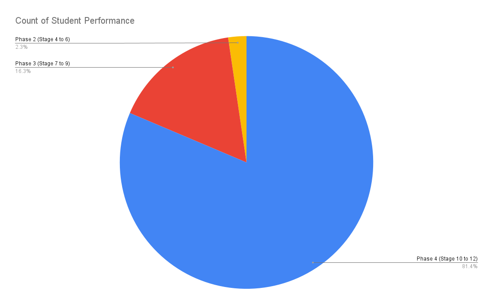

**Monsoon 2023, Database Management Systems Laboratory, NIT Calicut** 
**Number of respondents: 48** 
**Duration of the course: One semester (13 weeks)** 
**Type of course: Elective**

A feedback questionnaire was circulated to all the students who credited the course one week before the end of the semester. The responses are summarized below

Major phases of the project (Each stage subsumes the previous stages):

- Phase 1 (Stage 1 to 3): Preliminary Stages - Disk Buffer Implementation
- Phase 2 (Stage 4 to 6): Linear Search, Catalog Operations and Catalog Cache
- Phase 3 (Stage 7 to 9): Record Insertion, SELECT and PROJECT operations
- Phase 4 (Stage 10 to 12): Indexing with B+Trees, JOIN operation

### Q1. Student Performance: How many phases of the project did you complete?

### Q2. Time Management: How many hours of work did you put into the project per week on an average to complete up to what you have done?

### Q3. Effectiveness of road map and Documentation: Was the documentation provided in the roadmap and the Expos site sufficient for doing the project?

### Q4. Contribution to the understanding of theory: How much did the lab help to improve your understanding of DBMS theory?

### Q5. Contribution to Coding/Software development skills: How far did this lab contribute to the improvement of your coding, debugging and software development skills?

### Q6: Student background: Was your background sufficient for doing the lab? If not did you feel that your knowledge in any of the following subjects was inadequate for you?

