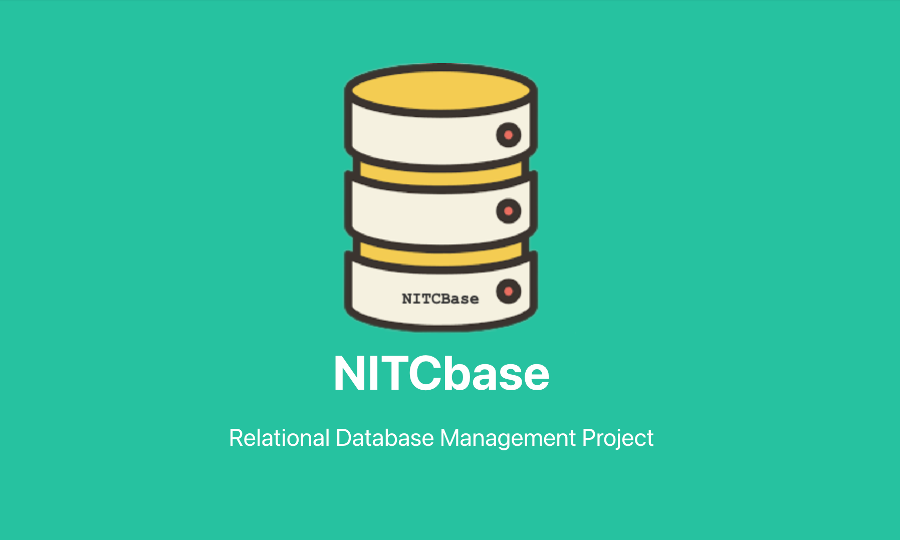

---
## Introduction
NITCbase is a Relational Database Management System Implementation (RDBMS) project that is intended to help an undergraduate student understand the design and data structures of an elementary RDBMS by implementing one herself.

A step-by-step implementation roadmap of the project guides the students through various stages of implementation of the RDBMS. The documentation of the project includes tutorials that help the student to assimilate the concepts, data structures and design details that she needs to understand at each phase of the project.

NITCbase follows a seven layer design, with the basic capabilities of a standard relational database which includes, creation and deletion of tables, managing records, selection queries and indexing using B+ Tree.

The complete design of the RDBMS and specifications of the various component subsystems are clearly specified and are made available to the student.   The final RDBMS implemented by the student supports elementary SQL queries such as Select, Project, Equi-Join and provides B+ Tree based Indexing.

## What we are building

The seven layer design will be starting from the Physical layer at the bottom (a disk simulator is provided to the student) progressing to Buffer layer, B+tree layer, Block access layer, Cache layer, Algebra layer and Schema layer at the intermediate levels and a Front-end command-line interface as user commands at the top. All layers except the front-end interface and the physical layer is to be completely implemented by the student, following the instructions in the road map (writing around 3000 lines of C++ code).

The following diagram gives an idea of the system that we are building and it's components on a higher level.

There are two command line interfaces([Frontend Interface](/docs/Frontend%20User%20Interface/introduction) and [XFS Interface](/docs/XFS%20Interface/introduction)), a disk and the Seven Layers. Since NITCbase is a relational database, it supports execution of SQL-like queries on the command-line interfaces. Disk is the single storage unit for for all data present in NITCbase. 

The project assumes that the student has adequate background in programming in C/C++ and data structures.
To begin with the project. Continue to the [Roadmap](/docs/Roadmap/introduction)