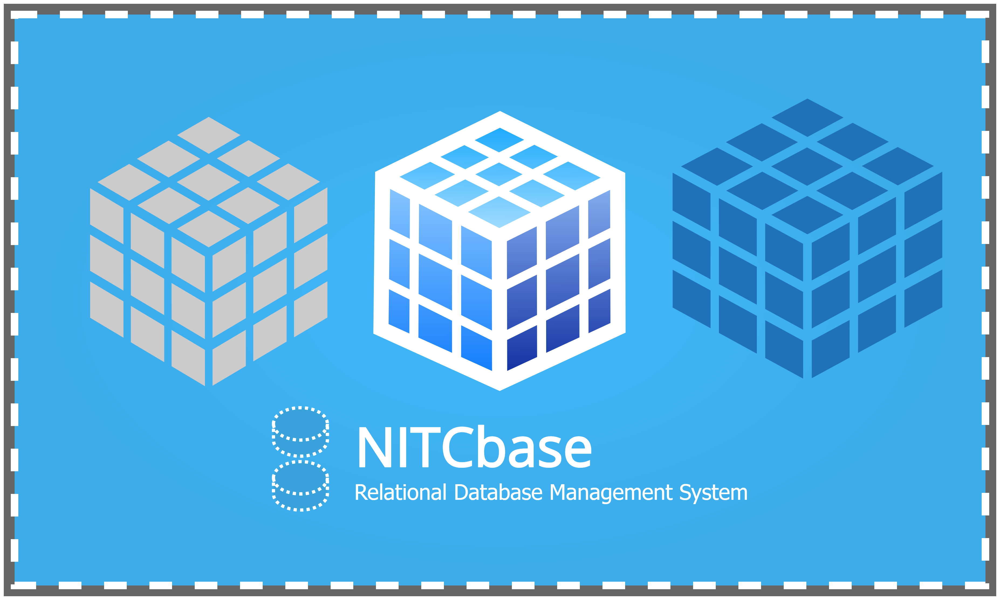

---

# NITCbase : RDBMS Implementation Project

## Introduction

NITCbase is a Relational Database Management System Implementation (RDBMS) project that is intended to help an undergraduate student understand the design and data structures of an elementary RDBMS by implementing one herself.

A step-by-step implementation roadmap of the project guides you through various stages of implementation of the RDBMS. The documentation of the project includes tutorials that help you to assimilate the concepts as well as the data structures and design details that you need to understand at each phase of the project. The complete design and specification of the RDBMS and its various component subsystems are also documented and made available.

NITCbase follows a eight layer design, with the basic capabilities of a standard relational database management system which includes, creation and deletion of tables, inserting records, selection queries and indexing using B+ Tree. The final RDBMS implemented by you will support elementary SQL queries such as create, drop, alter, insert, select, project, equi-join and also the queries for B+ Tree based indexing such as "create index" and "drop index". Currently, NITCbase does not support concurrency.

## What are you building

The eight layer design of NITCbase starts with the Physical Layer at the bottom, progresses to Buffer Layer, B+ Tree Layer, Block Access Layer, Cache Layer, Algebra Layer and Schema Layer at the intermediate levels and a Frontend Interface for interacting with the users at the top.

The following diagram gives an idea of the system that we are building and its components on a high level.

 

A more detailed overview is given below.

An even more detailed diagram can be found on the [architecture page](/docs/Design/Architecture).

A still more detailed diagram can be found on the [system design page](/docs/Design/DesignDiagram).

There are two command-line interfaces for NITCbase:

- [Frontend Interface](/docs/Design/Frontend)
- [XFS Interface](/docs/Misc/XFS%20Interface)

Since NITCbase is a relational database, it supports execution of SQL-like queries on these command-line interfaces. The XFS Disk is the single storage unit for all data present in NITCbase. In addition to storing the relations, records and indexes, the disk also stores meta data necessary for organizing, accessing, indexing and modifying the data.

## What are you given

This project assumes that you are working on a Unix/Linux system. The documentation specifies how the NITCbase RDBMS system can be implemented in C++ Language. The following are provided to you to get started on the project:

1. **A complete implementation of a command line user interface called XFS Interface** that allows a user to _access the system’s simulated disk from the host_ (Linux/Unix environment) and allows operations such as

   - formatting the disk to the NITCbase file system format
   - transferring files to and from the host system to the NITCbase file system
   - supporting standard NITCbase - [Data Definition Language (DDL)](/docs/User%20Interface%20Commands/ddl) and [Data Manipulation Language (DML)](/docs/User%20Interface%20Commands/dml) operations on the database file system and so on.

    

2. **A complete implementation of the Disk class**, implemented in `Disk.cpp`, that provides a bare minimum C++ programming interface to the NITCbase disk. The methods `readBlock()` and `writeBlock()` in this class allow for the transfer of one block of data between a C++ program and the XFS disk.

3. **Class definitions for various intermediate layers** of the database system are provided. These are

   1. Buffer Layer (`StaticBuffer.cpp`, `BlockBuffer.cpp`)
   2. Block Access Layer (`BlockAccess.cpp`)
   3. Cache Layer (`OpenRelTable.cpp`, `RelCacheTable.cpp`, `AttrCacheTable.cpp`)
   4. B+ Tree Layer (`BPlusTree.cpp`)
   5. Schema Layer (`Schema.cpp`)
   6. Algebra Layer (`Algebra.cpp`)  

   **The code for the methods in these classes are not supplied.** However, the documentation provides detailed descriptions of the algorithms corresponding to the non-trivial methods in these classes so that you can read and understand the algorithms and translate them to working C++ code.

4. **A partial implementation of the top-most layer of NITCbase - the Frontend Interface**. The Frontend Interface of NITCbase is divided into two sub-modules: (a) Frontend User Interface (`FrontendInterface.cpp`) and (b) Frontend Programming Interface (`Frontend.cpp`). The frontend user interface code is completely given to you. **However, only the class declaration and functional specification of the frontend programming interface sub-module is provided**.

5. [Documentation](/docs/Design/Architecture) containing detailed specification and design of each of the above modules, specification of the database disk organization, specification of the system’s high-level user-interface, descriptions of the algorithms used in various modules, and a detailed tutorial on B+tree implementation are provided. _You will be required to refer to appropriate parts of the documentation while implementing various components of the RDBMS._

6. A [roadmap](/docs/Roadmap) that guides you in implementing the system through a sequence of stages. The stages are of roughly ascending complexity. Each stage builds on the previous stages and guides you to relevant parts of the documentation which you need to read and understand for the implementation of the stage. You will have built a fully functional implementation of the RDBMS at the end of all the stages.

The project assumes that you have adequate background in programming in C/C++ and data structures.
At the end of the project, your code(approximately 3000 lines of C++ code) will allow the user to execute all NITCbase commands through the front-end interface.

Though not required to be read to get started on the project, a detailed design of the NITCbase system that will eventually be built at the end of all the stages is given in the design documentation linked [here](/docs/Design/Architecture).

To begin with the project, continue to the [Roadmap](/docs/Roadmap).

## To the teacher

We provide here a quick technical overview of the work involved in various layers of the NITCbase design. This section assumes that the reader is familiar with the theory of RDBMS, and hence is primarily written for the teacher to quickly find out what is done in the project. Please note that, although the NITCbase design organizes it into several layers, the roadmap does not ask the student to implement the project in a layer-by-layer manner. For a discussion of pedagogical principles on which the roadmap has been designed, we refer you to the writeup [here](/AboutUs#nitcbase-philosophy).

A brief functional description of the layers:

1. **Frontend User Interface Sub-layer**: This layer interacts with the user, and translates high level SQL queries /DDL commands from the user into calls to appropriate C++ functions in the Frontend Programming Interface Sub-layer.

   1. The student is given the complete code for this layer (around 650 lines of C++ code) in the [`FrontendInterface` folder](https://github.com/NITCbase/nitcbase/tree/master/FrontendInterface).  

   **Frontend Programming Interface Sub-layer**: This is a layer of wrapper functions. Most of the functions of this layer just redirects the call to an appropriate function of the Algebra/Schema Layer. (Some complex queries such as the [SELECT FROM JOIN WHERE](/docs/User%20Interface%20Commands/dml#select--from-join-where) command require a combination of calls to the lower layers). DDL commands are redirected to corresponding Schema Layer functions and DML commands are redirected to corresponding Algebra Layer functions. The student needs to complete around 100 lines of C++ code for completing this layer.

   1. The design of the layer is given [here](/docs/Design/Frontend#frontend-programming-interface).
   2. The student has to complete the code for this layer in the [stub file](/docs/Misc/stub/frontend).
   3. The header file [`Frontend.h`](https://github.com/NITCbase/nitcbase/blob/master/Frontend/Frontend.h) must be included.  

2. **Schema Layer**: All DDL commands of NITCbase - such as commands for creating, deleting, opening, closing and renaming relations; commands for renaming attributes of a relation and so on - are implemented in this layer. Thus, the layer contains important functions of the database system. While the main logic behind each DDL command is implemented here, all disk data access is made by invoking functions of the following lower layers: (1) Cache Layer - for accessing meta-data associated with open relations (2) Block Access Layer - for accessing disk data of relations and (3) B+ Tree Layer - for creating indices. Hence the implementation of most of the functions (except that of creating a new relation) is quite straightforward. The student needs to write around 200 lines of C++ code for completing this layer.

   1. The design of the layer is given [here](/docs/Design/Schema%20Layer).
   2. The student has to complete the code for this layer in the [stub file](/docs/Misc/stub/schema).
   3. The header file [`Schema.h`](https://github.com/NITCbase/nitcbase/blob/master/Schema/Schema.h) must be included.  

3. **Algebra Layer**: Data Manipulation Language (DML) commands - Insert, Select, Project and Join - gets directed to this layer. However, this layer essentially performs some preprocessing of steps and eventually calls the Block Access Layer functions implementing select and project, and hence has relatively low implementation complexity aside from the join operation. The student needs to write around 400 lines of C++ code for completing this layer.

   1. The design of the layer is given [here](/docs/Design/Algebra%20Layer).
   2. The student has to complete the code for this layer in the [stub file](/docs/Misc/stub/algebra).
   3. The header file [`Algebra.h`](https://github.com/NITCbase/nitcbase/blob/master/Algebra/Algebra.h) must be included.  

4. **Cache Layer**: This layer implements the run time memory data structures associated with open relations of the database (the relation cache and the attribute cache), and involves mostly implementation of the cache data structures and access functions. The layer uses functions of the Buffer Layer below for accessing disk data. The student needs to write around 500 lines of C++ code for completing this layer.

   1. The design of the layer is given [here](/docs/Design/Cache%20Layer/intro).
   2. The student has to complete the code for this layer in the [stub files](/docs/Misc/stub/cache).
   3. The header files [`AttrCacheTable.h`](https://github.com/NITCbase/nitcbase/blob/master/Cache/AttrCacheTable.h), [`RelCacheTable.h`](https://github.com/NITCbase/nitcbase/blob/master/Cache/RelCacheTable.h), [`OpenRelTable.h`](https://github.com/NITCbase/nitcbase/blob/master/Cache/OpenRelTable.h) must be included.  

5. **Block Access Layer**: This layer contains the implementation of the fundamental DML operations - select and project - on relations. (It turns out that equi-join implementation can be implemented with select and project, and hence easily handled by the Algebra Layer by calling appropriate Block Access Layer functions). This is one of the most important modules that implements the core functionality of the database system and involves substantial implementation work. The student needs to write around 500 lines of C++ code for completing this layer.

   1. The design of the layer is given [here](/docs/Design/Block%20Access%20Layer).
   2. The student has to complete the code for this layer in the [stub file](/docs/Misc/stub/block_access).
   3. The header file [`BlockAccess.h`](https://github.com/NITCbase/nitcbase/blob/master/BlockAccess/BlockAccess.h) must be included.  

6. **B+ Tree Layer**: This layer handles indexing operations with B+ trees. The primary purpose of this layer is to simplify the work in the Block Access Layer by separating all B+ tree operations into a separate layer. The two main operations - B+ tree search and insertion are somewhat sophisticated operations and involve substantial implementation work. Hence, we provide several tutorials to aid learning and implementation ([B+ Trees](docs/Misc/B+%20Trees) and [Indexing in NITCbase](/docs/Misc/Indexing#create-index)). The student needs to write around 500 lines of C++ code for completing this layer.

   1. The design of the layer is given [here](/docs/Design/B+%20Tree%20Layer).
   2. The student has to complete the code for this layer in the [stub file](/docs/Misc/stub/bplus).
   3. The header file [`BPlusTree.h`](https://github.com/NITCbase/nitcbase/blob/master/BPlusTree/BPlusTree.h) must be included.  

7. **Buffer Layer**: The buffer layer is the lowest layer which is to be implemented by the student and handles the low level access to the disk (using the low disk read/write functions that is already implemented and given). The Block Access Layer, Cache Layer and B+ Tree Layer functions invoke these functions to perform disk access and update operations. The Buffer Layer maintains a disk buffer that can cache up to 32 disk blocks at a time. The layer contains several access functions that help higher layers to access the disk in suitable format. Buffer replacement is carried out using least recently (LRU) scheme. This layer contains quite a bit of code, as it hides the low level disk details and provides a clean interface to the higher layers. The student needs to write around 500 lines of C++ code for completing this layer.

   1. The design of the layer is given [here](/docs/Design/Buffer%20Layer/intro).
   2. The student has to complete the code for this layer in the [stub files](/docs/Misc/stub/buffer).
   3. The header files [`BlockBuffer.h`](https://github.com/NITCbase/nitcbase/blob/master/Buffer/BlockBuffer.h) and [`StaticBuffer.h`](https://github.com/NITCbase/nitcbase/blob/master/Buffer/StaticBuffer.h) must be included.  

8. **Physical Layer**: This is the lowest layer of the NITCbase design and mainly contains two low level disk access routines. The disk read function allows a disk block to be written into a memory buffer. The disk write function transfers data in a memory buffer into a specified disk block.
   1. The student is given the complete code for this layer (around 70 lines of C++ code) in the [`Disk.cpp`](https://github.com/NITCbase/nitcbase/blob/master/Disk_Class/Disk.cpp) file.
   2. The header file [`Disk.h`](https://github.com/NITCbase/nitcbase/blob/master/Disk/Disk.h) must be included.
